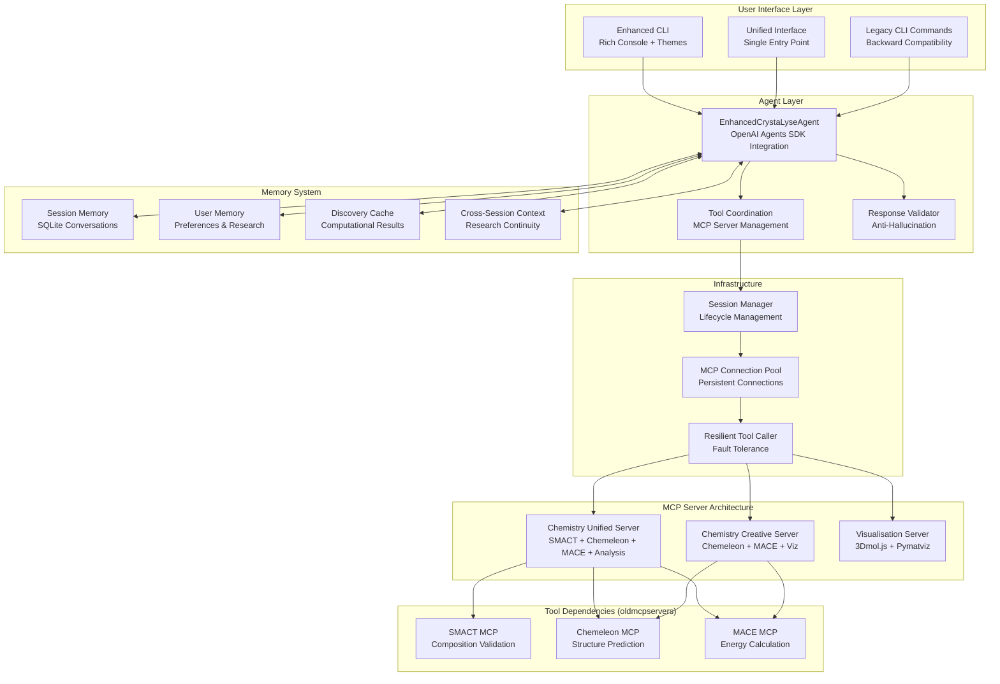
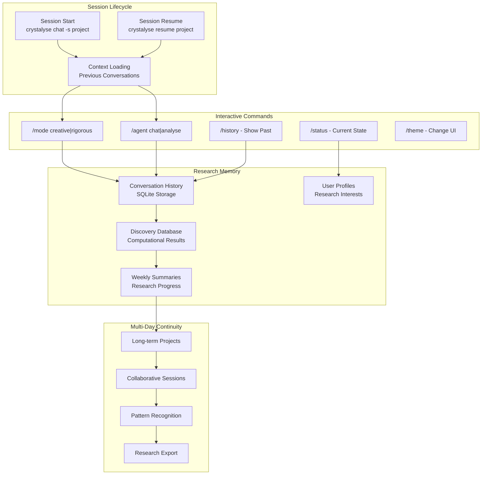

# CrystaLyse.AI


**Status**: Research Preview v2.0.0-alpha 

CrystaLyse.AI is an autonomous AI agent for inorganic materials design. CrystaLyse.AI lets materials scientists delegate computational materials design tasks directly from their terminal. In early testing, CrystaLyse completed materials design workflows in minutes that would normally take a few days of manual computational work. With CrystaLyse.AI, our goal is a tool that assists researchers in solving challenges at the materials design frontiers.

Built on the OpenAI Agents SDK framework with Model Context Protocol (MCP) integration, it provides a modular system for rapid, intelligent and adaptable materials design workflows.

> **💡 For AI Assistants & Copilots**: If you're using GitHub Copilot, Claude, ChatGPT, or other AI coding assistants, check out [`READMEFORLLMS.md`](READMEFORLLMS.md) - a comprehensive guide designed specifically for AI agents to quickly understand this project's capabilities, installation, and usage patterns. Simply copy-paste its contents into your AI assistant for instant project context!

## Key Features

### ✅ Enhanced Agent System with Intelligent Tool Coordination
- **Adaptive Mode**: Intelligent balance of speed and accuracy (default)
- **Creative Mode**: Fast exploration (~50 seconds) using Chemeleon + MACE  
- **Rigorous Mode**: Complete validation (2-5 minutes) with SMACT + Chemeleon + MACE + Analysis Suite
- **Dynamic tool coordination** through single enhanced agent (`EnhancedCrystaLyseAgent`)

### ✅ Complete Materials Pipeline
- **Composition Validation**: SMACT screening for chemically reasonable element combinations
- **Structure Prediction**: Chemeleon crystal structure generation with multiple candidates
- **Energy Calculations**: MACE formation energy evaluation with uncertainty quantification
- **Comprehensive Analysis**: XRD patterns, RDF analysis, coordination studies
- **3D Visualisation**: Interactive molecular viewers and professional analysis plots

### ✅ Advanced Interface & User Experience

- **Enhanced CLI**: Rich terminal interface with professional displays
- **Natural Language Clarification**: LLM-powered adaptive question system
- **Workspace Management**: Transparent file operations with preview/approval
- **Session-Based Chat**: Persistent conversations with cross-session learning
- **User Preference Memory**: Adaptive behavior based on expertise and usage patterns

## Architecture Overview

### High-Level System Architecture



### Dual-Mode Operation Flow

```mermaid
graph LR
    subgraph "Entry Points"
        USER_QUERY[User Query]
        MODE_SELECT{Mode Selection<br/>/mode creative or rigorous}
    end
    
    subgraph "Creative Mode (~50s)"
        CREATIVE_SERVER[Chemistry Creative Server]
        FAST_STRUCT[Chemeleon Structure<br/>Generation]
        FAST_ENERGY[MACE Energy<br/>Calculation]
        BASIC_VIZ[Basic 3D<br/>Visualisation]
        CREATIVE_RESULT[Fast Results<br/>Structure + Energy]
    end
    
    subgraph "Rigorous Mode (2-5min)"
        UNIFIED_SERVER[Chemistry Unified Server]
        SMACT_VAL[SMACT Composition<br/>Validation]
        FULL_STRUCT[Chemeleon Complete<br/>Structure Generation]
        FULL_ENERGY[MACE Full Energy<br/>Analysis]
        COMPREHENSIVE[XRD + RDF +<br/>Coordination Analysis]
        RIGOROUS_RESULT[Complete Results<br/>Publication Ready]
    end
    
    subgraph "Memory Integration"
        CACHE[Discovery Cache<br/>Avoid Redundancy]
        SESSION[Session History<br/>Research Context]
        INSIGHTS[Cross-Session<br/>Learning]
    end
    
    USER_QUERY --> MODE_SELECT
    MODE_SELECT -->|Creative| CREATIVE_SERVER
    MODE_SELECT -->|Rigorous| UNIFIED_SERVER
    
    CREATIVE_SERVER --> FAST_STRUCT
    FAST_STRUCT --> FAST_ENERGY
    FAST_ENERGY --> BASIC_VIZ
    BASIC_VIZ --> CREATIVE_RESULT
    
    UNIFIED_SERVER --> SMACT_VAL
    SMACT_VAL --> FULL_STRUCT
    FULL_STRUCT --> FULL_ENERGY
    FULL_ENERGY --> COMPREHENSIVE
    COMPREHENSIVE --> RIGOROUS_RESULT
    
    CREATIVE_RESULT --> CACHE
    RIGOROUS_RESULT --> CACHE
    CACHE --> SESSION
    SESSION --> INSIGHTS
```



### Session-Based Research Flow



## Repository Structure

```
CrystaLyse.AI/
├── crystalyse/                    # Core package
│   ├── agents/                    # AI agent implementations
│   ├── infrastructure/            # Connection pooling, session management
│   ├── memory/                    # Memory system and caching
│   ├── output/                    # Dual formatter and visualisation
│   ├── validation/                # Anti-hallucination system
│   └── cli.py                     # Unified command-line interface
├── chemistry-unified-server/      # Rigorous mode (SMACT + Chemeleon + MACE)
├── chemistry-creative-server/     # Creative mode (Chemeleon + MACE)
├── visualization-mcp-server/      # 3D structures and analysis plots
├── oldmcpservers/                 # Individual tool servers (required dependencies)
│   ├── smact-mcp-server/          # SMACT composition validation
│   ├── chemeleon-mcp-server/      # Chemeleon structure prediction
│   └── mace-mcp-server/           # MACE energy calculations
├── docs/                          # Comprehensive documentation
│   ├── guides/                    # Installation and usage guides
│   ├── concepts/                  # Analysis modes and architecture
│   ├── tools/                     # Individual tool documentation
│   └── reference/                 # Complete API reference
```

## Quick Start

### Installation

```bash
# Clone repository  
git clone https://github.com/ryannduma/CrystaLyse.AI.git
cd CrystaLyse.AI

# Create conda environment
conda create -n crystalyse python=3.11
conda activate crystalyse

# Step 1: Install core package FIRST (required)
cd dev
pip install -e .

# Step 2: Install MCP servers (they depend on core package)
pip install -e ./chemistry-unified-server      # Complete validation mode
pip install -e ./chemistry-creative-server     # Fast exploration mode
pip install -e ./visualization-mcp-server      # 3D visualization
```

### Configuration

```bash
# Set OpenAI API key
export OPENAI_API_KEY="sk-your-key-here"

# Verify installation
crystalyse --help
crystalyse config show
```

## Usage Examples

### Quick Analysis

```bash
# Creative mode (fast exploration)
crystalyse analyse "Find stable perovskite materials for solar cells" --mode creative

# Rigorous mode (complete validation)
crystalyse analyse "Analyse CsSnI3 for photovoltaic applications" --mode rigorous
```

### Interactive Research Sessions

```bash
# Start a research session
crystalyse chat -u researcher -s solar_project -m creative

# Resume previous work
crystalyse resume solar_project -u researcher

# List all sessions
crystalyse sessions -u researcher
```

### Unified Interface

```bash
# Launch interactive interface with mode switching
crystalyse

# In-session commands:
# /mode creative     - Switch to creative mode
# /mode rigorous     - Switch to rigorous mode
# /agent chat        - Switch to chat agent
# /agent analyse     - Switch to analysis agent
# /help              - Show available commands
# /exit              - Exit interface
```

## Example Output

**Creative Mode Results**:
```
╭─────────────────────── Design Results ────────────────────────────╮
│ Generated 5 perovskite candidates with formation energies:            │
│                                                                        │
│ 1. CsGeI₃ - Formation energy: -2.558 eV/atom (most stable)           │
│ 2. CsPbI₃ - Formation energy: -2.542 eV/atom                         │
│ 3. CsSnI₃ - Formation energy: -2.529 eV/atom                         │
│ 4. RbPbI₃ - Formation energy: -2.503 eV/atom                         │
│ 5. RbSnI₃ - Formation energy: -2.488 eV/atom                         │
│                                                                        │
│ 3D visualisations created: CsGeI3_3dmol.html, CsPbI3_3dmol.html      │
╰────────────────────────────────────────────────────────────────────────╯
```

**Rigorous Mode Output**:
- Complete SMACT composition validation
- Multiple structure candidates per composition
- Professional analysis plots (XRD, RDF, coordination analysis)
- 3D interactive visualisations
- Publication-ready results

## Applications

### Energy Materials
- Battery cathodes and anodes (Li-ion, Na-ion, solid-state)
- Solid electrolytes and ion conductors  
- Photovoltaic semiconductors and perovskites
- Thermoelectric materials

### Electronic Materials
- Ferroelectric and multiferroic materials
- Magnetic materials and spintronics
- Semiconductor devices and memory materials
- Superconductors and quantum materials

### Research Workflows
- High-throughput materials screening
- Structure-property relationship studies
- Materials optimisation and design
- Experimental validation planning

## Performance Characteristics

| Operation | Creative Mode | Rigorous Mode |
|-----------|---------------|---------------|
| Simple query | ~50 seconds | 2-3 minutes |
| Complex analysis | 1-2 minutes | 3-5 minutes |
| Batch processing | 5-10 minutes | 15-30 minutes |

**System Requirements**:
- Python 3.11+
- 8GB RAM minimum (16GB recommended)
- Storage: 5GB for installation + ~600MB for Chemeleon model checkpoints (auto-downloaded to `~/.cache/`)
- Internet: Required for first-run checkpoint download (~523MB from Figshare)
- OpenAI API key
- Optional: NVIDIA GPU for MACE acceleration

## Documentation

Comprehensive documentation is available in the [`docs/`](docs/) directory:

- **[Quickstart Guide](docs/quickstart.md)** - Get started in minutes
- **[Installation Guide](docs/guides/installation.md)** - Detailed setup instructions
- **[CLI Usage Guide](docs/guides/cli_usage.md)** - Complete command reference
- **[Analysis Modes](docs/concepts/analysis_modes.md)** - Creative vs Rigorous workflows
- **[Tool Documentation](docs/tools/)** - SMACT, Chemeleon, MACE, Visualisation
- **[API Reference](docs/reference/)** - Complete API documentation

## Scientific Integrity

CrystaLyse.AI maintains computational honesty:
- **100% Traceability**: Every result traces to actual tool calculations
- **Zero Fabrication**: No estimated or hallucinated numerical values
- **Complete Transparency**: Clear distinction between AI reasoning and computational validation
- **Anti-Hallucination System**: Response validation prevents fabricated results

## Acknowledgments

CrystaLyse.AI builds upon exceptional open-source tools:

- **[SMACT](https://github.com/WMD-group/SMACT)**: Semiconducting Materials by Analogy and Chemical Theory
- **[Chemeleon](https://github.com/hspark1212/chemeleon)**: Crystal structure prediction with AI
- **[MACE](https://github.com/ACEsuit/mace)**: Machine learning ACE force fields
- **[Pymatviz](https://github.com/janosh/pymatviz)**: Materials visualisation toolkit
- **[OpenAI Agents SDK](https://github.com/openai/openai-agents-python)**: Production-ready agent framework

## Citation

If you use CrystaLyse.AI in your research, please cite the underlying tools:

- **SMACT**: Davies et al., "SMACT: Semiconducting Materials by Analogy and Chemical Theory" JOSS 4, 1361 (2019)
- **Chemeleon**: Park et al., "Exploration of crystal chemical space using text-guided generative artificial intelligence" Nature Communications (2025)
- **MACE**: Batatia et al., "MACE: Higher Order Equivariant Message Passing Neural Networks for Fast and Accurate Force Fields" NeurIPS (2022)
- **Pymatviz**: Riebesell et al., "Pymatviz: visualization toolkit for materials informatics" (2022)

## License

MIT License - see LICENSE for details.
