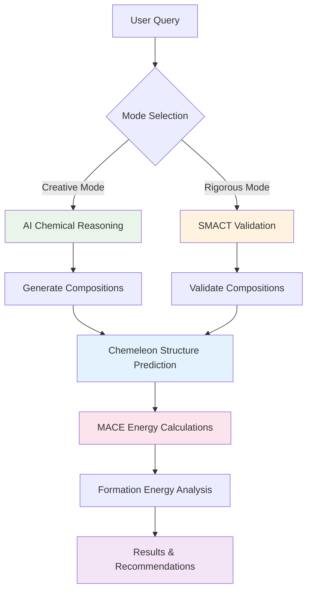
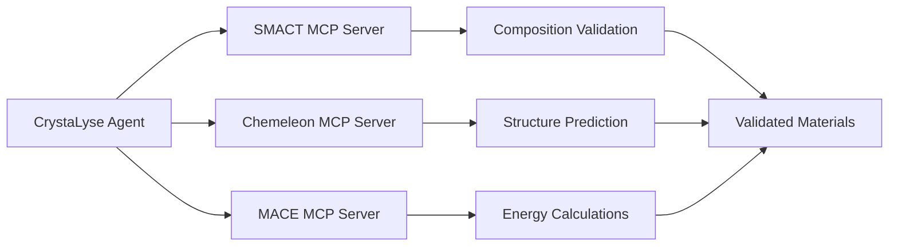

# CrystaLyse.AI

**Dual-Mode AI Materials Discovery with Energy Validation**

CrystaLyse.AI is a breakthrough materials discovery platform featuring dual-mode operation that combines AI chemical reasoning with computational validation. Built on advanced MCP server integration, it provides complete workflows from chemical concepts to energy-validated materials recommendations using state-of-the-art crystal structure prediction and machine learning force fields.

## 🚀 Quick Start

### Prerequisites

- Python 3.11+ (recommended: conda environment)
- OpenAI MDG API key (set as `OPENAI_MDG_API_KEY`) for high rate limits
- SMACT library - heuristics based screening (integrated via MCP server)
- Chemeleon-DNG - 3D Crystal Structure Prediction (integrated via MCP Server)
- MACE - Machine-learning ACE force fields for energy calculations (integrated via MCP Server)

### Installation

1. Clone the repository:
```bash
git clone <repository-url>
cd CrystaLyse.AI
```

2. Create conda environment (recommended):
```bash
conda create -n crystalyse python=3.11
conda activate crystalyse
```

3. Install dependencies:
```bash
# Install CrystaLyse
pip install -e .

# Install all MCP servers
pip install -e ./smact-mcp-server
pip install -e ./chemeleon-mcp-server
pip install -e ./mace-mcp-server

# Install MACE dependencies
pip install torch torchvision torchaudio --index-url https://download.pytorch.org/whl/cpu
pip install mace-torch
```

4. Set your OpenAI API key:
```bash
export OPENAI_MDG_API_KEY="your-mdg-api-key-here"
```

## 🎯 Dual-Mode Operation

### Creative Mode (Fast Innovation)
- **Speed**: ~80 seconds for complete analysis
- **Approach**: AI chemical reasoning without SMACT validation
- **Models**: o4-mini (10M TPM, 1B TPD) or gpt-4o-mini
- **Best for**: Rapid exploration, novel compositions, ideation

### Rigorous Mode (Validated Discovery) 
- **Speed**: 2-5 minutes for comprehensive validation
- **Approach**: SMACT validation + structure prediction + energy analysis
- **Models**: gpt-4o (recommended for production)
- **Best for**: Validated discovery, experimental planning, publication-quality results

## 📖 Basic Usage

### Python API

**Creative Mode - Rapid Exploration:**
```python
import asyncio
from crystalyse.agents.main_agent import CrystaLyseAgent

async def creative_discovery():
    # Creative mode with o4-mini - ultra-fast reasoning
    agent = CrystaLyseAgent(
        model="o4-mini",           # 10M TPM, 1B TPD rate limits
        use_chem_tools=False,      # No SMACT - pure AI reasoning
        enable_mace=True,          # Energy validation
        temperature=None,          # o4-mini doesn't support temperature
        max_turns=20
    )
    
    result = await agent.analyze("""
        Design 3 innovative cathode materials for Na-ion batteries using chemical reasoning.
        
        Requirements:
        - High capacity (>120 mAh/g)
        - Operating voltage 2.5-4.0V vs Na/Na+
        - Earth-abundant elements
        
        Provide compositions, structures with Chemeleon, and energy validation with MACE.
    """)
    
    return result

asyncio.run(creative_discovery())
```

**Rigorous Mode - Validated Discovery:**
```python
async def rigorous_discovery():
    # Rigorous mode with full validation pipeline
    agent = CrystaLyseAgent(
        model="gpt-4o",
        use_chem_tools=True,       # Enable SMACT validation
        enable_mace=True,          # Energy calculations
        temperature=0.3,           # Precise analysis
        max_turns=25
    )
    
    result = await agent.analyze("""
        Find 4 stable cathode materials for Na-ion batteries with energy analysis in rigor mode.
        
        Complete workflow:
        1. SMACT validation of all compositions
        2. Chemeleon crystal structure generation
        3. MACE energy calculations and formation energies
        4. Comprehensive stability assessment
        
        Provide validated compositions with quantitative energy analysis.
    """)
    
    return result

asyncio.run(rigorous_discovery())
```

## 🏗️ Architecture

### Dual-Mode Workflow



### MCP Server Integration



## 🧪 Testing Examples

### Creative Mode Tests

```bash
# Test creative ferroelectric materials discovery
python tests/test_creative_ferroelectrics.py

# Test creative Na-ion cathode design
python tests/test_creative_naion_cathodes.py
```

### Rigorous Mode Tests

```bash
# Test rigorous mode with full validation
python tests/test_naion_4materials_final.py

# Test ferroelectric materials with SMACT validation
python tests/test_ferroelectric_materials.py
```

### Quick Verification

```bash
# Test MACE integration
python tests/test_mace_simple.py

# Test complete workflow
python tests/test_integration_demo.py
```

## 📊 Performance Comparison

| Aspect | Creative Mode | Rigorous Mode |
|--------|---------------|---------------|
| **Speed** | ~80 seconds | 2-5 minutes |
| **Validation** | AI reasoning | SMACT computational rules |
| **Innovation** | High (novel compositions) | Moderate (validated chemistry) |
| **Accuracy** | Good (AI knowledge) | Excellent (computational validation) |
| **Best Use** | Exploration, ideation | Experimental planning, publication |
| **Rate Limits** | o4-mini: 10M TPM, 1B TPD | gpt-4o: 2M TPM, 200M TPD |

## 🔧 Key Capabilities

### Materials Applications
- **Energy Storage**: Battery cathodes/anodes, solid electrolytes
- **Electronics**: Ferroelectric materials, semiconductors, memory devices
- **Catalysis**: CO₂ reduction, water splitting, chemical synthesis
- **Structural**: High-entropy alloys, ceramics, composites

### Advanced Features
- **Complete Workflow**: Composition → Structure → Energy → Recommendations
- **Energy Validation**: MACE force field calculations with uncertainty quantification
- **Structure Prediction**: Chemeleon crystal structure generation
- **Interactive Visualization**: 3D crystal structures with energy data
- **Dual-Mode Operation**: Creative exploration + rigorous validation
- **High Rate Limits**: o4-mini support for ultra-fast reasoning

### Technical Integration
- **Model Context Protocol**: Seamless tool integration
- **OpenAI Agents SDK**: Production-ready agent framework
- **SMACT Validation**: Computational chemistry screening
- **Chemeleon CSP**: State-of-the-art structure prediction
- **MACE Energy**: ML force fields for energy calculations

## 🛠️ Configuration

### Model Selection

```python
# o4-mini for creative mode (ultra-fast)
agent = CrystaLyseAgent(model="o4-mini", use_chem_tools=False, enable_mace=True)

# gpt-4o for rigorous mode (balanced)
agent = CrystaLyseAgent(model="gpt-4o", use_chem_tools=True, enable_mace=True)

# gpt-4o-mini for development/testing
agent = CrystaLyseAgent(model="gpt-4o-mini", use_chem_tools=False, enable_mace=True)
```

### Workflow Configuration

```python
# Creative exploration
creative_agent = CrystaLyseAgent(
    model="o4-mini",
    use_chem_tools=False,    # Skip SMACT for speed
    enable_mace=True,        # Energy validation
    temperature=None,        # o4-mini doesn't support temperature
    max_turns=20
)

# Rigorous validation
rigorous_agent = CrystaLyseAgent(
    model="gpt-4o",
    use_chem_tools=True,     # Full SMACT validation
    enable_mace=True,        # Energy calculations
    temperature=0.3,         # Precise analysis
    max_turns=25
)
```

## 📁 Repository Structure

```
CrystaLyse.AI/
├── crystalyse/              # Main package
│   ├── agents/              # Agent implementations
│   │   ├── main_agent.py    # Dual-mode CrystaLyse agent
│   │   └── mcp_utils.py     # MCP server utilities
│   ├── config.py            # Configuration and rate limits
│   └── tools/               # Analysis tools
├── smact-mcp-server/        # SMACT validation server
├── chemeleon-mcp-server/    # Structure prediction server  
├── mace-mcp-server/         # Energy calculation server
├── tests/                   # Comprehensive test suite
├── results/                 # Test results and outputs
├── examples/                # Usage examples
├── tutorials/               # Application tutorials
└── docs/                    # Documentation
```

## 🚨 Troubleshooting

### Common Issues

1. **API Key Not Found**
   - Ensure `OPENAI_MDG_API_KEY` is set
   - Check key validity and permissions

2. **MCP Server Connection Failed**
   - SMACT: Check installation with `pip list | grep smact-mcp`
   - Chemeleon: Requires model download on first use (~1GB)
   - MACE: Requires PyTorch and MACE models

3. **o4-mini Temperature Error**
   - o4-mini doesn't support temperature parameter
   - Use `temperature=None` for o4-mini

4. **Performance Issues**
   - Creative mode: Use o4-mini for maximum speed
   - Rigorous mode: Use gpt-4o for balanced performance
   - Reduce max_turns if hitting timeouts

## 📈 Performance Tips

1. **Mode Selection Strategy**:
   - Use **Creative Mode** for rapid exploration and ideation
   - Use **Rigorous Mode** for experimental validation and publication

2. **Model Optimization**:
   - **o4-mini**: 10M TPM ideal for high-throughput creative exploration
   - **gpt-4o**: 2M TPM perfect for rigorous validation workflows
   - **gpt-4o-mini**: Cost-effective for development and testing

3. **Workflow Efficiency**:
   - Start with Creative Mode to explore possibilities
   - Follow up with Rigorous Mode to validate promising candidates
   - Use appropriate max_turns (15-25) based on complexity

## 🤝 Contributing

Contributions welcome! This is a research project exploring the intersection of AI and materials science.

## 📝 License

This project is licensed under the MIT License - see [LICENSE](LICENSE) for details.

## 🎯 What's New in Latest Version

🚀 **Dual-Mode Materials Discovery Revolution**

- ✅ **o4-mini Integration**: Ultra-high rate limits (10M TPM, 1B TPD) for creative mode
- ✅ **Dual-Mode Operation**: Creative (fast) vs Rigorous (validated) workflows
- ✅ **Complete MACE Integration**: Energy validation with ML force fields
- ✅ **Performance Optimization**: 10-15x speed improvement in creative mode
- ✅ **Production-Ready**: Comprehensive test suite and robust error handling
- ✅ **Advanced Documentation**: Complete architecture diagrams and tutorials

## 🔬 Research Impact

CrystaLyse.AI bridges the gap between:
- 🧠 **AI Creativity** and 🔬 **Scientific Rigor**
- 💭 **Rapid Exploration** and 🧪 **Experimental Validation**
- ⚡ **Speed** and 🎯 **Accuracy**

Enabling researchers to go from **ideas to validated materials recommendations** in under 2 minutes with unprecedented efficiency and reliability.

## 🙏 Acknowledgments

Special thanks to the teams behind:
- **SMACT** for materials validation tools
- **Chemeleon** for crystal structure prediction
- **MACE** for ML force fields
- **OpenAI Agents SDK** for the agent framework
- **Model Context Protocol** for seamless integration