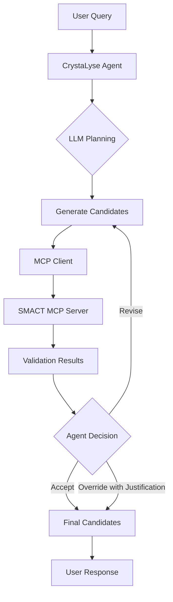

# CrystaLyse.AI

CrystaLyse.AI is an autonomous materials discovery platform built on the OpenAI Agents Python SDK. It features a dual-mode system that bridges creative AI-driven exploration with rigorous computational validation using Chem-informatics tools integrated via the Model Context Protocol (MCP).

## 🚀 Quick Start

### Prerequisites

- Python 3.11+ (recommended: conda environment)
- OpenAI API key (set as `OPENAI_MDG_API_KEY` or `OPENAI_API_KEY`)
- SMACT library - for heuristics based screening (integrated via MCP server)
- Chemeleon-DNG - for 3D crystal structure generation (integrated via MCP Server)

### Installation

1. Clone the repository:
```bash
git clone <repository-url>
cd CrystaLyse.AI
```

2. Create conda environment (recommended):
```bash
conda create -n crystalyse python=3.11
conda activate crystalyse
```

3. Install dependencies:
```bash
pip install -e .
pip install -e ./smact-mcp-server
```

4. Set your OpenAI API key:
```bash
export OPENAI_MDG_API_KEY="your-api-key-here"
```

### Basic Usage

#### Command Line Interface

```bash
# Run a simple query
crystalyse analyze "Design a stable cathode material for Na-ion battery"

# Use streaming output
crystalyse analyze "Find a Pb-free multiferroic crystal" --stream

# Save results to file
crystalyse analyze "Design oxide photocatalyst for water splitting" -o results.json

# Show example queries
crystalyse examples
```

#### Python API

```python
import asyncio
from crystalyse import CrystaLyseAgent

async def main():
    # Initialize agent
    agent = CrystaLyseAgent(model="gpt-4", temperature=0.7)
    
    # Run analysis
    result = await agent.analyze("Design a stable cathode material for Na-ion battery")
    print(result)

asyncio.run(main())
```

## 🧪 Testing the Agent

### Running Examples

We provide several example scripts to demonstrate CrystaLyse capabilities:

1. **Basic Analysis** - Simple material discovery queries:
```bash
python examples/basic_analysis.py
```

2. **Streaming Example** - Real-time response streaming:
```bash
python examples/streaming_example.py
```

3. **Advanced Constraints** - Complex queries with specific requirements:
```bash
python examples/advanced_constraints.py
```

### Running Tests

```bash
# Run all tests
pytest tests/ -v

# Run specific test file
pytest tests/test_basic.py -v

# Run with coverage
pytest tests/ --cov=crystalyse --cov-report=html
```

### Test Queries to Try

Here are some example queries to test different capabilities:

#### Energy Storage Materials
```bash
crystalyse analyze "Design a stable cathode material for a Na-ion battery with operating voltage 2.5-4.0V"
```

#### Photovoltaic Materials
```bash
crystalyse analyze "Suggest a non-toxic semiconductor for solar cell applications with band gap 1.5-2.0 eV"
```

#### Functional Ceramics
```bash
crystalyse analyze "Find a Pb-free piezoelectric material to replace PZT with d33 > 100 pC/N"
```

#### Structure-Specific Queries
```bash
crystalyse analyze "I want a composition with manganese in the perovskite structure type for magnetic applications"
```

#### Catalysis
```bash
crystalyse analyze "Design an oxide photocatalyst for water splitting that absorbs visible light"
```

## 🏗️ Architecture

### Core Components

1. **Main Agent (CrystaLyseAgent)**
   - Orchestrates the materials discovery workflow
   - Integrates with SMACT MCP server for validation
   - Uses GPT-4 for creative material design

2. **Specialized Sub-Agents**
   - **ValidationAgent**: Checks chemical validity using SMACT rules
   - **StructurePredictionAgent**: Predicts crystal structures from composition

3. **Tools**
   - **Composition Tools**: Generate and validate material compositions
   - **Structure Tools**: Predict crystal structures and analyze stability
   - **Design Tools**: End-to-end material design workflows

4. **MCP Integration**
   - Connects to SMACT MCP server for materials science calculations
   - Provides access to element data, oxidation states, and validation rules

### Workflow



## 🔧 Configuration

### Model Selection

CrystaLyse supports different OpenAI models:

```python
# Use GPT-4.1 (default)
agent = CrystaLyseAgent(model="gpt-4.1")

# Use o4-mini for reasoned responses
agent = CrystaLyseAgent(model="o4-mini")
```

### Temperature Control

Adjust creativity vs determinism:

```python
# Higher temperature (0.7-1.0) for more creative suggestions
agent = CrystaLyseAgent(temperature=0.8)

# Lower temperature (0.1-0.5) for more conservative results
agent = CrystaLyseAgent(temperature=0.3)
```

## 📊 Understanding Results

CrystaLyse returns structured results containing:

- **Top Candidates**: 5 best material compositions
- **Validation Status**: "valid", "override", or "invalid"
- **Novelty**: Whether the material is known or novel
- **Predicted Structures**: Likely crystal structures with confidence scores
- **Chemical Reasoning**: Justification for each candidate
- **Synthesis Notes**: Suggested synthesis methods

Example output structure:
```json
{
  "application": "Na-ion battery cathode",
  "top_candidates": [
    {
      "rank": 1,
      "formula": "NaFe0.5Mn0.5PO4",
      "validation": "valid",
      "novelty": "Novel",
      "proposed_structures": [
        {
          "structure_type": "olivine",
          "confidence": 0.85,
          "space_groups": ["Pnma"]
        }
      ],
      "reasoning": "Mixed Fe/Mn olivine structure for improved capacity",
      "synthesis_notes": "Sol-gel method followed by calcination at 800°C"
    }
  ],
  "generation_summary": {
    "total_generated": 20,
    "valid": 12,
    "overridden": 3,
    "selected": 5
  }
}
```

## 🛠️ Advanced Usage

### Custom Constraints

```python
constraints = {
    "exclude_elements": ["Co", "Ni"],  # Avoid expensive elements
    "prefer_elements": ["Fe", "Mn"],   # Use earth-abundant elements
    "structure_type": "layered",       # Target specific structure
    "band_gap_range": "2.0-3.0 eV"     # Property constraints
}

result = await agent.analyze(
    "Design a battery cathode",
    constraints=constraints
)
```

### Batch Processing

```python
queries = [
    "Cathode for Na-ion battery",
    "Solid electrolyte for Li-ion battery",
    "Anode material for K-ion battery"
]

results = []
for query in queries:
    result = await agent.analyze(query)
    results.append(result)
```

## 🚨 Troubleshooting

### Common Issues

1. **API Key Not Found**
   - Ensure `OPENAI_MDG_API_KEY` or `OPENAI_API_KEY` is set
   - Check the key is valid and has appropriate permissions

2. **SMACT MCP Server Connection Failed**
   - The SMACT MCP server should start automatically
   - If issues persist, try starting manually: `crystalyse server`

3. **Import Errors**
   - Ensure you're in the correct virtual environment
   - Reinstall with: `pip install -e .`

4. **Rate Limiting**
   - Add delays between queries if processing many requests
   - Consider using GPT-4o-mini for development/testing

## 📈 Performance Tips

1. **Use Streaming** for better user experience:
   ```bash
   crystalyse analyze "your query" --stream 
   ```

2. **Cache Results** when testing the same queries repeatedly

3. **Batch Similar Queries** to reduce API calls

4. **Start with Simple Queries** and add constraints gradually

## 🤝 Contributing

See [CONTRIBUTING.md](CONTRIBUTING.md) for development guidelines - this is a placeholder.

## 📝 License

This project is licensed under the MIT License - see [LICENSE](LICENSE) for details.

## 🙏 Acknowledgments

Special thanks to Aron Walsh and Hyunsoo Park for supervising, advising and guiding this project.

And lots of thanks to the teams and community developers who helped build:

- SMACT library for materials science tools
- CHEMELEON library for 3D Structure generation
- OpenAI Agents SDK for the agent framework
- Model Context Protocol for tool integration 
