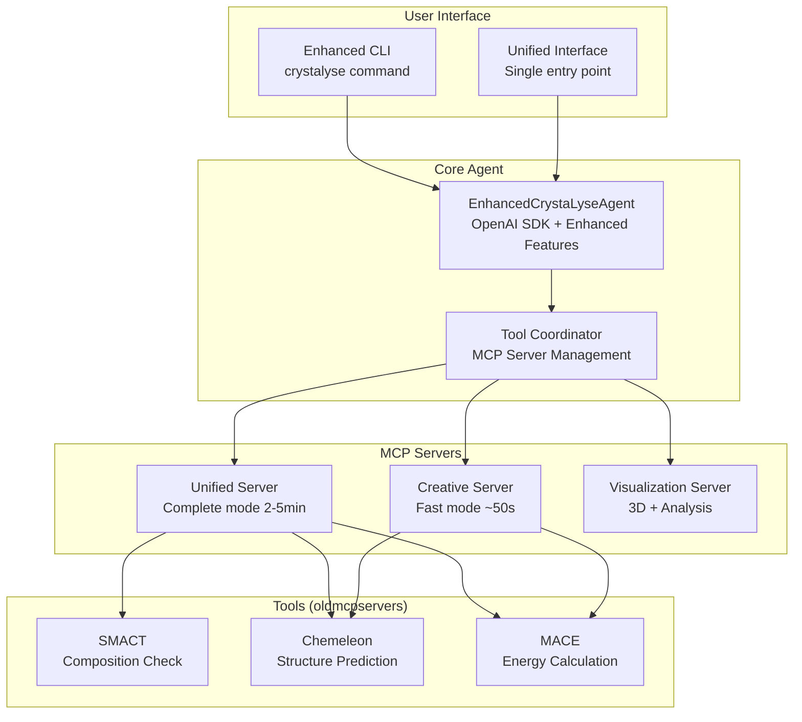
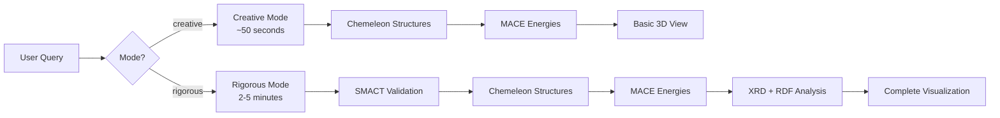

# READMEFORLLMS.md - CrystaLyse.AI Installation Guide for AI Agents

This document provides explicit, step-by-step instructions for AI coding agents, copilots, and LLM assistants to understand, install, verify, and troubleshoot CrystaLyse.AI. All commands are provided with exact syntax and expected outputs.

## Project Overview

**Project Name**: CrystaLyse.AI  
**Version**: Research Preview v2.0.0-alpha  
**Purpose**: Autonomous AI agent for accelerated inorganic materials design that lets materials scientists delegate substantial computational tasks directly from their terminal  
**Repository**: https://github.com/ryannduma/CrystaLyse.AI  
**PyPI Package**: `crystalyse-ai` (PyPI version: v1.0.14, Dev version: v2.0.0-alpha)  
**License**: MIT  

### What CrystaLyse.AI 2.0 Does
- **Enhanced Tool Coordination**: Single sophisticated agent (`EnhancedCrystaLyseAgent`) coordinates specialized chemistry tools intelligently
- **Adaptive Analysis**: Intelligent mode selection (adaptive/creative/rigorous) based on context and user expertise
- **Natural Language Clarification**: LLM-powered adaptive questioning system that learns user preferences
- **Enhanced UX**: Rich terminal interface with real-time progress visualization and transparent operations
- **Complete Pipeline**: SMACT composition validation → Chemeleon structure prediction → MACE energy calculation → 3D visualization
- **Scientific Integrity**: 100% computational honesty with anti-hallucination safeguards

## Architecture Overview for AI Agents

Understanding CrystaLyse.AI's architecture helps AI agents troubleshoot issues and explain functionality to users.

### System Architecture



### Dual-Mode Operation



### Critical Components for AI Agents

1. **MCP Servers**: Independent processes that provide computational tools
2. **Session Management**: SQLite-based conversation persistence
3. **Memory System**: Multi-layered caching and context management
4. **Validation Layer**: Anti-hallucination checks on all numerical outputs
5. **Dual Interface**: Traditional CLI commands + modern unified interface

---

## System Requirements

### Minimum Requirements
```
Operating System: Linux, macOS, Windows (with WSL2 recommended)
Python Version: 3.11 or higher (CRITICAL - earlier versions will fail)
RAM: 8GB minimum, 16GB recommended
Storage: 5GB for installation + ~600MB for Chemeleon checkpoints (auto-cached in ~/.cache/)
Network: Internet connection for package downloads, OpenAI API calls, and first-run Chemeleon checkpoint download (~523MB from Figshare)
```

**Note on First Run**: On first execution, CrystaLyse.AI will automatically download ~523MB of Chemeleon model checkpoints to `~/.cache/crystalyse/chemeleon_checkpoints/`. This is a one-time download that takes 2-5 minutes depending on connection speed.

### Required Dependencies
```
OpenAI API Key (required for operation)
Python 3.11+ with pip
Virtual environment capability (venv or conda)
Git (for repository cloning)
```

---

## Installation Methods

### Method 1: Automated Installation (Recommended for AI Agents)

**Step 1: Download and run the automated installer**
```bash
# Clone the repository
git clone https://github.com/ryannduma/CrystaLyse.AI.git
cd CrystaLyse.AI

# Make installer executable
chmod +x install.sh

# Run automated installation
./install.sh
```

**Expected Output:**
```
[INFO] Starting CrystaLyse.AI installation...
[SUCCESS] Using Python 3.11.x at /usr/bin/python3.11
[INFO] Creating virtual environment at /home/user/crystalyse-env...
[SUCCESS] Virtual environment created and activated
[INFO] Installing CrystaLyse.AI using pip...
[SUCCESS] CrystaLyse.AI installed successfully: v1.0.0
[SUCCESS] Installation completed successfully!
```

**Installer Options:**
```bash
# Install with all optional features
./install.sh -e all

# Use specific Python version
./install.sh --python python3.11

# Skip virtual environment (install globally)
./install.sh --skip-venv

# Use uv installer (faster)
./install.sh -m uv -e all
```

### Method 2: Manual Installation Step-by-Step

**Step 1: Verify Python Version**
```bash
# Check Python version (must be 3.11+)
python3 --version
# Expected output: Python 3.11.x or higher

# If Python 3.11+ not available, install it:
# Ubuntu/Debian:
sudo apt update && sudo apt install python3.11 python3.11-pip python3.11-venv

# macOS with Homebrew:
brew install python@3.11

# Windows:
# Download from https://python.org/downloads/
```

**Step 2: Create Virtual Environment**
```bash
# Create virtual environment
python3.11 -m venv crystalyse-env

# Activate virtual environment
# Linux/macOS:
source crystalyse-env/bin/activate
# Windows:
# crystalyse-env\Scripts\activate

# Verify activation (should show virtual env path)
which python
# Expected: /path/to/crystalyse-env/bin/python
```

**Step 3: Upgrade pip**
```bash
# Upgrade pip to latest version
pip install --upgrade pip
# Expected output: Successfully installed pip-x.x.x
```

**Step 4: Install CrystaLyse.AI**
```bash
# Basic installation
pip install crystalyse-ai

# OR with all optional features (recommended)
pip install "crystalyse-ai[all]"

# OR with specific feature sets
pip install "crystalyse-ai[visualization,quantum]"
```

**Step 5: Verify Installation**
```bash
# Check if command is available
crystalyse --version
# Expected output: CrystaLyse.AI v1.0.0

# Run help command
crystalyse --help
# Should display full help menu without errors

# Run system check
crystalyse config show
# Should display configuration without errors
```

### Method 3: Development Installation (From Source)

**Use this method if you need to modify the source code:**

```bash
# Clone repository
git clone https://github.com/ryannduma/CrystaLyse.AI.git
cd CrystaLyse.AI

# Create and activate virtual environment
python3.11 -m venv crystalyse-dev
source crystalyse-dev/bin/activate  # Linux/macOS
# crystalyse-dev\Scripts\activate  # Windows

# Navigate to dev directory (where pyproject.toml is located)
cd dev

# Step 1: Install core package in development mode FIRST
pip install -e .

# Step 2: Install all dependencies including dev tools (optional)
pip install -e ".[dev]"

# Step 3: Install MCP servers (they depend on core package from Step 1)
pip install -e ./chemistry-unified-server      # Complete validation mode
pip install -e ./chemistry-creative-server     # Fast exploration mode
pip install -e ./visualization-mcp-server      # 3D visualization
```

---

## Configuration Setup

### Required: OpenAI API Key Configuration

**Method 1: Environment Variable (Recommended)**
```bash
# Set API key as environment variable
export OPENAI_API_KEY="sk-your-api-key-here"

# Verify it's set
echo $OPENAI_API_KEY
# Should output your API key

# Make permanent by adding to shell profile
echo 'export OPENAI_API_KEY="sk-your-api-key-here"' >> ~/.bashrc
source ~/.bashrc
```

**Method 2: Configuration File**
```bash
# Create config directory if it doesn't exist
mkdir -p ~/.crystalyse

# Set API key via command
crystalyse config set openai.api_key "sk-your-api-key-here"

# Verify configuration
crystalyse config show
# Should display your settings
```

### Optional: Advanced Configuration
```bash
# Set default analysis mode
crystalyse config set analysis.default_mode "creative"

# Set output directory
crystalyse config set output.directory "./results"

# Enable verbose logging
crystalyse config set logging.level "DEBUG"
```

---

## Verification and Testing

### Basic Functionality Test
```bash
# Test 1: Check version and help
crystalyse --version
crystalyse --help

# Test 2: Verify configuration
crystalyse config show
# Should show configuration without errors

# Test 3: Run basic analysis (requires API key)
crystalyse analyse "LiFePO4" --mode creative
# Expected: Should complete analysis in ~50 seconds
```

### Advanced Functionality Test
```bash
# Test 4: Run rigorous analysis
crystalyse analyse "Find stable perovskite materials for solar cells" --mode rigorous
# Expected: Should complete analysis in 2-5 minutes

# Test 5: Start interactive session
crystalyse chat -u testuser -s testsession -m creative
# Should start interactive session, type /exit to quit

# Test 6: Check session management
crystalyse sessions -u testuser
# Should list sessions including testsession
```

### System Diagnostics
```bash
# Run comprehensive system check
crystalyse check-system
# Should report all systems operational

# Check MCP server status
crystalyse config test-servers
# Should show all servers as available

# Verify API connectivity
crystalyse config test-api
# Should confirm OpenAI API is working
```

---

## Common Installation Issues and Solutions

### Issue 1: Python Version Too Old
**Error**: `Python 3.11 or higher is required`
**Solution**:
```bash
# Ubuntu/Debian
sudo apt update
sudo apt install software-properties-common
sudo add-apt-repository ppa:deadsnakes/ppa
sudo apt update
sudo apt install python3.11 python3.11-pip python3.11-venv

# macOS
brew install python@3.11

# Then retry installation with specific Python version
python3.11 -m venv crystalyse-env
```

### Issue 2: OpenAI API Key Not Found
**Error**: `OpenAI API key not found in environment`
**Solution**:
```bash
# Check if key is set
echo $OPENAI_API_KEY

# If not set, add it
export OPENAI_API_KEY="sk-your-api-key-here"

# Make permanent
echo 'export OPENAI_API_KEY="sk-your-api-key-here"' >> ~/.bashrc
source ~/.bashrc
```

### Issue 3: MCP Servers Not Available
**Error**: `chemistry_unified server not responding`
**Solution**:
```bash
# For PyPI installation (servers should auto-install)
pip uninstall crystalyse-ai
pip install "crystalyse-ai[all]"

# For development installation
cd CrystaLyse.AI
pip install -e ./oldmcpservers/smact-mcp-server
pip install -e ./oldmcpservers/chemeleon-mcp-server
pip install -e ./oldmcpservers/mace-mcp-server
pip install -e ./chemistry-unified-server
pip install -e ./chemistry-creative-server
pip install -e ./visualization-mcp-server

# Verify servers
crystalyse config test-servers
```

### Issue 4: Permission Errors
**Error**: `Permission denied` during installation
**Solution**:
```bash
# Don't use sudo with pip in virtual environment
# Instead, ensure virtual environment is activated
source crystalyse-env/bin/activate
pip install crystalyse-ai

# If still having issues, use user installation
pip install --user crystalyse-ai
```

### Issue 5: Memory Errors During Analysis
**Error**: `Out of memory` or analysis fails
**Solution**:
```bash
# Use creative mode (less memory intensive)
crystalyse analyse "your query" --mode creative

# Close other applications to free RAM
# Consider upgrading to 16GB+ RAM for rigorous mode

# Check available memory
free -h  # Linux
top      # macOS/Linux
```

### Issue 6: Network/Firewall Issues
**Error**: `Connection timeout` or `Unable to reach OpenAI API`
**Solution**:
```bash
# Test internet connectivity
curl -I https://api.openai.com/v1/models

# Check firewall settings (allow outbound HTTPS)
# For corporate networks, configure proxy:
export https_proxy=http://proxy.company.com:8080
export http_proxy=http://proxy.company.com:8080

# Test API key validity
curl -H "Authorization: Bearer $OPENAI_API_KEY" \
     https://api.openai.com/v1/models
```

---

## Usage Examples for AI Agents

### Example 1: Quick Materials Analysis
```bash
# Activate environment
source crystalyse-env/bin/activate

# Run quick analysis
crystalyse analyse "Find stable perovskite materials for photovoltaics" --mode creative

# Expected output includes:
# - 5 material candidates
# - Formation energies
# - 3D visualization files
# - Completion time ~50 seconds
```

### Example 2: Research Session
```bash
# Start interactive research session
crystalyse chat -u researcher -s solar_project -m rigorous

# In session, you can:
# - Ask follow-up questions
# - Switch modes with /mode creative
# - View history with /history
# - Exit with /exit

# Resume later
crystalyse resume solar_project -u researcher
```

### Example 3: Batch Analysis
```bash
# Analyze multiple materials
echo "LiFePO4" | crystalyse analyse --mode creative
echo "LiCoO2" | crystalyse analyse --mode creative
echo "LiNi0.5Mn1.5O4" | crystalyse analyse --mode creative
```

---

## Expected Directory Structure After Installation

```
crystalyse-env/                          # Virtual environment
├── bin/crystalyse                       # Main executable
├── lib/python3.11/site-packages/
│   ├── crystalyse_ai/                   # Main package
│   ├── smact_mcp/                       # SMACT MCP server
│   ├── chemeleon_mcp/                   # Chemeleon MCP server
│   ├── mace_mcp/                        # MACE MCP server
│   └── visualization_mcp/               # Visualization server
~/.crystalyse/                           # Configuration directory
├── config.yaml                         # User configuration
├── sessions.db                          # Session database
└── cache/                               # Computational cache
./                                       # Working directory
├── *.html                              # 3D visualization files
└── *_analysis/                          # Analysis result folders
```

---

## API Reference for AI Agents

### Command Line Interface
```bash
# Basic commands
crystalyse --version                     # Show version
crystalyse --help                        # Show help
crystalyse config show                   # Show configuration
crystalyse config set KEY VALUE          # Set configuration

# Analysis commands
crystalyse analyse "QUERY" [OPTIONS]     # One-shot analysis
  --mode creative|rigorous               # Analysis mode
  --output PATH                          # Output directory
  --format json|markdown                 # Output format

# Session commands
crystalyse chat -u USER -s SESSION [OPTIONS]  # Start session
crystalyse resume SESSION -u USER        # Resume session
crystalyse sessions -u USER              # List sessions

# System commands
crystalyse check-system                  # System diagnostics
crystalyse config test-servers           # Test MCP servers
crystalyse config test-api               # Test OpenAI API
```

### In-Session Commands
```
/mode creative                           # Switch to creative mode
/mode rigorous                          # Switch to rigorous mode
/agent chat                             # Switch to chat agent
/agent analyse                          # Switch to analysis agent
/history                                # Show conversation history
/clear                                  # Clear conversation
/sessions                               # List all sessions
/help                                   # Show help
/exit                                   # Exit session
```

### Python API (for programmatic use)
```python
from crystalyse_ai import CrystaLyseAgent

# Initialize agent
agent = CrystaLyseAgent(mode="creative")

# Run analysis
result = agent.analyse("Find stable oxide materials")

# Access results
print(result.materials)      # List of materials
print(result.energies)       # Formation energies
print(result.structures)     # Crystal structures
```

---

## File Formats and Outputs

### Analysis Results
```
Material_Name_3dmol.html                 # Interactive 3D visualization
Material_Name_analysis/                  # Analysis folder
├── Material_Name.cif                    # Crystal structure file
├── XRD_Pattern_Material.pdf             # X-ray diffraction pattern
├── RDF_Analysis_Material.pdf            # Radial distribution function
└── Coordination_Analysis_Material.pdf   # Coordination environment
```

### Configuration Files
```yaml
# ~/.crystalyse/config.yaml
openai:
  api_key: "sk-your-key"
  model: "gpt-4"

analysis:
  default_mode: "creative"
  max_candidates: 100

output:
  directory: "./results"
  format: "json"

logging:
  level: "INFO"
  file: "~/.crystalyse/crystalyse.log"
```

---

## Troubleshooting Checklist for AI Agents

When installation or operation fails, work through this checklist:

### 1. Environment Check
```bash
# Check Python version
python3 --version  # Must be 3.11+

# Check virtual environment
which python       # Should point to venv

# Check pip
pip --version      # Should be latest

# Check disk space
df -h              # Need 5GB+ free
```

### 2. Dependency Check
```bash
# Check CrystaLyse.AI installation
pip show crystalyse-ai

# Check critical dependencies
pip show openai
pip show torch
pip show ase

# Reinstall if missing
pip install --upgrade crystalyse-ai
```

### 3. Configuration Check
```bash
# Check API key
echo $OPENAI_API_KEY  # Should output key

# Check config file
crystalyse config show  # Should show settings

# Test API connection
crystalyse config test-api  # Should succeed
```

### 4. System Check
```bash
# Run full diagnostics
crystalyse check-system

# Check MCP servers
crystalyse config test-servers

# Check memory
free -h  # Linux
vm_stat  # macOS
```

### 5. Clean Reinstall (if all else fails)
```bash
# Remove everything
pip uninstall crystalyse-ai
rm -rf ~/.crystalyse
deactivate
rm -rf crystalyse-env

# Start fresh
python3.11 -m venv crystalyse-env
source crystalyse-env/bin/activate
pip install --upgrade pip
pip install "crystalyse-ai[all]"
export OPENAI_API_KEY="sk-your-key"
crystalyse config show
```

---

## Success Indicators

The installation is successful when ALL of these commands work without errors:

```bash
✅ crystalyse --version                   # Shows v1.0.0
✅ crystalyse config show                 # Shows configuration
✅ crystalyse config test-api             # API connection works
✅ crystalyse config test-servers         # All servers available
✅ crystalyse analyse "LiFePO4" --mode creative  # Completes analysis
```

**Final verification command:**
```bash
crystalyse analyse "Find stable perovskite materials for solar cells" --mode creative
```

If this completes in ~50 seconds and produces 3D visualization files, the installation is fully functional.

---

## Support Information

- **Documentation**: https://crystalyse-ai.readthedocs.io
- **Issues**: https://github.com/ryannduma/CrystaLyse.AI/issues
- **Version**: Research Preview v1.0.0
- **License**: MIT
- **Python Requirements**: 3.11+
- **Platform Support**: Linux, macOS, Windows (WSL2)

**For AI Agents**: This document contains all necessary information for autonomous installation and troubleshooting. Follow commands exactly as written, check outputs match expected results, and use the troubleshooting checklist for any failures.