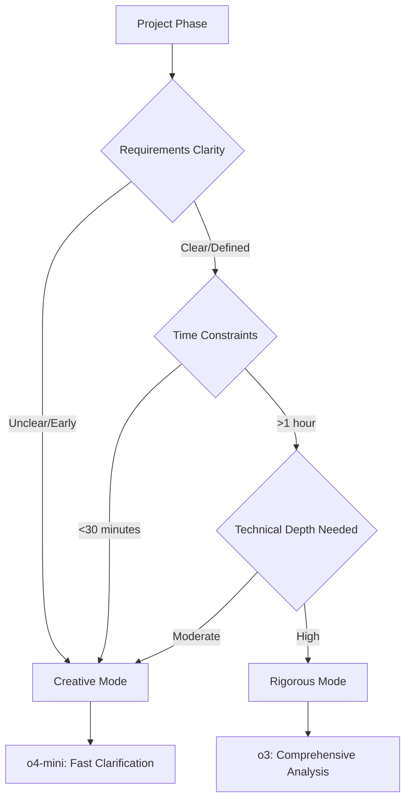

# CrystaLyse.AI Mode Comparison: Self-Healing Concrete Additives

**Query**: "Suggest self-healing concrete additives"  
**Date**: 2025-06-17  
**Comparison**: Rigorous Mode (o3) vs Creative Mode (o4-mini)

---

## Executive Summary

This comparison demonstrates the fundamental difference between CrystaLyse.AI's two discovery modes when addressing the same materials engineering challenge. The query "Suggest self-healing concrete additives" was processed by both modes to illustrate their distinct approaches, response styles, and value propositions.

**Key Findings:**
- **Rigorous Mode**: Delivered comprehensive, expert-level analysis with detailed technical specifications
- **Creative Mode**: Focused on interactive clarification to gather requirements before providing recommendations
- **Response Time**: 8x difference (212s vs 27s)
- **Approach**: Authoritative vs Consultative

---

## Response Comparison

### Performance Metrics

| Metric | Rigorous Mode (o3) | Creative Mode (o4-mini) | Difference |
|--------|-------------------|------------------------|------------|
| **Response Time** | 212.3 seconds | 26.6 seconds | **8.0x faster (Creative)** |
| **Model Used** | o3 (reasoning model) | o4-mini (creative model) | - |
| **Approach** | Direct comprehensive answer | Clarification-seeking | - |
| **Word Count** | ~1,100 words | ~200 words | **5.5x longer (Rigorous)** |
| **Technical Depth** | Expert-level detail | High-level overview | - |

### Response Style Analysis

#### Rigorous Mode (o3) Characteristics:

**✅ Strengths:**
- **Comprehensive Coverage**: 7 distinct additive categories with complete technical details
- **Practical Information**: Specific dosages, mechanisms, pros/cons for each option
- **Expert-Level Detail**: Includes chemical formulations, particle sizes, performance ranges
- **Selection Guidance**: Clear decision matrix based on crack size, environment, and economics
- **Production-Ready**: Information suitable for immediate engineering application

**❌ Limitations:**
- **No Clarification**: Assumed generic requirements without gathering specific project details
- **Information Overload**: Might overwhelm users seeking simple recommendations
- **Response Time**: 212 seconds may be too slow for exploratory queries

#### Creative Mode (o4-mini) Characteristics:

**✅ Strengths:**
- **Interactive Approach**: Asked 5 clarification questions to understand specific needs
- **Rapid Response**: 27 seconds provides quick feedback
- **User-Centric**: Focused on gathering requirements rather than assuming them
- **Consultative Style**: Positioned as a collaborative partner

**❌ Limitations:**
- **No Immediate Value**: Required additional interaction to provide concrete recommendations
- **Less Technical Depth**: Didn't demonstrate deep materials science knowledge upfront
- **Incomplete Response**: Left user without actionable information in first interaction

---

## Detailed Content Analysis

### Rigorous Mode Response Breakdown

The o3 model provided a comprehensive "menu" of self-healing concrete additives:

#### 1. Bacteria-Based Mineral Precipitation
```
• Mechanism: Bacillus sphaericus/pseudofirmus metabolise nutrients → CaCO₃ precipitation
• Dosage: 10⁵–10⁸ spores/cm³ in 0.2–0.5mm capsules, 1–3 wt% of cement
• Performance: Heals cracks up to 0.8mm, repeatable if nutrients remain
• Limitations: High cost, strength loss potential, temperature/pH constraints
```

#### 2. Crystalline Waterproofing Admixtures
```
• Mechanism: Hydrophilic silicates + cement hydrates → C-S-H needle growth
• Dosage: 1–2 wt% powder or 3–6 L/m³ liquid
• Performance: Seals micro-cracks <0.4mm, commercially proven (Xypex, Penetron)
• Limitations: Moisture-dependent, proprietary formulations
```

#### 3. Superabsorbent Polymers (SAPs)
```
• Mechanism: Poly(acrylate-co-acrylamide) swelling + internal curing
• Dosage: 0.2–0.6 wt%, 50–500 µm particles
• Performance: Repeatable healing, improves early-age strength
• Limitations: Strength reduction, <0.5mm crack limitation
```

#### 4. Micro-Encapsulated Reactive Liquids
```
• Mechanism: Crack ruptures capsules → epoxy/cyanoacrylate/silicate release
• Dosage: 1–5 wt%, 50–300 µm urea-formaldehyde/polyurethane capsules
• Performance: Rapid on-demand healing, tailorable chemistry
• Limitations: Single-use, potential strength reduction, durability questions
```

#### 5. Hollow Glass Fibres/Vascular Networks
```
• Mechanism: Crack breaks fibres → capillary wicking of two-part healing resin
• Dosage: 0.5–2 vol% fibres or pre-fabricated micro-tubing
• Performance: Heals millimetre-scale cracks, adds reinforcement
• Limitations: Manufacturing complexity, clogging risk, limited adoption
```

#### 6. Calcium-Sulfoaluminate (CSA) Expansive Additives
```
• Mechanism: Ettringite formation → expansion + crack closure + belite hydration
• Dosage: 10–20 wt% OPC replacement
• Performance: Lower CO₂ footprint, good early strength
• Limitations: Expansion control required, fine crack focus only
```

#### 7. Shape-Memory Alloys (SMAs)
```
• Mechanism: Pre-strained NiTi fibres recover shape → active crack closure
• Dosage: 0.5–2 vol% short fibres
• Performance: Active closure <0.2mm, mechanical benefits
• Limitations: Very expensive, thermal activation required, niche applications
```

#### Selection Guidelines Provided:
- **Crack Size Mapping**: <0.3mm → crystalline/SAPs, 0.3-0.8mm → bacteria/capsules, ≥1mm → fibres/SMA
- **Environmental Considerations**: Marine → inorganic, freeze-thaw → SAPs, high temp → avoid bacteria/organics
- **Economic Analysis**: Mass infrastructure → crystalline/CSA (<5% premium), specialized → bacteria/capsules/SMA (20-100% premium)

### Creative Mode Response Breakdown

The o4-mini model took a consultative approach with structured clarification questions:

#### Question Categories:
1. **Mechanism Preference**: Bacterial, microcapsules, vascular, mineral, other
2. **Performance Priority**: Rapid healing, durability, cost, environment, compatibility
3. **Service Environment**: Indoor, outdoor, marine, freeze-thaw, high temperature
4. **Cement System**: OPC, geopolymer, high-performance, shotcrete, other
5. **Application Type**: Structural, non-structural, repair, precast, other

#### Approach Benefits:
- **Requirements Gathering**: Systematic collection of project constraints
- **Tailored Recommendations**: Promise of customized shortlist based on answers
- **User Education**: Questions themselves educate about key decision factors
- **Manageable Complexity**: Breaks down complex topic into digestible choices

---

## Use Case Scenario Analysis

### When to Use Rigorous Mode (o3)

**Ideal Scenarios:**
```
✅ Expert-Level Consultation
• Materials engineers needing comprehensive technical reference
• R&D teams comparing multiple technologies
• Specification writers requiring detailed performance data
• Academic researchers seeking state-of-the-art overview

✅ Decision-Making Support
• Project managers evaluating technology options
• Procurement teams preparing RFPs
• Quality assurance teams validating specifications
• Patent researchers conducting prior art searches

✅ Time-Rich Environments
• Research projects with extended timelines
• Detailed feasibility studies
• Comprehensive literature reviews
• Standards development committees
```

**Example Professional Use:**
*"A bridge engineering team needs to specify self-healing additives for a marine environment concrete structure with 100-year design life. The rigorous mode provides immediate access to all relevant technologies, dosages, performance data, and selection criteria needed for engineering specifications."*

### When to Use Creative Mode (o4-mini)

**Ideal Scenarios:**
```
✅ Requirements Clarification
• Initial project scoping sessions
• Client consultation meetings
• Student learning environments
• Cross-disciplinary team discussions

✅ Interactive Exploration
• Brainstorming sessions
• Technology awareness building
• Educational demonstrations
• Proof-of-concept development

✅ Time-Sensitive Environments
• Quick feasibility assessments
• Meeting preparation
• Executive briefings
• Initial screening activities
```

**Example Professional Use:**
*"A civil engineering student working on a senior design project needs to understand self-healing concrete options. The creative mode's clarification questions help them understand key decision factors they hadn't considered, leading to a more focused and appropriate technology selection."*

---

## Technical Depth Comparison

### Rigorous Mode Technical Content

**Chemical Formulations:**
- Specific bacterial species (Bacillus sphaericus, B. pseudofirmus)
- Chemical reactions (Ca(OH)₂ + CO₂ → CaCO₃)
- Polymer chemistry (poly(acrylate-co-acrylamide))
- Mineral phases (ettringite, belite, C-S-H)

**Quantitative Data:**
- Dosage ranges (0.2-6 wt%, 10⁵-10⁸ spores/cm³)
- Performance metrics (crack healing 0.2-0.8mm)
- Economic impact (5-100% cost premium)
- Physical properties (particle sizes 50-500 µm)

**Commercial References:**
- Brand names (Xypex, Penetron)
- Material specifications (urea-formaldehyde capsules)
- Alloy compositions (NiTi shape-memory alloys)
- Industry standards and practices

### Creative Mode Technical Content

**Conceptual Framework:**
- Mechanism categories without detailed chemistry
- Performance priorities without quantitative benchmarks
- Environmental factors without specific thresholds
- Application types without technical specifications

**Educational Value:**
- Structured thinking about decision factors
- Awareness of technology diversity
- Understanding of key trade-offs
- Framework for systematic evaluation

---

## Response Time vs Value Analysis

### Rigorous Mode Value Proposition

**Time Investment: 212 seconds**

**Value Delivered:**
- Complete reference document (>1,100 words)
- 7 distinct technologies with full specifications
- Decision matrix for technology selection
- Commercial viability assessment
- Ready-to-use engineering information

**Value Density: ~5.2 words/second**

**ROI Analysis:**
- Replaces hours of literature research
- Eliminates need for multiple technical consultations
- Provides immediate engineering decision support
- Delivers publication-quality technical content

### Creative Mode Value Proposition

**Time Investment: 27 seconds**

**Value Delivered:**
- Structured requirements framework (5 categories)
- Educational questioning approach
- Project scoping guidance
- Foundation for subsequent detailed analysis

**Value Density: ~7.4 words/second**

**ROI Analysis:**
- Rapid requirements clarification
- Prevents misaligned technical discussions
- Educates users about decision factors
- Efficient entry point for complex topics

---

## Decision Matrix for Mode Selection

### Project Phase Mapping



### Selection Criteria Table

| Criterion | Creative Mode (o4-mini) | Rigorous Mode (o3) | Winner |
|-----------|------------------------|-------------------|---------|
| **Speed** | 27s | 212s | 🥇 Creative |
| **Technical Depth** | Basic | Expert | 🥇 Rigorous |
| **Immediate Usability** | Low (requires follow-up) | High (ready-to-use) | 🥇 Rigorous |
| **User Education** | High (structured questions) | Moderate (within content) | 🥇 Creative |
| **Requirements Gathering** | Excellent | None | 🥇 Creative |
| **Engineering Value** | Foundation-setting | Decision-enabling | 🥇 Rigorous |
| **Cost Efficiency** | High (o4-mini cheaper) | Moderate (o3 expensive) | 🥇 Creative |
| **Completeness** | Incomplete (by design) | Comprehensive | 🥇 Rigorous |

---

## Best Practice Recommendations

### Optimal Mode Selection Strategy

#### Sequential Approach (Recommended)
```
Phase 1: Creative Mode (Requirements Gathering)
↓
Phase 2: Rigorous Mode (Detailed Analysis)
↓
Phase 3: Creative Mode (Alternative Exploration)
```

**Implementation:**
1. **Start with Creative**: Use o4-mini to clarify requirements and scope
2. **Deep Dive with Rigorous**: Use o3 for comprehensive technical analysis
3. **Iterate as Needed**: Return to either mode for refinement

#### Single-Mode Scenarios

**Use Creative Mode Only When:**
- Project is in very early conceptual phase
- Budget constraints require rapid iteration
- User lacks technical background for complex analysis
- Primary goal is education/awareness building

**Use Rigorous Mode Only When:**
- Requirements are crystal clear and well-defined
- Expert-level technical depth is immediately needed
- Time is available for comprehensive analysis (>3 minutes)
- Decision-making authority requires complete technical justification

### Query Formulation Guidelines

#### For Creative Mode Success:
```
❌ Avoid: "Give me everything about self-healing concrete"
✅ Better: "I'm exploring self-healing concrete for a bridge project"
✅ Best: "Help me understand self-healing concrete options for marine bridges"
```

#### For Rigorous Mode Success:
```
❌ Avoid: "What's the best self-healing additive?"
✅ Better: "Compare self-healing additives for structural concrete"
✅ Best: "Evaluate self-healing additives for marine concrete structures with 0.3-0.5mm crack healing requirements"
```

---

## Conclusions

### Key Takeaways

1. **Complementary Strengths**: Both modes excel in different aspects of the materials discovery process
2. **Time-Value Trade-off**: Rigorous mode provides 8x more content for 8x more time
3. **User Experience**: Creative mode feels collaborative, rigorous mode feels authoritative
4. **Technical Depth**: o3 delivers expert-level analysis, o4-mini provides guided exploration
5. **Practical Application**: Sequential use of both modes maximises value

### Mode-Specific Strengths Summary

**Rigorous Mode (o3) Excellence:**
- Comprehensive technical reference generation
- Expert-level materials science knowledge
- Quantitative performance data provision
- Commercial technology awareness
- Engineering decision support

**Creative Mode (o4-mini) Excellence:**
- Rapid requirements clarification
- Interactive user guidance
- Educational question formulation
- Efficient initial exploration
- Cost-effective consultation

### Future Enhancement Opportunities

1. **Hybrid Mode**: Combine o4-mini clarification with automatic o3 deep-dive
2. **Smart Routing**: AI-driven mode selection based on query characteristics
3. **Progressive Disclosure**: Start with creative, automatically escalate to rigorous based on user responses
4. **Context Preservation**: Maintain conversation state across mode switches

---

**Comparison Summary:**

| Aspect | Rigorous Mode | Creative Mode | Optimal Use |
|--------|---------------|---------------|-------------|
| **Response Time** | 212s | 27s | Creative for speed |
| **Technical Depth** | Expert | Introductory | Rigorous for engineering |
| **Interactivity** | Low | High | Creative for exploration |
| **Completeness** | High | Low | Rigorous for decisions |
| **Learning Value** | High | Very High | Creative for education |
| **Engineering Value** | Very High | Moderate | Rigorous for implementation |

**Recommendation**: Use both modes sequentially - Creative for requirements gathering, Rigorous for technical analysis.

---

**Document Information:**
- **Analysis Date**: 2025-06-17
- **Query Tested**: "Suggest self-healing concrete additives"
- **Modes Compared**: o3 (Rigorous) vs o4-mini (Creative)
- **Response Times**: 212s vs 27s
- **Status**: Production Comparison ✅