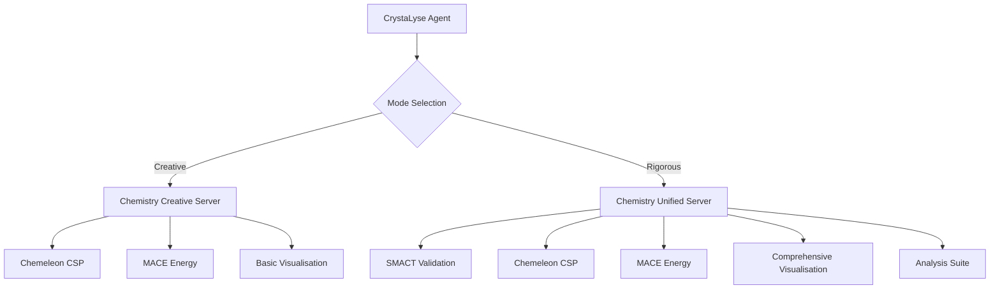

# Analysis Modes

CrystaLyse.AI provides two complementary analysis modes that map to different MCP server configurations, allowing you to balance speed and thoroughness based on your research needs.

## Overview

| Mode | Speed | Tools Used | Use Case |
|------|-------|------------|----------|
| **Creative** | ~50 seconds | Chemeleon + MACE + Visualisation | Fast exploration, idea generation, initial screening |
| **Rigorous** | 2-5 minutes | SMACT + Chemeleon + MACE + Visualisation + Analysis Suite | Complete validation, publication-ready results, detailed analysis |

## Creative Mode

### Purpose
Fast materials exploration and structure generation without extensive validation. Ideal for:
- Initial concept exploration
- Rapid prototyping of materials ideas
- Interactive sessions with quick feedback
- Educational demonstrations

### MCP Server Mapping
Creative mode uses the **Chemistry Creative Server** (`chemistry-creative-server`):

```python
# Tools available in creative mode
- Chemeleon CSP: Crystal structure prediction
- MACE: Formation energy calculations  
- Visualisation: 3D structure rendering
# Not included: SMACT validation (for speed)
```

### Workflow
1. **Input**: Natural language materials query
2. **Structure Generation**: Chemeleon generates multiple candidate structures
3. **Energy Evaluation**: MACE calculates formation energies for ranking
4. **Visualisation**: Automatic 3D structure files created
5. **Output**: Ranked structures with energies and interactive visualisations

### Example Usage

```bash
# Command line
crystalyse analyse "Find perovskite solar cell materials" --mode creative

# In unified interface
crystalyse
> /mode creative
> Design high-capacity battery cathodes

# In chat session
crystalyse chat -m creative
```

### Output Structure
```
Creative Mode Results:
├── Structure Generation: 3-5 candidates per composition
├── Energy Ranking: Formation energies (eV/atom)
├── 3D Visualisations: Interactive HTML files
└── Summary: Most stable structures identified
```

## Rigorous Mode

### Purpose
Complete materials validation with comprehensive analysis. Ideal for:
- Publication-quality research
- Detailed materials characterisation
- Validation of creative mode results
- Professional materials design projects

### MCP Server Mapping
Rigorous mode uses the **Chemistry Unified Server** (`chemistry-unified-server`):

```python
# Complete tool suite in rigorous mode
- SMACT: Composition validation and screening
- Chemeleon CSP: Crystal structure prediction
- MACE: Formation energy calculations
- Visualisation: 3D structures + analysis plots
- Pymatviz: XRD patterns, RDF analysis, coordination analysis
```

### Workflow
1. **Input**: Natural language materials query
2. **Composition Validation**: SMACT screens for chemically reasonable compositions
3. **Structure Generation**: Chemeleon generates structures for valid compositions
4. **Energy Evaluation**: MACE calculates detailed energetics
5. **Comprehensive Analysis**: XRD patterns, radial distribution functions, coordination analysis
6. **Visualisation**: 3D structures + professional analysis plots
7. **Output**: Complete materials characterisation package

### Example Usage

```bash
# Command line
crystalyse analyse "Validate CsSnI3 for photovoltaic applications" --mode rigorous

# In unified interface
crystalyse
> /mode rigorous
> Analyse LiCoO2 cathode stability

# In chat session
crystalyse chat -m rigorous -s detailed_study
```

### Output Structure
```
Rigorous Mode Results:
├── SMACT Validation: Composition feasibility screening
├── Structure Generation: Multiple candidates with validation
├── Energy Analysis: Formation energies + stability metrics
├── 3D Visualisations: Interactive molecular viewers
├── Analysis Suite:
│   ├── XRD_Pattern_[formula].pdf
│   ├── RDF_Analysis_[formula].pdf
│   ├── Coordination_Analysis_[formula].pdf
│   └── [formula].cif
└── Comprehensive Report: Complete materials characterisation
```

## Mode Switching

### In Unified Interface

```bash
crystalyse  # Launch unified interface

# Switch modes during session
> /mode creative    # Fast exploration
> /mode rigorous    # Complete validation
```

### In Chat Sessions

```bash
crystalyse chat -u researcher -s project_name

# Switch modes within session
🔬 You: /mode rigorous
✅ System: Mode switched to Rigorous
🔬 You: Now analyse the stability in detail
```

### Command Line

```bash
# Specify mode per analysis
crystalyse analyse "query" --mode creative
crystalyse analyse "query" --mode rigorous
```

## Choosing the Right Mode

### Use Creative Mode When:
- **Exploring ideas**: Initial brainstorming and concept validation
- **Time-sensitive**: Need quick results for decisions or presentations
- **Interactive sessions**: Real-time exploration with immediate feedback
- **Educational**: Teaching materials concepts with visual feedback
- **Screening**: Rapid evaluation of multiple concepts

### Use Rigorous Mode When:
- **Research publications**: Need comprehensive validation and analysis
- **Professional projects**: Client work requiring complete characterisation
- **Validation**: Confirming creative mode results with full analysis
- **Detailed studies**: Understanding materials properties in depth
- **Regulatory submissions**: Need complete documentation and traceability

## Performance Characteristics

### Creative Mode Performance
```bash
Typical Execution Times:
├── Simple queries: 30-50 seconds
├── Complex materials: 1-2 minutes
├── Multiple compositions: 2-3 minutes
└── Batch analysis: 5-10 minutes

Resource Usage:
├── CPU: Moderate (structure prediction)
├── GPU: Optional (MACE calculations)
├── Memory: 4-6 GB
└── Storage: ~50 MB per analysis
```

### Rigorous Mode Performance
```bash
Typical Execution Times:
├── Simple queries: 2-3 minutes
├── Complex materials: 3-5 minutes
├── Detailed analysis: 5-10 minutes
└── Batch analysis: 15-30 minutes

Resource Usage:
├── CPU: High (full analysis suite)
├── GPU: Recommended (MACE + visualisation)
├── Memory: 6-8 GB
└── Storage: ~200 MB per analysis
```

## Technical Implementation

### MCP Server Architecture



### Tool Availability by Mode

| Tool | Creative Mode | Rigorous Mode | Purpose |
|------|---------------|---------------|---------|
| SMACT | ❌ | ✅ | Composition validation |
| Chemeleon | ✅ | ✅ | Structure prediction |
| MACE | ✅ | ✅ | Energy calculations |
| 3D Visualisation | ✅ | ✅ | Interactive structures |
| XRD Analysis | ❌ | ✅ | Diffraction patterns |
| RDF Analysis | ❌ | ✅ | Structural analysis |
| Coordination Analysis | ❌ | ✅ | Local environment |

## Best Practices

### Mode Selection Strategy

1. **Start with Creative**: Use for initial exploration and idea generation
2. **Validate with Rigorous**: Confirm promising results with complete analysis
3. **Iterate**: Use creative mode for rapid iteration, rigorous for final validation
4. **Match Context**: Consider time constraints, audience, and required detail level

### Workflow Recommendations

```bash
# Recommended research workflow
1. Initial Exploration (Creative)
   crystalyse analyse "broad query" --mode creative

2. Focused Investigation (Creative)
   crystalyse chat -m creative
   > Refine based on initial results

3. Detailed Validation (Rigorous)
   crystalyse analyse "specific material" --mode rigorous

4. Final Analysis (Rigorous)
   crystalyse chat -m rigorous -s final_study
   > Complete characterisation
```

### Performance Optimisation

- **Creative Mode**: Reduce `num_samples` for faster iteration
- **Rigorous Mode**: Use GPU acceleration for MACE calculations
- **Both Modes**: Enable result caching to avoid redundant calculations
- **Batch Processing**: Group similar queries for efficiency

## Examples

### Creative Mode Example

```bash
crystalyse analyse "Design sodium-ion battery cathodes" --mode creative
```

Output focus:
- Quick structure generation (3-5 candidates)
- Energy ranking for stability
- 3D visualisations for immediate insight
- Recommendations for further investigation

### Rigorous Mode Example

```bash
crystalyse analyse "Characterise Na2FePO4F cathode material" --mode rigorous
```

Output focus:
- SMACT validation of composition
- Multiple structure polymorphs
- Detailed energetic analysis
- Complete structural characterisation
- Professional analysis plots
- Publication-ready results

The choice between creative and rigorous modes allows CrystaLyse.AI to adapt to your specific research needs, from rapid exploration to comprehensive validation.