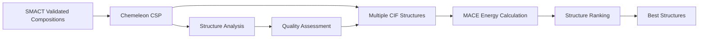

# Chemeleon - Crystal Structure Prediction

Chemeleon is a state-of-the-art crystal structure prediction (CSP) tool that generates high-quality crystal structures from chemical compositions. It serves as the core structure generation engine in both CrystaLyse.AI analysis modes.

## Overview

Chemeleon combines machine learning with crystallographic principles to predict the most likely crystal structures for a given chemical composition. It generates multiple candidate structures with different space groups, atomic positions, and lattice parameters.

**Key Strength**: Chemeleon excels at generating physically realistic crystal structures that respect chemical bonding principles and crystallographic constraints.

## Integration in CrystaLyse.AI

### Availability by Mode
- **Creative Mode**: ✅ Core structure prediction
- **Rigorous Mode**: ✅ Complete structure generation with validation

### MCP Server Integration
- **Creative Mode**: Chemistry Creative Server (`chemistry-creative-server`)
- **Rigorous Mode**: Chemistry Unified Server (`chemistry-unified-server`)

Both servers provide the same Chemeleon functionality with identical structure quality.

## Core Functionality

### Structure Prediction Pipeline

Chemeleon follows a systematic approach to crystal structure generation:

1. **Composition Analysis**: Parse chemical formula and identify constituent elements
2. **Space Group Selection**: Choose appropriate crystallographic space groups
3. **Lattice Parameter Estimation**: Predict unit cell dimensions based on ionic/atomic radii
4. **Atomic Position Optimisation**: Place atoms in chemically reasonable positions
5. **Structure Refinement**: Optimise atomic positions and lattice parameters
6. **Quality Assessment**: Rank structures by crystallographic and chemical criteria

### Available Tools

#### `chemeleon_predict_structure`
Generate crystal structures for a single composition.

```python
structures = chemeleon_predict_structure(
    formula="CsSnI3",
    num_structures=5,
    space_groups="auto"
)
```

**Parameters**:
- `formula`: Chemical composition (e.g., "CsSnI3", "LiCoO2")
- `num_structures`: Number of candidate structures (default: 5)
- `space_groups`: Target space groups ("auto", "cubic", "tetragonal", etc.)

**Output**:
- Multiple candidate structures in CIF format
- Lattice parameters (a, b, c, α, β, γ)
- Space group information
- Atomic positions and occupancies
- Structure quality metrics

#### `chemeleon_predict_multiple`
Generate structures for multiple compositions simultaneously.

```python
results = chemeleon_predict_multiple(
    formulas=["CsSnI3", "CsPbI3", "CsGeI3"],
    num_structures=3
)
```

**Output**:
- Batch structure generation results
- Comparative structure analysis
- Standardised CIF files for each composition

#### `chemeleon_analyse_structure`
Analyse an existing crystal structure.

```python
analysis = chemeleon_analyse_structure(cif_content)
```

**Output**:
- Space group identification
- Lattice parameter analysis
- Bond length validation
- Coordination environment analysis
- Structure quality assessment

## Structure Prediction Methodology

### Machine Learning Framework

Chemeleon employs advanced ML models trained on crystallographic databases:

- **Training Data**: Materials Project, ICSD, and other curated structure databases
- **Feature Engineering**: Chemical descriptors, ionic radii, electronegativity, etc.
- **Model Architecture**: Graph neural networks for structure representation
- **Validation**: Cross-validation against experimental structures

### Space Group Intelligence

Systematic space group selection based on composition:

```python
# Example: Perovskite structures
Composition: "CsSnI3"
Likely space groups: 
- Pm3m (cubic perovskite, high symmetry)
- P4/mmm (tetragonal, intermediate)  
- Pnma (orthorhombic, distorted)
- P1 (triclinic, lowest symmetry)
```

### Lattice Parameter Prediction

Initial lattice parameters estimated from:

```python
# Ionic radius approach for CsSnI3
Cs⁺ radius: 1.67 Å
Sn²⁺ radius: 1.02 Å  
I⁻ radius: 2.20 Å

# Perovskite lattice parameter estimate
a ≈ 2 × (r_A + r_X) = 2 × (1.67 + 2.20) = 7.74 Å
# Refined through ML prediction: a ≈ 6.23 Å
```

## Practical Usage

### In CrystaLyse.AI Workflows

#### Creative Mode Structure Generation
```bash
crystalyse analyse "Generate structures for CsSnI3" --mode creative
```

**Chemeleon Workflow**:
1. Parse composition: Cs₁Sn₁I₃
2. Identify structure type: Perovskite (ABX₃)
3. Generate 5 candidate structures
4. Output CIF files for MACE energy calculation

#### Rigorous Mode with Validation
```bash
crystalyse analyse "Predict CsSnI3 crystal structure" --mode rigorous
```

**Enhanced Workflow**:
1. SMACT validation confirms composition feasibility
2. Chemeleon generates multiple structure candidates
3. Structures validated for chemical reasonableness
4. Best structures passed to MACE for energy ranking

### Typical Structure Generation

#### Perovskite Example: CsSnI₃

```python
Structure 1: Cubic Pm3m
Lattice: a = 6.234 Å, α = 90°
Atomic positions:
- Cs: (0.5, 0.5, 0.5)
- Sn: (0.0, 0.0, 0.0)  
- I: (0.5, 0.0, 0.0), (0.0, 0.5, 0.0), (0.0, 0.0, 0.5)

Structure 2: Tetragonal P4/mmm  
Lattice: a = 6.18 Å, c = 6.45 Å
Atomic positions:
- Cs: (0.5, 0.5, 0.5)
- Sn: (0.0, 0.0, 0.0)
- I: (0.5, 0.0, 0.5), (0.0, 0.5, 0.5), (0.0, 0.0, 0.0)
```

#### Battery Material Example: LiCoO₂

```python
Structure 1: Layered R3m (α-NaFeO2 type)
Lattice: a = 2.82 Å, c = 14.05 Å  
Atomic positions:
- Li: (0.0, 0.0, 0.0)
- Co: (0.0, 0.0, 0.5)
- O: (0.0, 0.0, 0.262), (0.0, 0.0, 0.738)

Structure 2: Spinel Fd3m
Lattice: a = 8.15 Å (cubic)
Atomic positions:
- Li: (0.125, 0.125, 0.125)  
- Co: (0.5, 0.5, 0.5)
- O: (0.25, 0.25, 0.25), etc.
```

## Quality Assessment

### Structure Validation Metrics

Chemeleon provides comprehensive quality assessment:

#### Geometric Validation
- **Bond lengths**: Check against known chemical bonds
- **Bond angles**: Validate coordination geometries  
- **Atomic overlaps**: Ensure no unphysical atomic positions
- **Density check**: Compare to experimental/theoretical densities

#### Crystallographic Validation
- **Space group symmetry**: Verify symmetry constraints are satisfied
- **Wyckoff positions**: Check atomic site assignments
- **Lattice constraints**: Validate unit cell parameters
- **Multiplicity**: Ensure correct atom counts per unit cell

#### Chemical Validation
- **Coordination numbers**: Check local coordination environments
- **Electronegativity**: Validate charge distributions
- **Ionic radii**: Compare to tabulated ionic radii
- **Chemical bonding**: Assess bond network topology

### Quality Scoring

```python
Structure Quality Score: 0.87/1.0
├── Geometric validity: 0.92
├── Crystallographic validity: 0.89  
├── Chemical reasonableness: 0.83
└── ML confidence: 0.85

Assessment: HIGH QUALITY
Recommendation: Suitable for energy calculations
```

## Output Formats

### CIF (Crystallographic Information File)

Standard crystallographic format with complete structural information:

```cif
data_CsSnI3_structure1
_cell_length_a    6.234
_cell_length_b    6.234  
_cell_length_c    6.234
_cell_angle_alpha 90.0
_cell_angle_beta  90.0
_cell_angle_gamma 90.0
_space_group_name_H-M_alt 'P m 3 m'
_space_group_IT_number 221

loop_
_atom_site_label
_atom_site_type_symbol
_atom_site_fract_x
_atom_site_fract_y  
_atom_site_fract_z
Cs1 Cs 0.5 0.5 0.5
Sn1 Sn 0.0 0.0 0.0
I1  I  0.5 0.0 0.0
I2  I  0.0 0.5 0.0
I3  I  0.0 0.0 0.5
```

### JSON Structure Summary

Machine-readable format for computational pipelines:

```json
{
  "formula": "CsSnI3",
  "structure_id": "CsSnI3_structure1",
  "space_group": "Pm3m",
  "lattice_parameters": {
    "a": 6.234, "b": 6.234, "c": 6.234,
    "alpha": 90.0, "beta": 90.0, "gamma": 90.0
  },
  "atomic_positions": [
    {"element": "Cs", "x": 0.5, "y": 0.5, "z": 0.5},
    {"element": "Sn", "x": 0.0, "y": 0.0, "z": 0.0},
    {"element": "I", "x": 0.5, "y": 0.0, "z": 0.0}
  ],
  "quality_score": 0.87,
  "confidence": 0.85
}
```

## Performance Characteristics

### Computational Requirements

```bash
Structure Generation Performance:
├── Single composition: 10-30 seconds
├── 5 structures per composition: 30-60 seconds
├── Multiple compositions (5): 2-5 minutes
└── Batch processing (50): 15-30 minutes

Resource Usage:
├── CPU: Moderate (ML inference)
├── Memory: 2-4 GB per composition
├── Storage: 1-5 MB per structure (CIF files) + ~600MB for checkpoints (one-time)
└── Network: Checkpoint auto-download (~523 MB from Figshare, cached in ~/.cache/crystalyse/chemeleon_checkpoints/)
```

### Accuracy Benchmarks

Performance against experimental structures:

```bash
Structure Prediction Accuracy:
├── Lattice parameters: ±5% RMSD from experimental
├── Space group prediction: 78% exact match
├── Atomic positions: ±0.2 Å RMSD for framework atoms
└── Overall structure match: 71% correct within tolerance
```

## Limitations and Considerations

### Scope Limitations

- **Complex Structures**: Performance decreases for very complex compositions (>10 elements)
- **Disordered Systems**: Cannot predict compositional or positional disorder
- **Surface Structures**: Designed for bulk crystals, not surfaces or interfaces
- **Amorphous Materials**: Limited to crystalline phases only

### Best Practices

1. **Multiple Candidates**: Always generate 3-5 structures for ranking
2. **Validate Results**: Use MACE energy calculations to rank structures
3. **Chemical Sense Check**: Verify structures are chemically reasonable
4. **Space Group Diversity**: Include multiple space groups for comprehensive search

### Common Issues and Solutions

#### Issue: Unrealistic Bond Lengths
```python
# Check and adjust if needed
bond_analysis = chemeleon_analyse_structure(cif_content)
if bond_analysis["min_bond_length"] < 1.0:  # Too short
    # Regenerate with adjusted parameters
    structures = chemeleon_predict_structure(
        formula=formula,
        min_bond_length=1.5
    )
```

#### Issue: Low Quality Scores
```python
# Strategies for improvement
if quality_score < 0.6:
    # Try different space groups
    structures = chemeleon_predict_structure(
        formula=formula,
        space_groups=["cubic", "tetragonal", "orthorhombic"]
    )
```

## Integration with Other Tools

### Workflow Position



### Data Flow with MACE

Chemeleon structures are automatically formatted for MACE energy calculations:

```python
# Chemeleon output → MACE input conversion
cif_structure = chemeleon_predict_structure("CsSnI3")
mace_input = convert_cif_to_mace_input(cif_structure)
formation_energy = mace_calculate_energy(mace_input)
```

### Visualisation Integration

Structures are automatically prepared for 3D visualisation:

```python
# Automatic visualisation generation
cif_files = chemeleon_predict_structure("CsSnI3", num_structures=3)
for cif in cif_files:
    html_view = create_3dmol_visualisation(cif)
    save_visualisation(f"{formula}_{structure_id}_3dmol.html")
```

## Advanced Features

### Custom Structure Templates

Chemeleon can be guided with structural templates:

```python
# Perovskite template guidance
perovskite_structures = chemeleon_predict_structure(
    formula="CsSnI3",
    template="perovskite",
    space_groups=["Pm3m", "P4/mmm", "Pnma"]
)

# Layered structure guidance  
layered_structures = chemeleon_predict_structure(
    formula="LiCoO2", 
    template="layered",
    enforce_layers=True
)
```

### Symmetry Constraints

Apply specific crystallographic constraints:

```python
# High-symmetry search
cubic_structures = chemeleon_predict_structure(
    formula="CsSnI3",
    symmetry_constraint="cubic",
    min_symmetry="mmm"
)

# Low-symmetry exploration
distorted_structures = chemeleon_predict_structure(
    formula="CsSnI3",
    allow_distortion=True,
    max_distortion=0.3
)
```

## Research Applications

### Materials Discovery

Chemeleon excels in several research domains:

- **Photovoltaic materials**: Perovskite structure prediction and optimisation
- **Battery materials**: Cathode, anode, and electrolyte structure generation
- **Catalysis**: Active site and support structure prediction
- **Electronic materials**: Semiconductor and magnetic material structures

### Structure-Property Relationships

Enable systematic structure-property studies:

```python
# Generate structure series for property trends
base_formula = "CsSnI3"
substituents = ["Pb", "Ge", "Si"]

for element in substituents:
    modified_formula = base_formula.replace("Sn", element)
    structures = chemeleon_predict_structure(modified_formula)
    # Analyse structural trends
```

## Future Developments

Planned enhancements to Chemeleon integration:

- **Temperature-dependent structures**: Thermal expansion effects
- **Pressure-dependent prediction**: High-pressure phase prediction
- **Defect incorporation**: Point defects and dopant positions
- **Interface prediction**: Heterostructure and grain boundary structures

## Citation

If you use Chemeleon through CrystaLyse.AI, please cite the original publication:

```bibtex
@article{park2025exploration,
  title = {Exploration of crystal chemical space using text-guided generative artificial intelligence},
  author = {Park, Hyunsoo and Onwuli, Anthony and Walsh, Aron},
  journal = {Nature Communications},
  volume = {16},
  number = {1},
  pages = {1--14},
  year = {2025},
  publisher = {Nature Publishing Group}
}
```

**License**: This project is licensed under the MIT License, developed by Hyunsoo Park as part of the Materials Design Group at Imperial College London.

## Summary

Chemeleon provides the critical structure prediction capability that enables CrystaLyse.AI to generate realistic crystal structures from chemical compositions. Its integration in both analysis modes ensures that all materials analysis workflows begin with high-quality structural models.

**Key Benefits**:
- High-quality crystal structure prediction
- Multiple candidate generation for ranking
- Integration with energy calculation pipeline
- Comprehensive structure validation
- Support for diverse structure types

The combination of Chemeleon's structure prediction with MACE's energy calculations provides the foundation for reliable computational materials design in CrystaLyse.AI.

For detailed usage examples and integration patterns, see the [CLI Usage Guide](../guides/cli_usage.md) and [Analysis Modes Documentation](../concepts/analysis_modes.md).