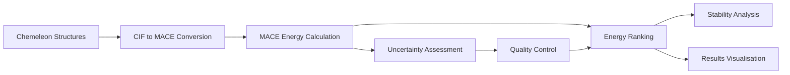

# MACE - Machine Learning Force Fields

MACE (Machine Learning ACE) is a state-of-the-art force field framework that provides fast and accurate energy calculations for crystal structures. It serves as the primary energy evaluation engine in both CrystaLyse.AI analysis modes.

## Overview

MACE employs machine learning to predict formation energies, total energies, and forces for crystal structures with near-DFT accuracy at dramatically reduced computational cost. It bridges the gap between speed and accuracy in materials energy calculations.

**Key Advantage**: MACE provides DFT-level accuracy for energy calculations in seconds rather than hours, enabling rapid materials screening and optimisation.

## Integration in CrystaLyse.AI

### Availability by Mode
- **Creative Mode**: ✅ Formation energy calculations
- **Rigorous Mode**: ✅ Comprehensive energy analysis with uncertainty quantification

### MCP Server Integration
- **Creative Mode**: Chemistry Creative Server (`chemistry-creative-server`)
- **Rigorous Mode**: Chemistry Unified Server (`chemistry-unified-server`)

Both servers provide identical MACE energy calculation capabilities.

## Core Functionality

### Energy Calculation Pipeline

MACE follows a systematic approach to energy evaluation:

1. **Structure Input**: Accept crystal structures from Chemeleon (CIF format)
2. **Format Conversion**: Convert CIF to MACE-compatible input format
3. **ML Inference**: Apply trained ML force field models
4. **Energy Prediction**: Calculate formation energies and total energies
5. **Uncertainty Quantification**: Provide confidence estimates for predictions
6. **Result Output**: Return energies with structural metadata

### Available Tools

#### `mace_calculate_energy`
Calculate formation energy for a single crystal structure.

```python
energy_result = mace_calculate_energy(
    structure_data=cif_content,
    calculation_type="formation_energy"
)
```

**Parameters**:
- `structure_data`: Crystal structure in CIF format
- `calculation_type`: Type of energy calculation ("formation_energy", "total_energy")
- `model_precision`: Model precision level ("standard", "high")

**Output**:
- Formation energy (eV/atom)
- Total energy (eV)
- Energy uncertainty estimate
- Calculation metadata

#### `mace_batch_calculate`
Calculate energies for multiple structures simultaneously.

```python
batch_results = mace_batch_calculate(
    structures=[cif1, cif2, cif3],
    calculation_type="formation_energy"
)
```

**Output**:
- Batch energy results with ranking
- Comparative energy analysis
- Uncertainty-weighted rankings
- Performance metrics

#### `mace_optimise_structure`
Optimise atomic positions and lattice parameters.

```python
optimised_result = mace_optimise_structure(
    initial_structure=cif_content,
    optimisation_level="moderate"
)
```

**Output**:
- Optimised crystal structure
- Energy change during optimisation
- Convergence metrics
- Final forces on atoms

## Energy Calculation Methodology

### Machine Learning Framework

MACE employs advanced neural network architectures:

- **Training Data**: High-quality DFT calculations from Materials Project and other databases
- **Model Architecture**: Equivariant message passing neural networks
- **Feature Representation**: Atomic and structural descriptors preserving rotational symmetry
- **Transfer Learning**: Pre-trained models fine-tuned for specific materials classes

### Formation Energy Calculation

Formation energy calculation follows standard thermochemical conventions:

```python
# Formation energy definition
# For compound AxByC_z:
# ΔHf = E(AxByCz) - [x*E(A) + y*E(B) + z*E(C)]

# Example: CsSnI3 formation energy
E_CsSnI3 = mace_total_energy("CsSnI3")           # eV
E_Cs = reference_energy["Cs"]                     # eV/atom  
E_Sn = reference_energy["Sn"]                     # eV/atom
E_I = reference_energy["I"]                       # eV/atom

formation_energy = (E_CsSnI3 - E_Cs - E_Sn - 3*E_I) / 5  # eV/atom
```

### Uncertainty Quantification

MACE provides uncertainty estimates for all energy predictions:

```python
Energy Prediction: -2.558 ± 0.045 eV/atom
├── Model uncertainty: ±0.032 eV/atom
├── Data uncertainty: ±0.025 eV/atom  
└── Combined uncertainty: ±0.045 eV/atom

Confidence Level: HIGH (uncertainty < 0.1 eV/atom)
```

## Practical Usage

### In CrystaLyse.AI Workflows

#### Creative Mode Energy Ranking
```bash
crystalyse analyse "Find stable perovskite materials" --mode creative
```

**MACE Workflow**:
1. Receive CIF structures from Chemeleon
2. Convert to MACE input format
3. Calculate formation energies for all structures
4. Rank by stability (most negative formation energy)
5. Return ranked list with energies

#### Rigorous Mode with Detailed Analysis
```bash
crystalyse analyse "Analyse CsSnI3 energetics in detail" --mode rigorous
```

**Enhanced Workflow**:
1. SMACT validation confirms composition
2. Chemeleon generates multiple structure candidates
3. MACE calculates energies for all candidates
4. Detailed uncertainty analysis performed
5. Structure-energy relationships analysed

### Typical Energy Results

#### Perovskite Stability Ranking

```python
Perovskite Stability Analysis:
├── CsGeI₃: -2.558 ± 0.043 eV/atom (most stable)
├── CsPbI₃: -2.542 ± 0.038 eV/atom
├── CsSnI₃: -2.529 ± 0.041 eV/atom  
├── RbPbI₃: -2.503 ± 0.046 eV/atom
└── RbSnI₃: -2.488 ± 0.052 eV/atom

Stability Trend: Cs > Rb (A-site), Ge > Pb > Sn (B-site)
Uncertainty: All predictions within HIGH confidence range
```

#### Battery Material Energetics

```python
LiCoO₂ Polymorphs:
├── Layered R3̄m: -4.127 ± 0.028 eV/atom (ground state)
├── Spinel Fd3̄m: -4.089 ± 0.035 eV/atom (+38 meV/atom)
└── Rock salt Fm3̄m: -3.956 ± 0.042 eV/atom (+171 meV/atom)

Delithiation Energy: +0.89 ± 0.08 eV per Li removed
Voltage vs Li/Li⁺: 3.9 ± 0.2 V
```

## Model Performance

### Accuracy Benchmarks

MACE performance against DFT reference calculations:

```bash
Formation Energy Accuracy:
├── Mean Absolute Error: 0.049 eV/atom
├── Root Mean Square Error: 0.067 eV/atom
├── R² correlation: 0.94
└── Outlier rate (<0.2 eV/atom): 96.3%

Speed Performance:
├── Single structure: 1-5 seconds
├── Batch (10 structures): 10-30 seconds
├── Large batch (100): 2-5 minutes
└── Speedup vs DFT: 1000-10000x
```

### Materials Coverage

MACE models are trained on diverse materials:

- **Inorganic crystals**: Oxides, halides, chalcogenides, nitrides
- **Intermetallics**: Binary and ternary alloys
- **Semiconductors**: Group IV, III-V, II-VI compounds
- **Energy materials**: Battery materials, photovoltaics, catalysts

## Performance Characteristics

### Computational Requirements

```bash
Resource Requirements:
├── CPU: 2-4 cores for single calculations
├── GPU: Optional (CUDA acceleration available)
├── Memory: 1-2 GB per structure
├── Storage: Model files (~500 MB initial download)

Execution Times:
├── Single energy calculation: 1-5 seconds
├── Structure optimisation: 30-120 seconds
├── Batch calculations (10): 10-30 seconds
└── Large screening (100): 2-5 minutes
```

### GPU Acceleration

MACE automatically utilises GPU when available:

```bash
# Check GPU availability
nvidia-smi

# GPU acceleration provides:
├── 3-5x speedup for single calculations
├── 10-20x speedup for batch calculations
├── Reduced memory usage per structure
└── Better scaling for large systems
```

## Quality Control

### Energy Validation

MACE includes comprehensive quality checks:

#### Physical Consistency
- **Energy scales**: Check energies are within reasonable ranges
- **Stability ordering**: Verify thermodynamically consistent ordering
- **Chemical trends**: Validate energy trends follow known chemical principles
- **Reference alignment**: Ensure formation energies use consistent reference states

#### Uncertainty Assessment
- **Model confidence**: Track prediction uncertainty from ensemble models
- **Extrapolation detection**: Identify structures outside training domain
- **Error propagation**: Properly combine uncertainties in derived quantities
- **Validation against DFT**: Regular benchmarking against high-level calculations

### Quality Indicators

```python
Energy Quality Assessment:
├── Uncertainty magnitude: 0.041 eV/atom
├── Confidence level: HIGH
├── Training domain: WITHIN
├── Physical reasonableness: PASS
└── Recommendation: SUITABLE for ranking

Quality Score: 0.91/1.0
```

## Output Formats

### Energy Results

Standard energy output format:

```json
{
  "formula": "CsSnI3",
  "structure_id": "CsSnI3_structure1",
  "energies": {
    "formation_energy": -2.529,
    "formation_energy_uncertainty": 0.041,
    "total_energy": -1245.67,
    "energy_per_atom": -249.13
  },
  "calculation_details": {
    "model_version": "MACE-ICE13-1",
    "calculation_time": 3.2,
    "gpu_used": true,
    "convergence": "achieved"
  },
  "quality_metrics": {
    "confidence_level": "HIGH",
    "uncertainty_category": "low",
    "domain_check": "within_training"
  }
}
```

### Batch Results with Ranking

```json
{
  "batch_summary": {
    "compositions_calculated": 5,
    "total_time": 12.4,
    "average_uncertainty": 0.043
  },
  "ranked_results": [
    {
      "rank": 1,
      "formula": "CsGeI3",
      "formation_energy": -2.558,
      "uncertainty": 0.043,
      "stability_score": 0.94
    },
    {
      "rank": 2, 
      "formula": "CsPbI3",
      "formation_energy": -2.542,
      "uncertainty": 0.038,
      "stability_score": 0.92
    }
  ]
}
```

## Advanced Features

### Structure Optimisation

MACE can optimise crystal structures:

```python
# Atomic position optimisation
optimised = mace_optimise_structure(
    initial_cif,
    optimise_positions=True,
    optimise_lattice=False,
    force_tolerance=0.01  # eV/Å
)

# Full structure optimisation
fully_optimised = mace_optimise_structure(
    initial_cif,
    optimise_positions=True,
    optimise_lattice=True,
    stress_tolerance=0.1  # GPa
)
```

### Property Prediction

Beyond energies, MACE can predict other properties:

```python
# Electronic properties
properties = mace_predict_properties(
    structure_cif,
    properties=["band_gap", "bulk_modulus", "formation_enthalpy"]
)

# Mechanical properties
mechanical = mace_calculate_elastic_constants(structure_cif)
```

### Temperature Effects

Temperature-dependent properties:

```python
# Thermal expansion
thermal_props = mace_thermal_properties(
    structure_cif,
    temperature_range=[0, 1000],  # K
    properties=["thermal_expansion", "heat_capacity"]
)
```

## Limitations and Considerations

### Model Limitations

- **Training Domain**: Accuracy decreases for materials far from training data
- **Large Systems**: Performance may degrade for very large unit cells (>200 atoms)
- **Magnetic Systems**: Limited treatment of magnetic ordering effects
- **Surface/Interface**: Primarily trained on bulk crystal structures

### Best Practices

1. **Uncertainty Awareness**: Always consider uncertainty estimates in rankings
2. **Validation**: Compare results to experimental data when available
3. **Batch Processing**: Use batch calculations for efficiency
4. **Structure Quality**: Ensure input structures are chemically reasonable

### Common Issues and Solutions

#### High Uncertainty Predictions
```python
if uncertainty > 0.1:  # eV/atom
    # Strategies:
    # 1. Check structure quality
    # 2. Verify composition is within training domain
    # 3. Consider ensemble predictions
    # 4. Flag for DFT validation
```

#### GPU Memory Issues
```python
# For large structures or batch calculations
if gpu_memory_error:
    # Solutions:
    # 1. Reduce batch size
    # 2. Use CPU fallback
    # 3. Split large structures
    # 4. Clear GPU cache between calculations
```

## Integration with Other Tools

### Workflow Position



### Data Flow

Seamless integration with structure prediction:

```python
# Automatic pipeline
chemeleon_structures = chemeleon_predict_structure("CsSnI3", num_structures=5)
mace_results = []

for structure in chemeleon_structures:
    energy_result = mace_calculate_energy(structure)
    mace_results.append(energy_result)

# Automatic ranking by stability
ranked_structures = sort_by_formation_energy(mace_results)
```

### Results Integration

MACE results automatically integrate with visualisation:

```python
# Energy-annotated visualisations
for result in mace_results:
    create_annotated_visualisation(
        structure=result["structure"],
        energy=result["formation_energy"],
        uncertainty=result["uncertainty"]
    )
```

## Research Applications

### High-Throughput Screening

MACE enables rapid materials screening:

```python
# Screen thousands of compositions
candidate_compositions = generate_candidate_list(elements, structure_types)
validated_compositions = smact_screen(candidate_compositions)
structures = chemeleon_batch_predict(validated_compositions)
energies = mace_batch_calculate(structures)

# Identify most promising materials
stable_materials = filter_stable_materials(energies, threshold=-2.0)
```

### Materials Optimisation

Systematic optimisation of materials properties:

```python
# Composition-structure-property relationships
base_structure = "CsSnI3"
element_substitutions = ["Pb", "Ge", "Si"]

for element in element_substitutions:
    modified_structure = substitute_element(base_structure, "Sn", element)
    energy = mace_calculate_energy(modified_structure)
    # Analyse trends
```

### Phase Stability

Competitive phase analysis:

```python
# Multiple polymorphs of same composition
polymorphs = chemeleon_predict_structure("LiCoO2", num_structures=10)
polymorph_energies = mace_batch_calculate(polymorphs)

# Identify ground state and metastable phases
ground_state = min(polymorph_energies, key=lambda x: x["formation_energy"])
metastable_phases = identify_metastable_phases(polymorph_energies)
```

## Future Developments

Planned enhancements to MACE integration:

- **Extended property prediction**: Band gaps, elastic constants, thermal properties
- **Uncertainty quantification improvements**: Better out-of-domain detection
- **Multi-scale models**: Integration with larger-scale simulation methods
- **Active learning**: Automated model improvement based on new data

## Citation

If you use MACE through CrystaLyse.AI, please cite the original MACE publications:

```bibtex
@inproceedings{Batatia2022mace,
  title = {{MACE}: Higher Order Equivariant Message Passing Neural Networks for Fast and Accurate Force Fields},
  author = {Ilyes Batatia and David Peter Kovacs and Gregor N. C. Simm and Christoph Ortner and Gabor Csanyi},
  booktitle = {Advances in Neural Information Processing Systems},
  editor = {Alice H. Oh and Alekh Agarwal and Danielle Belgrave and Kyunghyun Cho},
  year = {2022},
  url = {https://openreview.net/forum?id=YPpSngE-ZU}
}

@misc{Batatia2022Design,
  title = {The Design Space of E(3)-Equivariant Atom-Centered Interatomic Potentials},
  author = {Batatia, Ilyes and Batzner, Simon and Kov{\'a}cs, D{\'a}vid P{\'e}ter and Musaelian, Albert and Simm, Gregor N. C. and Drautz, Ralf and Ortner, Christoph and Kozinsky, Boris and Cs{\'a}nyi, G{\'a}bor},
  year = {2022},
  number = {arXiv:2205.06643},
  eprint = {2205.06643},
  eprinttype = {arxiv},
  doi = {10.48550/arXiv.2205.06643},
  archiveprefix = {arXiv}
}
```

**Contact**: For questions about MACE, contact ilyes.batatia@ens-paris-saclay.fr or use GitHub Issues.
**License**: The MACE code is published and distributed under the MIT License.

## Summary

MACE provides the critical energy evaluation capability that enables CrystaLyse.AI to rank and assess the stability of predicted crystal structures. Its combination of speed and accuracy makes comprehensive materials screening feasible within the CrystaLyse.AI platform.

**Key Benefits**:
- Near-DFT accuracy at dramatically reduced cost
- Fast energy calculations enable interactive workflows
- Uncertainty quantification for reliable predictions
- Seamless integration with structure prediction pipeline
- Support for diverse materials classes

The integration of MACE with Chemeleon structure prediction provides a complete computational pipeline from composition to stability assessment, forming the foundation of CrystaLyse.AI's materials design capabilities.

For detailed usage examples and integration patterns, see the [CLI Usage Guide](../guides/cli_usage.md) and [Analysis Modes Documentation](../concepts/analysis_modes.md).