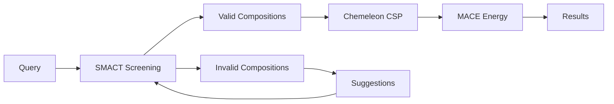

# SMACT - Semiconducting Materials from Analogy and Chemical Theory

SMACT is a computational framework for rapid screening of materials compositions based on chemical analogy and electronegativity principles. In CrystaLyse.AI, SMACT serves as the primary composition validation tool in rigorous mode.

## Overview

SMACT screens millions of possible chemical compositions to identify those most likely to be chemically reasonable and synthesisable. This screening dramatically reduces the search space before expensive structure prediction and energy calculations.

**Key Principle**: Materials with similar chemical properties (oxidation states, electronegativity differences) to known stable compounds are more likely to be synthesisable.

## Integration in CrystaLyse.AI

### Availability by Mode
- **Creative Mode**: ❌ Not included (for speed)
- **Rigorous Mode**: ✅ Full validation pipeline

### MCP Server Integration
SMACT is integrated through the **Chemistry Unified Server** (`chemistry-unified-server`) which provides the complete validation pipeline for rigorous analysis.

## Core Functionality

### Composition Screening

SMACT validates compositions based on:

1. **Oxidation State Analysis**: Checks if the proposed oxidation states are chemically reasonable
2. **Electronegativity Ratios**: Validates whether the electronegativity differences support the proposed bonding
3. **Chemical Analogy**: Compares to known stable compounds with similar chemistries
4. **Charge Balance**: Ensures overall electrical neutrality

### Available Tools

#### `smact_screen`
Screens multiple compositions for chemical feasibility.

```python
# Example compositions screened
compositions = ["CsSnI3", "CsPbI3", "CsGeI3", "RbSnI3", "RbPbI3"]
results = smact_screen(compositions)
```

**Output**:
- Valid compositions with confidence scores
- Rejection reasons for invalid compositions
- Suggested modifications for near-valid compositions

#### `smact_validate_single`
Validates a single composition in detail.

```python
result = smact_validate_single("CsSnI3")
```

**Output**:
- Detailed oxidation state analysis
- Electronegativity compatibility assessment
- Chemical analogy matches
- Confidence score (0-1)

#### `smact_suggest_analogues`
Finds chemical analogues to a given composition.

```python
analogues = smact_suggest_analogues("CsPbI3")
```

**Output**:
- Structurally similar compounds
- Element substitution suggestions
- Stability predictions based on analogies

## Screening Methodology

### Oxidation State Rules

SMACT applies systematic rules for oxidation state assignments:

```python
# Example: CsSnI3 validation
Cs: +1 (Group 1, typical oxidation state)
Sn: +2 (Group 14, common oxidation state)  
I:  -1 (Group 17, typical halide state)
Charge balance: 1 + 2 + 3(-1) = 0 ✓
```

### Electronegativity Analysis

Validates bonding based on Pauling electronegativity differences:

```python
# Electronegativity values (Pauling scale)
Cs: 0.79
Sn: 1.96  
I:  2.66

# Bond analysis
Cs-I: |0.79 - 2.66| = 1.87 (ionic character expected) ✓
Sn-I: |1.96 - 2.66| = 0.70 (polar covalent) ✓
```

### Chemical Analogy Database

SMACT references a database of known stable compounds to assess feasibility:

- **Perovskites**: ABX₃ structures with known stable examples
- **Binary Compounds**: Simple AX, AX₂ compositions
- **Ternary Systems**: ABC, AB₂C, ABC₂ compositions
- **Complex Compositions**: Multi-component materials

## Practical Usage

### In CrystaLyse.AI Workflows

#### Rigorous Mode Analysis
```bash
crystalyse analyse "Find stable perovskite solar cell materials" --mode rigorous
```

**SMACT Workflow**:
1. Generate candidate perovskite compositions (ABX₃)
2. Screen each composition for chemical feasibility
3. Rank valid compositions by confidence score
4. Pass validated compositions to Chemeleon for structure prediction

#### Session-Based Research
```bash
crystalyse chat -m rigorous -s perovskite_study

🔬 You: What makes CsSnI3 chemically feasible as a perovskite?

🤖 CrystaLyse: [SMACT validation runs automatically]
Based on SMACT analysis:
- Cs⁺ (ionic radius: 1.67 Å) fits well in A-site
- Sn²⁺ (ionic radius: 1.02 Å) suitable for B-site  
- I⁻ (ionic radius: 2.20 Å) forms stable halide framework
- Electronegativity differences support ionic bonding
- Chemical analogy to CsPbI₃ (known stable perovskite)
```

### Typical Results

#### Valid Composition Example
```python
Composition: "CsSnI3"
SMACT Result: {
    "valid": True,
    "confidence": 0.87,
    "oxidation_states": {"Cs": 1, "Sn": 2, "I": -1},
    "electronegativity_check": "PASS",
    "known_analogues": ["CsPbI3", "CsGeI3"],
    "notes": "Strong analogy to known perovskites"
}
```

#### Invalid Composition Example
```python
Composition: "CsF4O3"  
SMACT Result: {
    "valid": False,
    "confidence": 0.12,
    "rejection_reason": "Charge imbalance",
    "attempted_states": {"Cs": 1, "F": -1, "O": -2},
    "charge_sum": -6,
    "suggestions": ["CsF", "Cs2O"]
}
```

## Limitations and Considerations

### Scope Limitations

- **Kinetic Barriers**: SMACT only considers thermodynamic feasibility, not synthesis kinetics
- **Metastable Phases**: May miss metastable materials that are synthetically accessible
- **Novel Chemistries**: Conservative approach may reject genuinely novel but stable compositions
- **Complex Structures**: Primarily designed for simple ionic/covalent materials

### Best Practices

1. **Use as Pre-Filter**: SMACT is most effective as an initial screening step
2. **Validate Results**: Always follow SMACT screening with structure prediction and energy calculations
3. **Consider Context**: Materials requirements may justify exploring SMACT-rejected compositions
4. **Iterative Refinement**: Use SMACT suggestions to refine composition search

### Performance Characteristics

```bash
Screening Performance:
├── Single Composition: <1 second
├── Small Set (5-10): 1-3 seconds  
├── Medium Set (50-100): 10-30 seconds
└── Large Set (1000+): 2-5 minutes

Memory Usage:
├── Database Loading: ~100 MB
├── Per Composition: ~1 KB
└── Large Screening: ~500 MB maximum
```

## Integration with Other Tools

### Workflow Position


### Data Flow

1. **Input**: List of target compositions from materials query
2. **SMACT Processing**: Chemical feasibility validation
3. **Output**: Filtered list of chemically reasonable compositions
4. **Handoff**: Valid compositions sent to Chemeleon for structure prediction

### Error Handling

SMACT provides graceful degradation:

```python
# If SMACT validation fails
if smact_error:
    log_warning("SMACT validation failed, proceeding without pre-filtering")
    # Continue with all compositions
    proceed_to_structure_prediction(all_compositions)
else:
    # Use SMACT-validated compositions
    proceed_to_structure_prediction(valid_compositions)
```

## Advanced Features

### Custom Screening Rules

SMACT can be configured with custom screening parameters:

```python
# Stricter screening for experimental work
strict_rules = {
    "max_electronegativity_diff": 2.0,
    "require_known_analogues": True,
    "min_confidence": 0.7
}

# Exploratory screening for novel materials
exploratory_rules = {
    "max_electronegativity_diff": 3.5,
    "require_known_analogues": False,
    "min_confidence": 0.3
}
```

### Composition Generation

SMACT can also generate new compositions based on structural templates:

```python
# Generate perovskite compositions
perovskites = smact_generate_perovskites(
    a_site_elements=["Cs", "Rb", "K"],
    b_site_elements=["Sn", "Pb", "Ge"], 
    x_site_elements=["I", "Br", "Cl"]
)
```

## Research Applications

### Materials Discovery Pipelines

SMACT is particularly valuable for:

- **High-throughput screening**: Reducing computational cost by pre-filtering
- **Novel composition discovery**: Finding chemically reasonable but unexplored materials
- **Substitution studies**: Systematically exploring element substitutions
- **Materials optimisation**: Refining compositions for specific properties

### Success Stories

Research areas where SMACT has proven particularly effective:

- **Photovoltaic perovskites**: Screening lead-free alternatives
- **Battery materials**: Identifying new cathode and electrolyte compositions
- **Thermoelectric materials**: Exploring complex multi-component systems
- **Magnetic materials**: Validating rare-earth based compositions

## Future Developments

SMACT continues to evolve with new features planned:

- **Machine learning integration**: ML-enhanced feasibility prediction
- **Kinetic considerations**: Incorporation of synthesis accessibility metrics
- **Database expansion**: Addition of more complex structure types
- **Property prediction**: Direct property prediction from composition

## Citation

If you use SMACT through CrystaLyse.AI, please cite the original SMACT publications:

```bibtex
@article{park2024mapping,
  title = {Mapping inorganic crystal chemical space},
  author = {H. Park and others},
  journal = {Faraday Discussions},
  year = {2024}
}

@article{davies2019smact,
  title = {SMACT: Semiconducting Materials by Analogy and Chemical Theory},
  author = {D. W. Davies and others},
  journal = {Journal of Open Source Software},
  volume = {4},
  number = {38},
  pages = {1361},
  year = {2019}
}

@article{davies2018materials,
  title = {Materials discovery by chemical analogy: role of oxidation states in structure prediction},
  author = {D. W. Davies and others},
  journal = {Faraday Discussions},
  volume = {211},
  pages = {553},
  year = {2018}
}

@article{davies2016computational,
  title = {Computational screening of all stoichiometric inorganic materials},
  author = {D. W. Davies and others},
  journal = {Chem},
  volume = {1},
  pages = {617},
  year = {2016}
}

@article{pamplin1964systematic,
  title = {A systematic method of deriving new semiconducting compounds by structural analogy},
  author = {B. R. Pamplin},
  journal = {Journal of Physics and Chemistry of Solids},
  volume = {25},
  pages = {675},
  year = {1964}
}
```

## Summary

SMACT provides the essential first step in rigorous materials validation, ensuring that computational resources are focused on chemically reasonable compositions. Its integration in CrystaLyse.AI's rigorous mode provides the foundation for reliable, scientifically grounded materials design workflows.

**Key Benefits**:
- Rapid composition screening (seconds to minutes)
- Chemical feasibility validation
- Reduction of computational waste
- Integration with structure prediction pipeline
- Research-grade reliability

For detailed usage examples and advanced features, see the [CLI Usage Guide](../guides/cli_usage.md) and [Rigorous Mode Documentation](../concepts/analysis_modes.md).