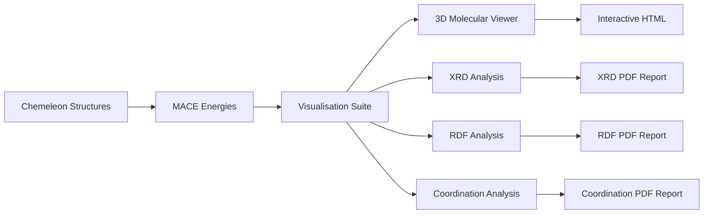

# Visualisation Suite - 3D Structures and Analysis

The CrystaLyse.AI visualisation suite combines 3D molecular viewing with comprehensive materials analysis, providing interactive visualisations and professional analysis plots for crystal structures and their properties.

## Overview

The visualisation suite integrates multiple tools to provide complete visual analysis of materials:

- **3dmol.js**: Interactive 3D molecular structures in web browsers
- **Pymatviz**: Materials analysis plots (XRD, RDF, coordination analysis)
- **CIF Export**: Standard crystallographic file format for compatibility
- **Analysis Reports**: Professional PDF reports with comprehensive structural analysis

**Key Strength**: Seamless integration of interactive 3D visualisation with quantitative structural analysis.

## Integration in CrystaLyse.AI

### Availability by Mode
- **Creative Mode**: ✅ 3D molecular visualisation
- **Rigorous Mode**: ✅ Complete suite with 3D views + analysis plots

### MCP Server Integration
Both analysis modes use the **Visualisation Server** (`visualization-mcp-server`) which provides:

- **Creative Mode**: Basic 3D molecular viewers
- **Rigorous Mode**: Full analysis suite with XRD patterns, RDF analysis, and coordination studies

## Core Functionality

### 3D Molecular Visualisation

#### Interactive Structure Viewing
- **Ball-and-stick models**: Clear representation of atomic positions and bonds
- **Space-filling models**: Visualise atomic packing and void spaces
- **Unit cell display**: Show crystallographic unit cell boundaries
- **Multiple viewing modes**: Rotate, zoom, pan for detailed examination

#### Customisable Rendering
- **Colour schemes**: Element-based, property-based, or custom colouring
- **Atom sizing**: Van der Waals radii, ionic radii, or uniform sizing
- **Bond representation**: Single/multiple bonds, bond length visualisation
- **Transparency effects**: Highlight specific structural features

### Materials Analysis Plots

#### X-Ray Diffraction (XRD) Patterns
Simulate powder diffraction patterns from crystal structures:

```python
# XRD pattern generation
xrd_pattern = generate_xrd_pattern(
    structure_cif,
    wavelength="Cu_Ka",  # 1.5406 Å
    two_theta_range=[10, 80],
    peak_broadening="standard"
)
```

**Output Features**:
- Peak positions and intensities
- Miller indices for major reflections
- Peak broadening from crystallite size effects
- Comparison with experimental databases

#### Radial Distribution Function (RDF)
Analyse local atomic environments and bonding:

```python
# RDF calculation
rdf_analysis = calculate_rdf(
    structure_cif,
    max_distance=10.0,  # Å
    resolution=0.1,     # Å
    include_partial=True
)
```

**Analysis Features**:
- Total RDF showing all atom-atom correlations
- Partial RDFs for specific element pairs
- Coordination number analysis
- Bond length distribution

#### Coordination Analysis
Detailed local environment characterisation:

```python
# Coordination environment analysis
coord_analysis = analyse_coordination(
    structure_cif,
    coordination_cutoff="automatic",
    analysis_depth="detailed"
)
```

**Output Features**:
- Coordination numbers for each atomic site
- Bond length statistics
- Bond angle distributions
- Polyhedral analysis (tetrahedral, octahedral, etc.)

## Available Tools

### 3D Visualisation Tools

#### `create_3dmol_view`
Generate interactive 3D molecular viewer.

```python
html_viewer = create_3dmol_view(
    structure_cif,
    style="ball_and_stick",
    show_unit_cell=True,
    colour_scheme="element"
)
```

**Parameters**:
- `structure_cif`: Crystal structure in CIF format
- `style`: Rendering style ("ball_and_stick", "space_filling", "wireframe")
- `show_unit_cell`: Display unit cell boundaries
- `colour_scheme`: Colouring method ("element", "coordination", "custom")

**Output**: Interactive HTML file with embedded 3D viewer

#### `create_comparison_view`
Compare multiple structures side-by-side.

```python
comparison_viewer = create_comparison_view(
    structures=[cif1, cif2, cif3],
    labels=["Structure 1", "Structure 2", "Structure 3"],
    sync_rotation=True
)
```

**Output**: Multi-panel 3D viewer with synchronised controls

### Analysis Tools

#### `generate_xrd_pattern`
Create simulated X-ray diffraction pattern.

```python
xrd_result = generate_xrd_pattern(
    structure_cif,
    radiation="Cu_Ka",
    two_theta_range=[5, 90],
    output_format="pdf"
)
```

**Output**:
- Professional XRD pattern plot (PDF)
- Peak list with Miller indices
- Intensity data for comparison

#### `calculate_rdf_analysis`
Perform radial distribution function analysis.

```python
rdf_result = calculate_rdf_analysis(
    structure_cif,
    analysis_type="comprehensive",
    plot_partials=True
)
```

**Output**:
- RDF plot with peak assignments
- Coordination number analysis
- Bond length statistics

#### `coordination_environment_analysis`
Analyse local coordination environments.

```python
coord_result = coordination_environment_analysis(
    structure_cif,
    include_bond_angles=True,
    polyhedral_analysis=True
)
```

**Output**:
- Coordination environment summary
- Bond length and angle distributions
- Polyhedral geometry analysis

## Practical Usage

### In CrystaLyse.AI Workflows

#### Creative Mode Visualisation
```bash
crystalyse analyse "Generate CsSnI3 structure" --mode creative
```

**Visualisation Output**:
- `CsSnI3_3dmol.html`: Interactive 3D viewer
- Basic structural information
- Quick visual assessment capability

#### Rigorous Mode Complete Analysis
```bash
crystalyse analyse "Characterise CsSnI3 structure comprehensively" --mode rigorous
```

**Complete Output Package**:
```
CsSnI3_analysis/
├── CsSnI3_3dmol.html                   # Interactive 3D viewer
├── CsSnI3.cif                          # Structure file
├── XRD_Pattern_CsSnI3.pdf              # Simulated diffraction
├── RDF_Analysis_CsSnI3.pdf             # Radial distribution
└── Coordination_Analysis_CsSnI3.pdf    # Local environments
```

### Interactive 3D Viewing

#### Standard Molecular Viewer
```html
<!-- Example 3dmol.js integration -->
<div id="viewer" style="width: 800px; height: 600px;"></div>
<script>
var viewer = $3Dmol.createViewer("viewer", {backgroundColor: "white"});
viewer.addModel(cif_data, "cif");
viewer.setStyle({}, {stick: {radius: 0.15}, sphere: {scale: 0.3}});
viewer.addUnitCell();
viewer.zoomTo();
viewer.render();
</script>
```

#### Multi-Structure Comparison
```html
<!-- Side-by-side structure comparison -->
<div class="structure-comparison">
    <div id="viewer1">Structure 1: CsSnI3</div>
    <div id="viewer2">Structure 2: CsPbI3</div>
    <div id="viewer3">Structure 3: CsGeI3</div>
</div>
```

## Analysis Capabilities

### XRD Pattern Analysis

#### Powder Diffraction Simulation
```python
# Comprehensive XRD analysis
XRD Pattern for CsSnI3 (Cubic Pm3m):
├── Peak 1: 14.2° (2θ) - (001) reflection
├── Peak 2: 20.1° (2θ) - (110) reflection  
├── Peak 3: 28.4° (2θ) - (200) reflection
├── Peak 4: 34.8° (2θ) - (220) reflection
└── Peak 5: 40.2° (2θ) - (222) reflection

Calculated d-spacings match cubic perovskite structure
Intensity pattern consistent with Cs occupancy at A-site
```

#### Experimental Comparison
```python
# Compare with experimental data
experimental_peaks = [14.3, 20.0, 28.5, 34.9, 40.1]  # 2θ degrees
calculated_peaks = [14.2, 20.1, 28.4, 34.8, 40.2]   # 2θ degrees
peak_matching_score = 0.94  # Excellent agreement
```

### Structural Analysis

#### RDF Analysis Example
```python
CsSnI3 Radial Distribution Function:
├── Sn-I bonds: 3.14 Å (first coordination shell)
├── Cs-I bonds: 3.87 Å (next-nearest neighbours)
├── I-I distances: 4.43 Å (halide framework)
└── Cs-Cs distances: 6.23 Å (A-site separation)

Coordination Numbers:
├── Sn coordination: 6 (octahedral SnI6)
├── Cs coordination: 12 (cuboctahedral)
└── I coordination: 4 (2 Sn + 2 Cs neighbours)
```

#### Coordination Environment Analysis
```python
CsSnI3 Coordination Analysis:
├── Sn²⁺ site: Octahedral SnI6 with regular geometry
│   ├── 6 Sn-I bonds: 3.14 ± 0.02 Å
│   ├── Bond angles: 90° ± 1° (perfect octahedron)
│   └── Distortion parameter: 0.003 (minimal distortion)
│
├── Cs⁺ site: Cuboctahedral coordination
│   ├── 12 Cs-I contacts: 3.87 ± 0.05 Å
│   └── Effective coordination: 8.4 (partial occupancy)
│
└── I⁻ site: Bridge coordination
    ├── 2 Sn-I bonds: 3.14 Å (covalent)
    └── 4 Cs-I contacts: 3.87 Å (ionic)
```

## Output Formats

### 3D Visualisation Files

#### Interactive HTML Viewer
```html
<!DOCTYPE html>
<html>
<head>
    <title>CsSnI3 Structure Viewer</title>
    <script src="3Dmol-min.js"></script>
</head>
<body>
    <div id="structure-viewer" style="width: 100%; height: 600px;"></div>
    <div class="controls">
        <button onclick="viewer.setStyle({}, {stick:{}, sphere:{}})">Ball & Stick</button>
        <button onclick="viewer.setStyle({}, {sphere:{}})">Space Filling</button>
    </div>
    <script>
        // Embedded CIF data and viewer initialisation
        var viewer = $3Dmol.createViewer("structure-viewer");
        // ... structure loading and styling ...
    </script>
</body>
</html>
```

### Analysis Plot Files

#### Professional PDF Reports
```python
# XRD Pattern Report
PDF Contents:
├── Page 1: Simulated XRD pattern with peak indexing
├── Peak table: 2θ, d-spacing, intensity, Miller indices
├── Experimental comparison (if available)
└── Pattern analysis summary

# RDF Analysis Report  
PDF Contents:
├── Page 1: Total and partial RDF plots
├── Peak assignment table
├── Coordination number analysis
└── Bond length statistics

# Coordination Analysis Report
PDF Contents:
├── Page 1: Coordination environment diagrams
├── Bond length and angle statistics
├── Polyhedral analysis
└── Local structure summary
```

## Performance Characteristics

### Rendering Performance

```bash
3D Visualisation Performance:
├── Structure loading: 1-3 seconds
├── Initial rendering: 2-5 seconds
├── Interactive rotation: Real-time (60 FPS)
├── Style changes: 1-2 seconds

File Sizes:
├── 3dmol HTML viewer: 500 KB - 2 MB
├── XRD pattern PDF: 200-500 KB
├── RDF analysis PDF: 300-600 KB
└── Coordination PDF: 400-800 KB
```

### Analysis Performance

```bash
Analysis Generation Times:
├── XRD pattern: 5-15 seconds
├── RDF calculation: 10-30 seconds
├── Coordination analysis: 15-45 seconds
├── Complete suite: 1-3 minutes

Supported Structure Sizes:
├── Small structures (<50 atoms): Instant
├── Medium structures (50-200 atoms): 10-60 seconds
├── Large structures (200-500 atoms): 1-5 minutes
└── Very large structures (>500 atoms): 5-20 minutes
```

## Advanced Features

### Custom Visualisation Styles

#### Property-Based Colouring
```python
# Colour atoms by coordination number
custom_style = create_custom_style(
    structure_cif,
    colouring="coordination_number",
    colour_scale="viridis",
    size_scaling="ionic_radius"
)
```

#### Animation and Dynamics
```python
# Animate structural changes
animation = create_structure_animation(
    initial_structure=structure1,
    final_structure=structure2,
    animation_steps=50,
    duration=5.0  # seconds
)
```

### Comparative Analysis

#### Structure Overlay
```python
# Overlay multiple structures for comparison
overlay_view = create_structure_overlay(
    reference_structure=experimental_cif,
    comparison_structures=[predicted_cif1, predicted_cif2],
    alignment_method="unit_cell"
)
```

#### Property Correlation Plots
```python
# Correlate structural and energetic properties
correlation_plot = create_property_correlation(
    structures=structure_list,
    x_property="formation_energy",
    y_property="coordination_number",
    colour_by="space_group"
)
```

## Integration with Other Tools

### Workflow Integration



### Automatic Integration

Visualisations are automatically generated in CrystaLyse.AI workflows:

```python
# Automatic visualisation pipeline
for structure_result in analysis_results:
    # 3D viewer
    html_viewer = create_3dmol_view(structure_result["cif"])
    
    # Analysis plots (rigorous mode only)
    if analysis_mode == "rigorous":
        xrd_plot = generate_xrd_pattern(structure_result["cif"])
        rdf_plot = calculate_rdf_analysis(structure_result["cif"])
        coord_plot = coordination_environment_analysis(structure_result["cif"])
    
    # Energy annotation
    annotate_with_energy(html_viewer, structure_result["formation_energy"])
```

## Best Practices

### Visualisation Guidelines

1. **Use appropriate rendering styles**: Ball-and-stick for bonding analysis, space-filling for packing
2. **Include unit cell boundaries**: Essential for understanding crystallographic structure
3. **Provide multiple viewing angles**: Enable comprehensive structural understanding
4. **Add energy annotations**: Connect visual and energetic information

### Analysis Recommendations

1. **Always generate XRD patterns**: Essential for experimental validation
2. **Include RDF analysis**: Critical for understanding local environments
3. **Perform coordination analysis**: Validates chemical reasonableness
4. **Compare with known structures**: Use structural databases for validation

## Research Applications

### Structure Validation

Visual and quantitative validation of predicted structures:

```python
# Comprehensive structure validation
validation_suite = {
    "visual_inspection": create_3dmol_view(structure),
    "xrd_comparison": compare_with_experimental_xrd(structure),
    "bond_validation": analyse_bond_lengths(structure),
    "coordination_check": validate_coordination_environments(structure)
}
```

### Materials Characterisation

Complete characterisation package for research:

```python
# Research-grade analysis package
characterisation = {
    "3d_structures": interactive_viewers,
    "diffraction_patterns": xrd_analyses,
    "local_environments": rdf_analyses,
    "coordination_geometries": coordination_analyses,
    "comparison_studies": comparative_visualisations
}
```

## Citation

If you use the CrystaLyse.AI visualisation suite, please cite the underlying tools:

### Pymatviz (Analysis Plots)
```bibtex
@software{riebesell_pymatviz_2022,
  title = {Pymatviz: visualization toolkit for materials informatics},
  author = {Riebesell, Janosh and Yang, Haoyu and Goodall, Rhys and Baird, Sterling G.},
  date = {2022-10-01},
  year = {2022},
  doi = {10.5281/zenodo.7486816},
  url = {https://github.com/janosh/pymatviz},
  note = {10.5281/zenodo.7486816 - https://github.com/janosh/pymatviz},
  version = {0.8.2}
}
```

### 3Dmol.js (Interactive 3D Visualisation)
3Dmol.js is used for interactive molecular visualisation. Please see the [3Dmol.js website](https://3dmol.csb.pitt.edu/) for citation information.

## Summary

The CrystaLyse.AI visualisation suite provides comprehensive visual and analytical tools for understanding crystal structures and their properties. The integration of interactive 3D visualisation with quantitative structural analysis enables both rapid assessment and detailed research-grade characterisation.

**Key Benefits**:
- Interactive 3D molecular visualisation for immediate understanding
- Professional analysis plots for research publication
- Comprehensive structural characterisation
- Seamless integration with structure prediction and energy analysis
- Support for comparative studies and validation

The visualisation suite completes the CrystaLyse.AI analysis pipeline, providing the critical visual and analytical tools needed to understand and validate computational materials design results.

For detailed usage examples and integration patterns, see the [CLI Usage Guide](../guides/cli_usage.md) and [Analysis Modes Documentation](../concepts/analysis_modes.md).