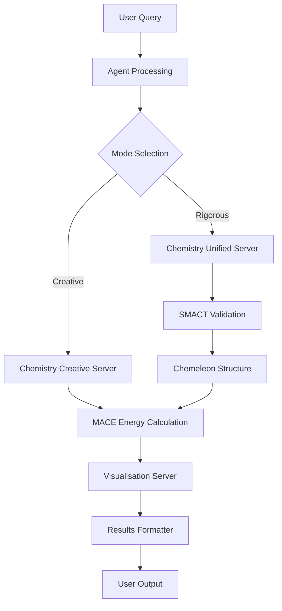

# Crystalyse Architecture Overview

## System Architecture

Crystalyse v1.0.0 implements a  materials discovery platform built on the OpenAI Agents SDK with Model Context Protocol (MCP) integration.

### Core Components

#### 1. Agent System
- **Primary Agent**: `EnhancedCrystaLyseAgent` - Production-grade materials discovery agent
- **OpenAI Agents SDK**: Session management, memory, and tool orchestration
- **Anti-hallucination System**: Computational honesty validation
- **Response Validator**: Prevents fabricated results

#### 2. MCP Server Architecture
```
Chemistry Unified Server (Rigorous Mode)
├── SMACT Validation
├── Chemeleon Structure Generation  
└── MACE Energy Calculations

Chemistry Creative Server (Fast Mode)
├── Chemeleon Structure Generation
└── MACE Energy Calculations

Visualisation Server
├── 3D Molecular Visualisation
├── XRD Pattern Generation
├── RDF Analysis
└── Coordination Environment Analysis
```

#### 3. Memory System (4-Layer Architecture)
1. **Session Memory**: In-memory conversation context
2. **Discovery Cache**: JSON-based computational result storage
3. **User Memory**: Markdown files for preferences and notes
4. **Cross-Session Context**: Auto-generated research summaries

#### 4. Interface Layer
- **Enhanced CLI**: Rich console interface with session management
- **Chat System**: Multi-turn research conversations
- **Clarification Engine**: Intelligent query understanding
- **Progress Tracking**: Real-time tool execution feedback

### Data Flow



### Performance Characteristics

- **Discovery Speed**: 40-45 seconds (target: 2-5 minutes)
- **Session Persistence**: SQLite-based conversation storage
- **Memory Performance**: <100ms retrieval from file-based cache
- **Computational Honesty**: 100% validation against tool outputs
- **Multi-user Support**: Isolated user workspaces

### Security & Validation

- **Tool Result Validation**: All computational claims verified against actual tool outputs
- **Pattern Detection**: Anti-fabrication system identifies hallucinated results
- **Graceful Degradation**: Continues operation when tools are unavailable
- **Error Transparency**: Clear reporting of computational failures

### Integration Points

- **PyMatGen**: Crystal structure manipulation
- **ASE**: Atomic simulation environment
- **MACE**: Machine learning force fields
- **Plotly/PyMatViz**: Scientific visualisation
- **3Dmol.js**: Interactive molecular viewers