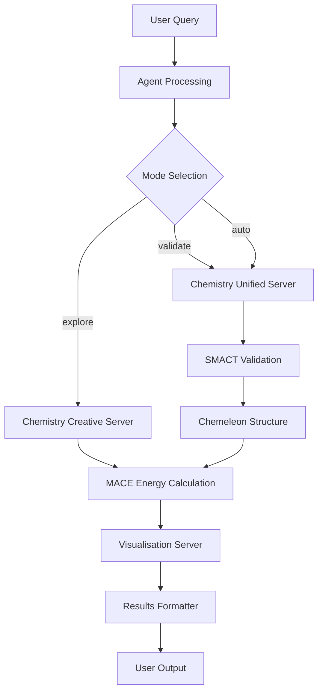

# Crystalyse Architecture Overview

## System Architecture

Crystalyse v1.0.0-dev implements a materials discovery platform built on the OpenAI Agents SDK with Model Context Protocol (MCP) integration.

### Core Components

#### 1. Agent System
- **Primary Agent**: `EnhancedCrystaLyseAgent` (`crystalyse/agents/agents_bridge.py`) - Production-grade materials discovery agent
- **OpenAI Agents SDK**: Session management, memory, and tool orchestration
- **Model Backbone**: selected from the model registry per invocation, not hardcoded - see [Configuration Layer](#2-configuration-layer)
- **Anti-hallucination System**: Computational honesty validation
- **Response Validator**: Prevents fabricated results

#### 2. Configuration Layer

Model selection and runtime settings are resolved before the agent is constructed.

- **`MODEL_REGISTRY`** (`crystalyse/config/models.py`): named backbones, each a
  `ModelConfig` carrying `backend`, `model_id`, `api_key_env_var`, `context_window`,
  `reasoning_effort`, `thinking_budget_tokens` and `supported_modes`. Backends are
  `openai`, `litellm` and `openai-compat`, covering OpenAI, Anthropic, OpenRouter, Mistral
  and a local Ollama endpoint
- **Resolution**: `resolve_model_name()`, `resolve_model_config()` and
  `get_effective_registry()`. `MODE_DEFAULTS` supplies the fallback - explore and auto map
  to `openai_o4_mini`, validate to `openai_o3`
- **Reasoning wiring**: `ModelConfig.agent_model_settings()` translates the declarative
  reasoning fields into each provider's wire format. OpenAI reasoning models receive
  `reasoning=Reasoning(effort=...)`; Anthropic Claude 5 models receive
  `thinking={"type": "adaptive"}` plus `output_config={"effort": ...}`; Claude 4.x models
  receive `thinking={"type": "enabled", "budget_tokens": N}`. LiteLLM parameters travel in
  `extra_args`
- **Settings**: `CrystalyseSettings` (`crystalyse/config/settings.py`) loads
  `.crystalyse/config.toml` with three-layer precedence - project config beats user config
  (`~/.crystalyse/config.toml`) beats built-in defaults
- **Registry overrides**: `[models.<name>]` tables in that file may override the
  *value-like* fields of a built-in entry (a stale provider model ID, say) or define an
  entirely new entry. Capability fields cannot be overridden on a built-in, and an invalid
  table raises `ModelOverrideError` rather than being ignored
  (`crystalyse/config/model_overrides.py`)

#### 3. MCP Server Architecture
```
Chemistry Unified Server (validate and auto modes) - 20 tools
├── SMACT Validation and Screening
├── Chemeleon Structure Generation
├── MACE Energy, Relaxation, Stress and EOS
└── PyMatgen Analysis (space group, coordination,
    oxidation states, energy above hull)

Chemistry Creative Server (explore mode) - 4 tools
├── Chemeleon Structure Generation
└── MACE Energy Calculations
    (no SMACT, deliberately, for speed)

Visualisation Server - 5 tools
├── CIF Export (3dmol.js disabled for v2.0-alpha)
├── 3D Structure Rendering (static PDF)
├── XRD Pattern Generation
├── RDF Analysis
└── Coordination Environment Analysis
```

Server selection is `MODE_MCP_SERVERS` in `crystalyse/config/modes.py`. The server
*directory* names (`chemistry-creative-server`) are package names and are unchanged by the
mode rename.

#### 4. Memory System (4-Layer Architecture)
1. **Session Memory**: In-memory conversation context
2. **Discovery Cache**: JSON-based computational result storage
3. **User Memory**: Markdown files for preferences and notes
4. **Cross-Session Context**: Auto-generated research summaries

#### 5. Interface Layer
- **Enhanced CLI**: Rich console interface with session management
- **Chat System**: Multi-turn research conversations
- **Progress Tracking**: Real-time tool execution feedback

#### 6. Provenance Subsystem

`crystalyse/provenance/` (core, handlers, integration) is a first-class component, not an
opt-in extra. `crystalyse discover` always creates a provenance handler - every query
generates a complete audit trail of materials discovered, MCP tool calls and performance
metrics - written to `./provenance_output` by default, or wherever `--provenance-dir`
points. The summary table is printed unless `--hide-summary` is passed, and
`crystalyse analyse-provenance` reads past sessions back. `crystalyse/ui/provenance_bridge.py`
connects it to the agent.

### Data Flow


```mermaid
graph TB
    A[User Query] --> B[Agent Processing]
    B --> C{Mode Selection}
    C -->|explore| D[Chemistry Creative Server]
    C -->|validate| E[Chemistry Unified Server]
    C -->|auto| E
    D --> F[MACE Energy Calculation]
    E --> G[SMACT Validation]
    G --> H[Chemeleon Structure]
    H --> F
    F --> I[Visualisation Server]
    I --> J[Results Formatter]
    J --> K[User Output]
```

### Performance Characteristics

- **Mode Timeout Budgets**: explore 120 s, validate 300 s, auto 180 s (`MODE_TIMEOUTS`).
  These are budgets, not measured runtimes - the repository contains no timing
  instrumentation, so no discovery-speed or retrieval-latency figure is quoted here
- **Session Persistence**: SQLite-based conversation storage via the SDK's `SQLiteSession`,
  at `~/.crystalyse/sessions/{session_id}.db`
- **Computational Honesty**: results validated against tool outputs
- **Multi-user Support**: *partial*, and worth stating precisely. Conversation state is
  keyed by project and mode only - `session_id = f"{project_name}_{mode}"` - with no
  `user_id` component, so two users on the same project and mode share one session
  database. `user_id` scopes only the file-based memory layer
  (`~/.crystalyse/memory_{user_id}.md`, `insights_{user_id}.md`); the discovery cache
  (`~/.crystalyse/discoveries.json`) is shared across users too

### Security & Validation

- **Tool Result Validation**: All computational claims verified against actual tool outputs
- **Pattern Detection**: Anti-fabrication system identifies hallucinated results
- **Graceful Degradation**: Continues operation when tools are unavailable
- **Error Transparency**: Clear reporting of computational failures

### Integration Points

- **PyMatGen**: Crystal structure manipulation
- **ASE**: Atomic simulation environment
- **MACE**: Machine learning force fields
- **Plotly/PyMatViz**: Scientific visualisation, exported to PDF through Kaleido
- **LiteLLM**: Non-OpenAI provider routing for the `litellm` backend