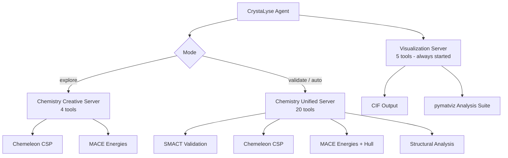

# Analysis Modes

Crystalyse has three operating modes - `explore`, `validate` and `auto` - that trade breadth of validation against speed. They are defined in `crystalyse/config/modes.py`, and `auto` is the default.

The legacy names `creative`, `rigorous` and `adaptive` still resolve to `explore`, `validate` and `auto`, but they emit a `DeprecationWarning` and will be removed in v2.0. (The MCP package directory `chemistry-creative-server` and the server name `chemistry_creative` keep their original names and are unaffected by the rename.)

## Overview

| Mode | Chemistry MCP server | Default model | Timeout | Use case |
|------|---------------------|---------------|---------|----------|
| **Auto** (Default) | `chemistry_unified` (20 tools) | `openai_o4_mini` (`o4-mini`) | 180 s | General research: full tool set, faster backbone |
| **Explore** | `chemistry_creative` (4 tools) | `openai_o4_mini` (`o4-mini`) | 120 s | Fast exploration and initial screening, no SMACT |
| **Validate** | `chemistry_unified` (20 tools) | `openai_o3` (`o3`) | 300 s | Complete validation with the strongest reasoning model |

The `visualization` server (5 tools) is started in **every** mode, so a session has either 4 + 5 tools (explore) or 20 + 5 tools (validate and auto).

## What the Mode Actually Changes

Exactly three things:

1. **Which chemistry MCP server is started** - `chemistry_creative` for `explore`, `chemistry_unified` for `validate` and `auto`. The `visualization` server is always started alongside it.
2. **Which model backbone is selected by default** - `explore` and `auto` use `openai_o4_mini`, `validate` uses `openai_o3`. A `--model` value, or `/model` inside chat, overrides this.
3. **The timeout** - 120 s, 180 s and 300 s respectively, after which the run returns a `failed` status.

Everything else follows from those. Tool choice *within* the running servers is left to the model (`tool_choice="auto"`); there is no context-aware tool selector. The resolved mode is also injected into the agent's instructions and pinned in a global mode manager, so the mode argument the MCP tools receive stays consistent for the life of the agent.

## Auto Mode (Default)

### Purpose
The balanced default: the complete `chemistry_unified` tool set with the faster `o4-mini` backbone and a 180-second ceiling. Use it when you do not want to think about mode selection - the model can reach SMACT validation, hull energies and the full analysis suite if the query calls for them, without paying for `o3` reasoning on every turn.

### MCP Server Mapping
Auto mode uses the same servers as validate mode: the **Chemistry Unified Server** (`chemistry-unified-server`) plus the **Visualization Server**. The difference is the default backbone and the timeout, not the tools.

## Explore Mode

### Purpose
Fast materials exploration:

- Initial concept exploration and idea generation
- Rapid screening before committing to a full validation run
- Interactive sessions where turnaround matters more than completeness
- Teaching and demonstrations

### MCP Server Mapping
Explore mode uses the **Chemistry Creative Server** (`chemistry-creative-server`), which exposes four tools:

```text
generate_crystal_structure      # Chemeleon CSP structure prediction
calculate_formation_energy      # MACE formation energies
creative_discovery_pipeline     # Chemeleon + MACE in one call
comprehensive_materials_analysis# Pipeline wrapper with unified-server-shaped output
# Not included: SMACT validation and hull calculations (deliberately, for speed)
```

The **Visualization Server** is started as well, so CIF output and the pymatviz analysis suite are still reachable in explore mode.

### Workflow
1. **Input**: Natural language materials query
2. **Structure Generation**: Chemeleon generates candidate structures
3. **Energy Evaluation**: MACE calculates formation energies for ranking
4. **Output Files**: CIF files written to the working directory, optionally with the pymatviz analysis suite
5. **Output**: Ranked structures with energies

### Example Usage

```bash
# Single-shot
crystalyse discover "Find perovskite solar cell materials" --mode explore

# Interactive session (--mode is a global option, so it precedes the subcommand)
crystalyse --mode explore chat

# Or switch inside a running session
> /mode explore
> Design high-capacity battery cathodes
```

### Output Structure
```
Explore Mode Results:
├── Structure Generation: candidate structures per composition
├── Energy Ranking: formation energies (eV/atom)
├── Files: [formula].cif in the working directory
└── Summary: most stable structures identified
```

## Validate Mode

### Purpose
Complete materials validation:

- Work you intend to report, with the full composition-to-analysis pipeline
- Detailed characterisation of a shortlist produced in explore mode
- Cases where SMACT screening and hull energies matter
- Runs where the strongest available reasoning model is worth the wall-clock cost

### MCP Server Mapping
Validate mode uses the **Chemistry Unified Server** (`chemistry-unified-server`), which exposes 20 tools, including:

```text
validate_composition, smact_validate_fast   # SMACT composition validation and screening
generate_crystal_csp                        # Chemeleon CSP structure prediction
calculate_formation_energy, relax_structure # MACE energetics and relaxation
calculate_energy_above_hull                 # Phase-diagram stability
analyze_space_group, analyze_coordination   # Structural analysis
validate_oxidation_states                   # Chemical sanity checks
save_cif_file, create_analysis_suite        # Output and analysis bundles
```

The **Visualization Server** is started alongside it, as in every mode.

### Workflow
1. **Input**: Natural language materials query
2. **Composition Validation**: SMACT screens for chemically reasonable compositions
3. **Structure Generation**: Chemeleon generates structures for valid compositions
4. **Energy Evaluation**: MACE calculates formation energies and, where relevant, energy above hull
5. **Analysis**: XRD patterns, radial distribution functions and coordination analysis
6. **Output**: A complete characterisation package on disk

### Example Usage

```bash
# Single-shot
crystalyse discover "Validate CsSnI3 for photovoltaic applications" --mode validate

# Interactive session
crystalyse --mode validate chat -s detailed_study

# Or switch inside a running session
> /mode validate
> Analyse LiCoO2 cathode stability
```

### Output Structure
```
Validate Mode Results:
├── SMACT Validation: composition feasibility screening
├── Structure Generation: multiple candidates
├── Energy Analysis: formation energies + stability metrics
├── Analysis Suite, when the pymatviz suite is run ([formula]_analysis/):
│   ├── XRD_Pattern_[formula].pdf
│   ├── RDF_Analysis_[formula].pdf
│   ├── Coordination_Analysis_[formula].pdf
│   └── [formula].cif
└── Provenance summary: tool calls and materials found
```

## Mode Switching

### In a Chat Session

```bash
crystalyse chat -s project_name

# Change mode mid-session
➤ /mode validate
✓ Mode changed from 'auto' to 'validate'
Note: Agent recreated with new mode. Model will be auto-selected based on mode. Use /model to override.
```

`/mode <name>` sets the new mode, recreates the agent, re-arms mode injection, and lets the mode's default backbone be reselected unless `/model` has overridden it. Because the agent is recreated, the conversation store also follows the new mode key.

`/mode` with no argument (or `/mode show`) prints a table of the three modes with their default model and description. An unrecognised name prints `Unknown mode: ...` followed by `Available modes: explore, validate, auto`; legacy names are accepted but deprecated.

Mode is otherwise fixed for the lifetime of an agent: nothing in Crystalyse switches modes on its own, and there is no performance-, confidence- or keyword-based adaptation.

### On the Command Line

```bash
# Global option, applies to whichever subcommand follows
crystalyse --mode explore chat
crystalyse --mode validate discover "query"

# discover also has its own --mode, which overrides the global one
crystalyse discover "query" --mode explore
crystalyse discover "query" --mode validate
```

## Choosing the Right Mode

### Use Auto Mode When: (Recommended Default)
- **General research**: The full tool set is available if the query needs it
- **Mixed workflows**: Exploration and checking in the same session
- **Cost/latency balance**: The `o4-mini` backbone with the complete unified server

### Use Explore Mode When:
- **Rapid exploration**: Many quick results for initial screening
- **Time-sensitive work**: The shortest timeout and the smallest tool surface
- **Brainstorming**: Generating candidates before narrowing down
- **Educational demos**: Quick feedback while teaching
- **Iterative design**: Fast concept → evaluation → refinement cycles

### Use Validate Mode When:
- **Results you will report**: SMACT screening and hull energies included
- **Critical decisions**: The strongest reasoning backbone (`o3`)
- **Deep analysis**: Coordination, oxidation states and the full analysis suite
- **Following up explore**: Confirming a shortlist with the complete pipeline

## Timeouts

The only per-mode timing numbers in the code are timeouts. They are ceilings, not expected runtimes; exceeding one returns `{"status": "failed", "error": "The operation timed out."}`.

| Mode | Timeout |
|------|---------|
| `explore` | 120 s |
| `auto` | 180 s |
| `validate` | 300 s |

Real runtimes depend on the query, the number of compositions, the model backbone, and whether Chemeleon and MACE find a GPU.

## Models and Reasoning Effort

Mode selects the default backbone, but it is only a default:

| Mode | Default backbone | Model ID |
|------|------------------|----------|
| `explore` | `openai_o4_mini` | `o4-mini` |
| `auto` | `openai_o4_mini` | `o4-mini` |
| `validate` | `openai_o3` | `o3` |

Override it globally with `--model <name>`, or per session with `/model <name>` in chat. `crystalyse models list` prints the effective registry (Name, Backend, Model ID, Context, Modes, Env Var, Source, Usable) and `crystalyse models check` validates that the required API keys are set, exiting non-zero if any is missing.

Registry entries can restrict which modes they support - `anthropic_claude_haiku` and `openrouter_llama3_70b` are `explore`/`auto` only, and `ollama_llama3_70b_direct` is `explore` only, because validate is where the reasoning gap matters most.

Each entry can also declare a reasoning effort, which is what actually makes a validate run more thorough: `ModelConfig.agent_model_settings()` forwards it to the provider - as `reasoning=Reasoning(effort=...)` for OpenAI reasoning models, as `thinking={"type": "adaptive"}` plus `output_config={"effort": ...}` for Anthropic Claude 5 models, and as `thinking={"type": "enabled", "budget_tokens": N}` for Claude 4.x.

## Technical Implementation

### MCP Server Architecture



### Tool Availability by Mode

| Capability | Explore | Validate / Auto | Server |
|------------|---------|-----------------|--------|
| SMACT composition validation | ❌ | ✅ | `chemistry_unified` |
| Chemeleon structure prediction | ✅ | ✅ | both chemistry servers |
| MACE formation energies | ✅ | ✅ | both chemistry servers |
| Structure relaxation, energy above hull | ❌ | ✅ | `chemistry_unified` |
| Space group, coordination, oxidation states | ❌ | ✅ | `chemistry_unified` |
| CIF file output | ✅ | ✅ | `visualization` |
| XRD / RDF / coordination PDFs | ✅ | ✅ | `visualization` |

The pymatviz analysis suite lives on the `visualization` server, which every mode starts, so `XRD_Pattern_<formula>.pdf`, `RDF_Analysis_<formula>.pdf` and `Coordination_Analysis_<formula>.pdf` are reachable in explore mode too. What is genuinely validate-only is the unified server's own analysis tools.

Interactive 3D rendering is currently switched off: `create_3dmol_visualization` writes `<formula>.cif` and reports `3dmol.js visualization disabled for v2.0-alpha - CIF file provided instead`. The defaults match - `cif_only` is true and `enable_html` is false. So visualisation output is a CIF file, plus the pymatviz PDFs whenever `create_pymatviz_analysis_suite` (or `create_rigorous_visualization`, which wraps it) is called. The `visualization` server's tools still take the pre-rename mode strings, so `create_mode_aligned_visualization` only produces the analysis suite when it is passed `mode="rigorous"`; ask for the analysis suite explicitly if you want the PDFs.

## Best Practices

### Mode Selection Strategy

1. **Start in explore**: Generate and rank candidates cheaply
2. **Confirm in validate**: Re-run the shortlist through SMACT, hull energies and the analysis suite
3. **Stay in auto** if you do not want to choose: it has the full tool set with the faster backbone
4. **Match the constraint**: Timeout, cost and the need for SMACT screening are what actually differ

### Workflow Recommendations

```bash
# 1. Initial exploration
crystalyse discover "broad query" --mode explore

# 2. Focused investigation, interactively
crystalyse --mode explore chat
> Refine based on the initial results

# 3. Detailed validation
crystalyse discover "specific material" --mode validate

# 4. Final analysis, interactively
crystalyse --mode validate chat -s final_study
> Complete characterisation
```

### Performance Optimisation

- **Explore mode**: Reduce `num_samples` on structure generation for faster iteration
- **Validate mode**: Use GPU acceleration for MACE calculations
- **Either mode**: Use `--model` to trade backbone cost against reasoning depth
- **Batch processing**: Give scripted runs their own `--project` so they do not share a session store with your chat sessions

## Examples

### Explore Mode Example

```bash
crystalyse discover "Design sodium-ion battery cathodes" --mode explore
```

Output focus:

- Quick structure generation
- Energy ranking for stability
- CIF files for immediate inspection
- Candidates worth a validate run

### Validate Mode Example

```bash
crystalyse discover "Characterise Na2FePO4F cathode material" --mode validate
```

Output focus:

- SMACT validation of the composition
- Multiple structure candidates
- Detailed energetics, including energy above hull
- Coordination and oxidation-state analysis
- pymatviz analysis plots on disk

Choosing between explore and validate is a choice about how much of the pipeline to run and which backbone to pay for; `auto` sits in between and is what you get if you choose nothing.
