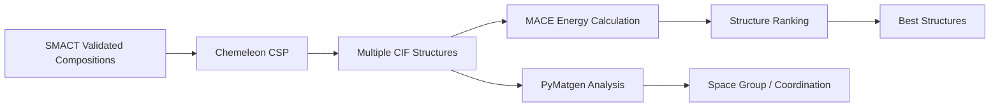

# Chemeleon - Crystal Structure Prediction

Chemeleon is a state-of-the-art crystal structure prediction (CSP) tool that generates crystal structures from chemical compositions. It serves as the core structure generation engine in every Crystalyse analysis mode.

## Overview

Chemeleon is a generative denoising diffusion model over crystal structures. Given a
composition it samples candidate structures directly - each a unit cell, a set of Cartesian
atomic positions, and the atomic numbers that occupy them. Asking for several samples gives
several independent candidates.

**Key Strength**: Chemeleon generates structures in a single learned sampling step, with no
hand-written crystallographic rules, template library or refinement stage in the loop.

## Integration in Crystalyse

### Availability by Mode
- **explore**: ✅ Core structure prediction
- **validate**: ✅ Structure generation, alongside SMACT screening and PyMatgen analysis
- **auto**: ✅ Same server as validate

### MCP Server Integration
- **explore**: Chemistry Creative Server (`chemistry-creative-server`), tool
  `generate_crystal_structure(formula, num_samples=3, prefer_gpu=True)`
- **validate** and **auto**: Chemistry Unified Server (`chemistry-unified-server`), tool
  `generate_crystal_csp(formulas, num_samples=1, prefer_gpu=True)` - which also accepts a
  list of formulas

Both servers call the same `ChemeleonPredictor`, so structure quality is identical; they
differ only in the tool name, defaults, and what else the server offers alongside. The
legacy mode names `creative`, `rigorous` and `adaptive` still resolve, with a
`DeprecationWarning`. Note that the server *directory* is still named
`chemistry-creative-server` - a package name, unchanged.

## Core Functionality

### Structure Prediction Pipeline

The path from formula to structure is short:

1. **Composition Parsing**: `pymatgen.Composition` expands the formula into a flat list of
   atomic numbers (one entry per atom), repeated once per requested sample
2. **Diffusion Sampling**: a single batched call to the cached diffusion module,
   `model.sample(task="csp", atom_types=..., num_atoms=...)`
3. **Conversion**: each returned ASE `Atoms` object becomes a `CrystalStructure` record

That is the whole pipeline. There is no space-group selection step, no ionic-radius lattice
estimate, no refinement pass and no quality scoring - the sampled structures are returned
as they come out of the model. Analysis of what came back (symmetry, coordination,
oxidation states) is the job of the separate PyMatgen-backed tools on the unified server:
`analyze_space_group`, `analyze_coordination` and `validate_oxidation_states`.

### Available Tools

#### `ChemeleonPredictor`
Core class for crystal structure prediction.

```python
from crystalyse.tools.chemeleon import ChemeleonPredictor

# Initialize predictor
predictor = ChemeleonPredictor()

# Generate structures (async)
result = await predictor.predict_structure(
    formula="CsSnI3",
    num_samples=5,
    prefer_gpu=True
)

# Or synchronous usage
result = predictor.predict_structure_sync(
    formula="CsSnI3",
    num_samples=5
)
```

**Parameters**:
- `formula`: Chemical composition (e.g., "CsSnI3", "LiCoO2")
- `num_samples`: Number of candidate structures (default: 1)
- `checkpoint_path`: Optional path to specific model checkpoint
- `prefer_gpu`: Use GPU if available (default: True)

**Output**:
`PredictionResult` containing:
- `success` and, on failure, `error`
- `formula` as requested
- `predicted_structures`: a list of `CrystalStructure` records, each with `formula`,
  `cell` (3x3 matrix), `positions` (Cartesian), `numbers`, `symbols`, `volume` and
  `confidence`
- `computation_time` in seconds
- `method`, which is `"chemeleon-dng"`
- `checkpoint_used`

The `confidence` field exists on the model but is never computed - it takes its default of
`1.0` for every structure. Do not read it as a quality signal.

Structures are returned in memory. `ChemeleonPredictor` performs no file I/O; CIF text is
produced downstream (`structure_dict_to_cif` on the creative server, or `save_cif_file` and
the visualisation server).

### Checkpoint Management

`chemeleon-dng` is a plain PyPI dependency, pinned `>=0.1.5,<0.2.0`. Crystalyse manages the
model checkpoints itself rather than relying on the upstream downloader:

- **Auto-download**: on first use, a 523 MB archive is fetched from Figshare and expanded
  to roughly 604 MB on disk
- **Caching**: checkpoints live in `~/.cache/crystalyse/chemeleon_checkpoints/`
- **Two checkpoints**: `chemeleon_csp_alex_mp_20_v0.0.2.ckpt` (task `csp`) and
  `chemeleon_dng_alex_mp_20_v0.0.2.ckpt` (task `dng`) are both downloaded and verified.
  `predict_structure` uses only `csp`
- **Custom Path**: `CHEMELEON_CHECKPOINT_DIR` points at a directory that must *already*
  contain the expected filename. Setting it disables auto-download rather than relocating
  it - if the file is not there, you get a `FileNotFoundError` naming the file it wanted

## Structure Prediction Methodology

### Machine Learning Framework

The object Crystalyse loads is a `chemeleon_dng` `DiffusionModule`: a denoising diffusion
model over crystal structures, built from the hyperparameters stored in the checkpoint. The
compatibility path constructs it explicitly via
`chemeleon_dng.script_util.create_diffusion_module`, whose knobs are the diffusion ones -
`num_timesteps`, `beta_schedule_ddpm`, `beta_schedule_d3pm`, `d3pm_hybrid_coeff`,
`sigma_begin`, `sigma_end`, `max_atoms`.

The upstream work is a text-guided generative diffusion model for crystal chemical space;
see the [citation](#citation) below. Crystalyse drives only its structure-prediction
(`csp`) task, feeding it a composition rather than text.

The model runs on CUDA where available, then MPS on Apple Silicon, then CPU. It is cached
per `(task, checkpoint)` pair, so the load cost is paid once per process.

### What the Model Does Not Give You

Because sampling is a single call with no post-processing, the following are simply absent
from Chemeleon's output and must come from elsewhere if you need them:

- **Space group**: not recorded. Use `analyze_space_group` (PyMatgen `SpacegroupAnalyzer`)
  on the returned structure
- **Decomposed lattice parameters**: the output carries the 3x3 `cell` matrix, not
  a/b/c/alpha/beta/gamma
- **Fractional coordinates**: `positions` are Cartesian, as ASE supplies them
- **Coordination and oxidation states**: use `analyze_coordination` and
  `validate_oxidation_states`

## Practical Usage

### In Crystalyse Workflows

#### Explore Mode Structure Generation
```bash
crystalyse discover "Generate structures for CsSnI3" --mode explore
```

**Chemeleon Workflow**:
1. Parse composition into atomic numbers: Cs, Sn, I, I, I
2. Sample the requested number of candidate structures in one batched call
3. Return the structures in memory
4. Convert to CIF on the server for MACE energy calculation

#### Validate Mode with Screening
```bash
crystalyse discover "Predict CsSnI3 crystal structure" --mode validate
```

**Enhanced Workflow**:
1. SMACT validation confirms composition feasibility
2. Chemeleon generates multiple structure candidates
3. PyMatgen tools analyse symmetry, coordination and oxidation states
4. Structures passed to MACE for energy ranking

### Typical Structure Generation

Each sample comes back as a `CrystalStructure`. Asking for three samples of CsSnI₃ gives
three independent records of this shape:

```python
CrystalStructure(
    formula="CsSnI3",
    cell=[[6.21, 0.00, 0.00],
          [0.00, 6.24, 0.00],
          [0.00, 0.00, 6.19]],   # 3x3 lattice matrix, as sampled
    positions=[...],              # Cartesian, one triple per atom
    numbers=[55, 50, 53, 53, 53],
    symbols=["Cs", "Sn", "I", "I", "I"],
    volume=239.8,
    confidence=1.0,               # default, never computed
)
```

The numbers above are illustrative of the *shape* of the output, not measured values -
sampling is stochastic and every run differs. Note what is not there: no space group label,
no a/b/c/alpha/beta/gamma breakdown, no Wyckoff assignment. If you want a symmetry label
for a sampled structure, run `analyze_space_group` on it.

## Assessing What Came Back

Chemeleon itself performs no validation of its samples: no bond-length check, no Wyckoff
analysis, no density check, no ML-confidence output. The `confidence` field is a default,
not a score. Judging a sampled structure is therefore a separate step, and Crystalyse
provides three PyMatgen-backed tools on the unified server for it:

| Tool | What it reports |
|------|-----------------|
| `analyze_space_group` | Symmetry analysis via PyMatgen's `SpacegroupAnalyzer` |
| `analyze_coordination` | Coordination environments (Voronoi by default) |
| `validate_oxidation_states` | Whether a consistent oxidation-state assignment exists |

Energetic ranking is MACE's job - see [MACE](mace.md). In practice, sampling several
structures and ranking them by MACE formation energy is the standard way to pick one.

## Output Formats

### CIF (Crystallographic Information File)

`ChemeleonPredictor` returns structure records, not files. CIF text is generated one step
later - by `structure_dict_to_cif` on the creative server, or by `save_cif_file` and the
visualisation server - and looks like this:

```cif
data_CsSnI3_structure1
_cell_length_a    6.234
_cell_length_b    6.234  
_cell_length_c    6.234
_cell_angle_alpha 90.0
_cell_angle_beta  90.0
_cell_angle_gamma 90.0
_space_group_name_H-M_alt 'P m 3 m'
_space_group_IT_number 221

loop_
_atom_site_label
_atom_site_type_symbol
_atom_site_fract_x
_atom_site_fract_y  
_atom_site_fract_z
Cs1 Cs 0.5 0.5 0.5
Sn1 Sn 0.0 0.0 0.0
I1  I  0.5 0.0 0.0
I2  I  0.0 0.5 0.0
I3  I  0.0 0.0 0.5
```

### JSON Structure Summary

Machine-readable format for computational pipelines:

```json
{
  "success": true,
  "formula": "CsSnI3",
  "predicted_structures": [
    {
      "formula": "CsSnI3",
      "cell": [[6.21, 0.0, 0.0], [0.0, 6.24, 0.0], [0.0, 0.0, 6.19]],
      "positions": [[3.10, 3.12, 3.10], [0.0, 0.0, 0.0], "..."],
      "numbers": [55, 50, 53, 53, 53],
      "symbols": ["Cs", "Sn", "I", "I", "I"],
      "volume": 239.8,
      "confidence": 1.0
    }
  ],
  "computation_time": 18.4,
  "method": "chemeleon-dng",
  "checkpoint_used": "default",
  "error": null
}
```

These are the complete field sets for `PredictionResult` and `CrystalStructure`. There is
no `structure_id`, `space_group`, `lattice_parameters` or `quality_score` key.

## Performance Characteristics

### Computational Requirements

Sampling cost scales with the diffusion timestep count and the number of atoms, and depends
heavily on whether a GPU is available. Crystalyse does not benchmark it, but every result
carries a measured `computation_time`, so the honest way to size a run is to time one
composition on your own hardware and multiply.

What is fixed and known:

```bash
Storage:
├── Checkpoints: 523 MB archive from Figshare, ~604 MB expanded (one-time)
│   └── ~/.cache/crystalyse/chemeleon_checkpoints/
└── Structures: returned in memory; CIF files are written only downstream

Compute:
├── Device: CUDA if available, else MPS on Apple Silicon, else CPU
└── Model cache: loaded once per process, per (task, checkpoint) pair
```

### Accuracy

Crystalyse ships no benchmark harness, reference dataset or accuracy metric for Chemeleon,
so this page quotes no accuracy figures. (The tool records no space group at all, so a
space-group match rate could not be produced by this code even in principle.) For
published accuracy, see the upstream paper in the [citation](#citation) section. To judge a
particular structure in your own workflow, rank samples by MACE formation energy and check
the symmetry and coordination with the PyMatgen tools.

## Limitations and Considerations

### Scope Limitations

- **Complex Structures**: Performance decreases for very complex compositions (>10 elements)
- **Disordered Systems**: Cannot predict compositional or positional disorder
- **Surface Structures**: Designed for bulk crystals, not surfaces or interfaces
- **Amorphous Materials**: Limited to crystalline phases only

### Best Practices

1. **Multiple Candidates**: Always generate 3-5 structures for ranking
2. **Validate Results**: Use MACE energy calculations to rank structures
3. **Chemical Sense Check**: Verify structures are chemically reasonable
4. **Sample, Then Filter**: sampling is the only knob - there is no way to constrain the
   search, so generate more candidates and discard the poor ones downstream

### Common Issues and Solutions

#### Issue: Unrealistic Bond Lengths

Sampling cannot be constrained. Increase `num_samples`, then screen the results with
`analyze_coordination` and MACE energies and keep what survives:

```python
result = await predictor.predict_structure(formula="CsSnI3", num_samples=10)
# Screen result.predicted_structures downstream; there is no
# min_bond_length or geometry constraint to pass in.
```

#### Issue: Checkpoint Not Found

If `CHEMELEON_CHECKPOINT_DIR` is set, auto-download is disabled and the expected filename
must already be present in that directory. Unset the variable to fall back to the managed
cache in `~/.cache/crystalyse/chemeleon_checkpoints/`.

## Integration with Other Tools

### Workflow Position



### Data Flow with MACE

Chemeleon structures are automatically formatted for MACE energy calculations:

On the servers, the Chemeleon structure record is turned into CIF text and handed to the
MACE tool:

```python
# Chemeleon output -> CIF -> MACE (creative server)
result = await predictor.predict_structure("CsSnI3", num_samples=3)
cif = structure_dict_to_cif(result.predicted_structures[0].model_dump())
energy = await calculate_formation_energy(cif)
```

### Visualisation Integration

Structures are written out as CIF files; interactive 3D viewing is disabled for
v2.0-alpha:

```python
# create_3dmol_visualization writes {formula}.cif and nothing else
create_3dmol_visualization(cif_content, formula="CsSnI3", output_dir=".")
```

For plots, `create_pymatviz_analysis_suite` produces a CIF plus four PDFs (3D structure,
XRD, RDF, coordination). See [Visualisation](visualisation.md).

## Controlling Generation

`predict_structure` takes four arguments and no more:

| Parameter | Default | Effect |
|-----------|---------|--------|
| `formula` | - | Chemical composition to sample for |
| `num_samples` | `1` | How many independent structures to sample |
| `checkpoint_path` | `None` | Use a specific checkpoint file instead of the managed one |
| `prefer_gpu` | `True` | Use CUDA/MPS when available, else CPU |

There is no template, space-group, symmetry or distortion control. Structure diversity
comes from the stochasticity of sampling, so the practical lever is `num_samples`.

## Research Applications

### Materials Discovery

Chemeleon excels in several research domains:

- **Photovoltaic materials**: Perovskite structure prediction and optimisation
- **Battery materials**: Cathode, anode, and electrolyte structure generation
- **Catalysis**: Active site and support structure prediction
- **Electronic materials**: Semiconductor and magnetic material structures

### Structure-Property Relationships

Enable systematic structure-property studies:

```python
# Generate structure series for property trends
base_formula = "CsSnI3"
substituents = ["Pb", "Ge", "Si"]

for element in substituents:
    modified_formula = base_formula.replace("Sn", element)
    result = await predictor.predict_structure(modified_formula, num_samples=5)
    # Rank result.predicted_structures with MACE, then analyse trends
```

## Future Developments

Planned enhancements to Chemeleon integration:

- **Temperature-dependent structures**: Thermal expansion effects
- **Pressure-dependent prediction**: High-pressure phase prediction
- **Defect incorporation**: Point defects and dopant positions
- **Interface prediction**: Heterostructure and grain boundary structures

## Citation

If you use Chemeleon through Crystalyse, please cite the original publication:

```bibtex
@article{park2025exploration,
  title = {Exploration of crystal chemical space using text-guided generative artificial intelligence},
  author = {Park, Hyunsoo and Onwuli, Anthony and Walsh, Aron},
  journal = {Nature Communications},
  volume = {16},
  number = {1},
  pages = {1--14},
  year = {2025},
  publisher = {Nature Publishing Group}
}
```

**License**: This project is licensed under the MIT License, developed by Hyunsoo Park as part of the Materials Design Group at Imperial College London.

## Summary

Chemeleon provides the structure prediction capability that lets Crystalyse turn a chemical composition into a concrete crystal structure. It is available in every mode, so all materials analysis workflows can begin from a structural model.

**Key Benefits**:
- Generative crystal structure prediction in a single sampling call
- Multiple candidate generation for downstream ranking
- In-memory output, no temporary files
- Integration with the energy calculation and analysis pipeline
- Zero-configuration checkpoint management

The combination of Chemeleon's structure prediction with MACE's energy calculations provides the foundation for reliable computational materials design in Crystalyse.

For detailed usage examples and integration patterns, see the [CLI Usage Guide](../guides/cli_usage.md) and [Analysis Modes Documentation](../concepts/analysis_modes.md).