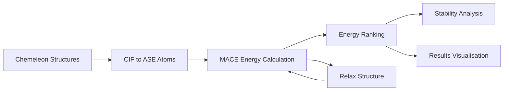

# MACE - Machine Learning Force Fields

MACE is a state-of-the-art force field framework that provides fast and accurate energy calculations for crystal structures. It serves as the primary energy evaluation engine in every Crystalyse analysis mode.

## Overview

MACE employs machine learning to predict formation energies, total energies, and forces for crystal structures with near-DFT accuracy at dramatically reduced computational cost. It bridges the gap between speed and accuracy in materials energy calculations.

**Key Advantage**: MACE provides DFT-level accuracy for energy calculations in seconds rather than hours, enabling rapid materials screening and optimisation.

## Integration in Crystalyse

### Availability by Mode
- **explore**: ✅ Formation energy calculations
- **validate**: ✅ Formation energies, relaxation, stress and EOS fitting
- **auto**: ✅ Same server as validate

### MCP Server Integration
- **explore**: Chemistry Creative Server (`chemistry-creative-server`)
- **validate** and **auto**: Chemistry Unified Server (`chemistry-unified-server`)

Both servers construct `MACECalculator()` with no arguments, so the underlying model and
accuracy are identical in every mode. The unified server additionally exposes
`relax_structure`, `calculate_stress`, `fit_equation_of_state` and
`list_foundation_models`. The legacy mode names `creative`, `rigorous` and `adaptive` still
resolve, with a `DeprecationWarning`.

## Core Functionality

### Energy Calculation Pipeline

MACE follows a systematic approach to energy evaluation:

1. **Structure Input**: Accept crystal structures from Chemeleon, as a structure dict or
   as CIF text
2. **Format Conversion**: Parse into an ASE `Atoms` object
3. **ML Inference**: Attach the cached MACE calculator and evaluate
4. **Energy Prediction**: Calculate total energy, formation energy per atom, and forces
5. **Result Output**: Return energies with structural metadata

There is no uncertainty quantification step. See
[What MACE Does Not Report](#what-mace-does-not-report) below.

### Available Tools

#### `MACECalculator`
Core class for energy calculations and structure relaxation.

```python
from crystalyse.tools.mace import MACECalculator

# Initialize calculator (these are the defaults)
calc = MACECalculator(model_type="mace_mp", size="medium", device="auto")

# Calculate formation energy
result = await calc.calculate_formation_energy(structure_dict)

# Relax atomic positions
relaxed = await calc.relax_structure(
    structure_dict, fmax=0.01, steps=500, optimizer="BFGS"
)
```

**Output**:

- `EnergyResult`: `success`, `formula`, `formation_energy`, `energy_per_atom`,
  `total_energy`, `unit` (`"eV"`), `method` (`"mace"`), `max_force`, `rms_force`, `error`.
  Note that `max_force` and `rms_force` are declared on the model but never populated by
  `calculate_formation_energy` - they are always `None`
- `RelaxationResult`: `success`, `converged`, `initial_energy`, `final_energy`,
  `energy_change`, `max_displacement`, `n_steps`, `relaxed_structure`, `error`

`relax_structure` accepts `optimizer` values `BFGS`, `FIRE` or `LBFGS`; anything else
returns a failed result naming the three. It relaxes **atomic positions only** - the cell
is not varied.

#### `MACEStressCalculator`
Calculates stress tensors and fits equations of state.

```python
from crystalyse.tools.mace import MACEStressCalculator

# Calculate stress tensor
stress = MACEStressCalculator.calculate_stress(structure_dict)

# Fit Equation of State (EOS)
eos = MACEStressCalculator.fit_equation_of_state(
    structure_dict,
    eos_type="birchmurnaghan"
)
```

**Output**: `StressResult` (3x3 tensor, Voigt 6-vector, pressure, von Mises and maximum
shear stress) or `EOSResult` (fitted EOS parameters plus the sampled volumes and
energies).

#### `MACEFoundationModels`
A catalogue of pre-trained foundation models.

```python
from crystalyse.tools.mace import MACEFoundationModels

# List available models
models = MACEFoundationModels.list_models()

# Get specific model info (returns None for an unknown name)
info = MACEFoundationModels.get_model_info("medium-mpa-0")
```

Eight models are registered:

| Name | Family | Training data | Functional | Licence |
|------|--------|---------------|------------|---------|
| `small` | MACE-MP | Materials Project DFT | PBE | MIT |
| `medium` | MACE-MP | Materials Project DFT | PBE | MIT |
| `large` | MACE-MP | Materials Project + trajectories (MPtrj 2022.9) | PBE | MIT |
| `medium-mpa-0` | MACE-MPA-0 | Materials Project, enhanced training | PBE | MIT |
| `small-omat-0` | MACE-OMAT-0 | OMAT24 | PBE | ASL |
| `medium-omat-0` | MACE-OMAT-0 | OMAT24 | PBE | ASL |
| `mace-matpes-pbe-0` | MACE-MatPES | MatPES | PBE | ASL |
| `mace-matpes-r2scan-0` | MACE-MatPES | MatPES | r2SCAN | ASL |

The OMAT24 and MatPES entries carry the **ASL** licence, not MIT - check its terms before
using them in work you intend to distribute. `mace-matpes-r2scan-0` is the only entry
trained on a non-PBE functional.

`get_model_calculator(model_name="medium-mpa-0", device="auto", dispersion=False,
dispersion_xc="pbe", default_dtype="float32")` builds a calculator for a named entry,
validating `model_name` against the table above. Checkpoints are downloaded on first use
and cached by mace-torch in `~/.cache/mace/`.

#### Which Model Actually Runs

Worth stating plainly, because the code is inconsistent here: **every energy, relaxation
and stress calculation in Crystalyse uses MACE-MP `medium`.**

- `get_mace_calculator()` defaults to `size="medium"`
- `MACECalculator.__init__` defaults to `size="medium"`
- `MACEStressCalculator` defaults to `size="medium"` on `__init__`, `calculate_stress` and
  `fit_equation_of_state`
- both MCP servers instantiate `MACECalculator()` with no arguments

Separately, `MACEFoundationModels.get_model_calculator` defaults to
`model_name="medium-mpa-0"`, and that registry entry is described as
*"MACE-MPA-0 medium (default, improved accuracy)"*. But that method is never called by any
code path in this repository - only `list_models` is, via the `list_foundation_models` MCP
tool. **So the entry advertised as the default is not the model in use.** If you need
MACE-MPA-0, pass `size="medium-mpa-0"` to `MACECalculator` explicitly.

For the record, the `medium` registry entry is self-consistent: it is described as
"MACE-MP medium model (128 channels, L=1)" and points at
`2023-12-03-mace-128-L1_epoch-199.model`, which is what mace-torch resolves `"medium"` to.
The "MACE-MP large model (MPtrj 2022.9)" description belongs to the separate `large` entry.

## Energy Calculation Methodology

### Machine Learning Framework

MACE employs advanced neural network architectures:

- **Training Data**: High-quality DFT calculations from Materials Project and other databases
- **Model Architecture**: Equivariant message passing neural networks
- **Feature Representation**: Atomic and structural descriptors preserving rotational symmetry
- **Transfer Learning**: Pre-trained models fine-tuned for specific materials classes

### Formation Energy Calculation

Read the reference state carefully - it is not the usual one.

```python
# What the code actually computes:
compound_energy = atoms.get_potential_energy()          # eV, total

# Reference energies come from the MACE model's own isolated-atom
# energies (calc.models[0].atomic_energies_fn), NOT from elemental
# solid reference phases.
total_reference_energy = sum(atomic_energies)            # eV

formation_energy = (compound_energy - total_reference_energy) / len(atoms)
```

So the quantity reported as `formation_energy` is referenced to **isolated atoms**, which
makes it a cohesive-energy-like number rather than a standard formation enthalpy against
elemental phases. It is well suited to ranking polymorphs and closely related compositions,
and it is **not** directly comparable to a Materials Project formation energy.

Also note that `energy_per_atom` on `EnergyResult` is set to the same value as
`formation_energy` - it is not the total energy divided by the atom count.

For a hull-referenced number, feed `total_energy` to `calculate_energy_above_hull` on the
unified server, which uses the phase-diagram dataset.

### What MACE Does Not Report

Crystalyse's MACE path produces a single deterministic number per structure. It does not
quantify uncertainty:

- `EnergyResult` has no uncertainty field at all
- the CIF-facing wrapper `calculate_energy` hard-codes `"uncertainty": None`, with the
  comment *"MACE doesn't provide uncertainty by default"*
- there is no ensemble of models, no out-of-domain or extrapolation detection, no
  confidence level and no quality score anywhere in the MACE code
- `max_force` and `rms_force` exist as fields on `EnergyResult` but nothing ever sets them;
  they come back `None` from every call
- `computation_time` on the CIF-facing result is likewise always `None`

Rank structures by formation energy, and treat small differences between candidates with
the scepticism any single-model ML prediction deserves - but do not expect the tool to
quantify that scepticism for you. For a thermodynamic check that *is* available, see
`calculate_energy_above_hull` on the unified server.

## Practical Usage

### In Crystalyse Workflows

#### Explore Mode Energy Ranking
```bash
crystalyse discover "Find stable perovskite materials" --mode explore
```

**MACE Workflow**:
1. Receive CIF structures from Chemeleon
2. Convert to MACE input format
3. Calculate formation energies for all structures
4. Rank by stability (most negative formation energy)
5. Return ranked list with energies

#### Validate Mode with Detailed Analysis
```bash
crystalyse discover "Analyse CsSnI3 energetics in detail" --mode validate
```

**Enhanced Workflow**:
1. SMACT validation confirms composition
2. Chemeleon generates multiple structure candidates
3. MACE calculates energies for all candidates
4. Structures optionally relaxed with `relax_structure` before re-evaluation
5. Structure-energy relationships analysed

### Typical Energy Results

#### Perovskite Stability Ranking

```python
Perovskite Stability Analysis (formation energy, eV/atom):
├── CsGeI₃: -2.558 (most stable)
├── CsPbI₃: -2.542
├── CsSnI₃: -2.529
├── RbPbI₃: -2.503
└── RbSnI₃: -2.488

Stability Trend: Cs > Rb (A-site), Ge > Pb > Sn (B-site)
```

Each number is a single deterministic prediction; there is no error bar to report.

#### Battery Material Energetics

```python
LiCoO₂ Polymorphs (formation energy, eV/atom):
├── Layered:   -4.127 (lowest)
├── Spinel:    -4.089 (+38 meV/atom)
└── Rock salt: -3.956 (+171 meV/atom)
```

Space-group labels for the polymorphs come from `analyze_space_group`, not from MACE -
MACE sees only atoms, positions and a cell.

## Model Performance

### Accuracy

Crystalyse contains no benchmark harness or timing instrumentation for MACE - the
`computation_time` key in the CIF-facing result is returned as `None` unconditionally - so
this page quotes no accuracy or speedup figures of its own. For published accuracy of the
MACE-MP foundation models, see the [citation](#citation) section and the upstream
model cards.

### Materials Coverage

MACE models are trained on diverse materials:

- **Inorganic crystals**: Oxides, halides, chalcogenides, nitrides
- **Intermetallics**: Binary and ternary alloys
- **Semiconductors**: Group IV, III-V, II-VI compounds
- **Energy materials**: Battery materials, photovoltaics, catalysts

## Performance Characteristics

### Computational Requirements

```bash
Resource Requirements:
├── CPU: works on CPU alone; a GPU is optional
├── GPU: used automatically when torch.cuda.is_available()
├── Storage: foundation-model checkpoints cached in ~/.cache/mace/
└── Model cache: each (model, size, device, dtype) combination is loaded once
    per process and reused
```

Crystalyse does not time MACE calls, so no execution-time figures are quoted here.

### GPU Acceleration

Device selection is a single `torch.cuda.is_available()` check when `device="auto"`
(the default) - CUDA if present, CPU otherwise. Nothing measures the difference, so no
speedup figure is claimed. To force one or the other, pass `device="cpu"` or
`device="cuda"` to `MACECalculator`; the MCP tools expose this as `prefer_gpu`.

```bash
# Check GPU availability
nvidia-smi
```

## Quality Control

### Energy Validation

Sanity checks on MACE output are the analyst's responsibility, not the tool's. Useful
habits:

- **Energy scales**: check energies are within a physically reasonable range
- **Stability ordering**: verify the ordering is thermodynamically consistent
- **Chemical trends**: check trends follow known chemical principles
- **Reference alignment**: formation energies are only comparable when they share
  reference states
- **Hull distance**: `calculate_energy_above_hull` on the unified server places a
  computed total energy against the phase-diagram dataset

The most useful check the tool *does* support is relaxation. `relax_structure` returns
`converged`, `energy_change` and `max_displacement`: a structure whose energy drops sharply
on relaxation was far from a local minimum, and its unrelaxed energy should not be trusted
for ranking. Relax every candidate, or none of them, so the comparison is fair.

## Output Formats

### Energy Results

Standard energy output format:

This is what `calculate_energy(cif_content)` returns - the shape the MCP servers hand back:

```json
{
  "success": true,
  "formula": "CsSnI3",
  "formation_energy_per_atom": -2.529,
  "total_energy": -1245.67,
  "num_atoms": 5,
  "uncertainty": null,
  "computation_time": null,
  "model_used": "mace_mp_medium",
  "error": null
}
```

Every key is listed above; there are no others. Note that `uncertainty` and
`computation_time` are always `null`, and `model_used` is built as
`f"{model_type}_{size}"` - so it reads `mace_mp_medium` with the defaults, which is also a
convenient way to confirm which model actually ran.

The structure-dict entry point, `calculate_formation_energy`, returns an `EnergyResult`
instead. It declares `max_force` and `rms_force` but never populates them.

## Structure Relaxation

MACE relaxes atomic positions to a local energy minimum:

```python
relaxed = await calc.relax_structure(
    structure_dict,
    fmax=0.01,        # force convergence criterion, eV/Å
    steps=500,        # maximum optimiser steps
    optimizer="BFGS", # BFGS, FIRE or LBFGS
)

relaxed.converged        # whether fmax was reached within `steps`
relaxed.energy_change    # final_energy - initial_energy
relaxed.max_displacement # largest atomic movement, Å
relaxed.n_steps
relaxed.relaxed_structure
```

The **cell is held fixed** - only atomic positions move. There is no variable-cell
relaxation, no lattice or stress tolerance parameter.

## Mechanical Properties

Mechanical quantities come from `MACEStressCalculator`, documented above:
`calculate_stress` for the stress tensor, pressure, von Mises and maximum shear stress, and
`fit_equation_of_state` for a fitted EOS (bulk modulus and equilibrium volume) from a
strain sweep.

There is no band-gap, elastic-constant or thermal-property prediction in the MACE path.
For an electronegativity-based band gap estimate, see
[SMACT](smact.md) - a different tool with very different accuracy expectations.

## Limitations and Considerations

### Model Limitations

- **Training Domain**: Accuracy decreases for materials far from training data
- **Large Systems**: Performance may degrade for very large unit cells (>200 atoms)
- **Magnetic Systems**: Limited treatment of magnetic ordering effects
- **Surface/Interface**: Primarily trained on bulk crystal structures

### Best Practices

1. **Relax Before Comparing**: run `relax_structure` so candidates are compared at
   comparable states - and check `converged`, since a run that hit the step limit has not
   reached a minimum
2. **Mind the Reference State**: `formation_energy` is referenced to isolated atoms, so use
   it for ranking, not for comparison against tabulated formation enthalpies
3. **Validation**: compare results to experimental or DFT data when available
4. **Treat Small Gaps Sceptically**: no uncertainty is reported, so differences of a few
   tens of meV/atom between candidates should not decide anything on their own
5. **Structure Quality**: ensure input structures are chemically reasonable

### Common Issues and Solutions

#### Energies That Look Wrong
```python
# No force diagnostic comes back with an energy, so probe with a relaxation:
relaxed = await calc.relax_structure(structure)

if not relaxed.converged:
    ...  # hit the step limit - not at a minimum

if relaxed.energy_change < -0.1:  # eV, a large drop for a small cell
    ...  # the input was far from a minimum; use relaxed.final_energy
```

#### GPU Memory Issues
```python
# Fall back to CPU for large structures
calc = MACECalculator(device="cpu")
# or, through the MCP tools, pass prefer_gpu=False
```

## Integration with Other Tools

### Workflow Position



### Data Flow

Seamless integration with structure prediction:

```python
# Chemeleon -> MACE
prediction = await predictor.predict_structure("CsSnI3", num_samples=5)

results = []
for structure in prediction.predicted_structures:
    results.append(await calc.calculate_formation_energy(structure.model_dump()))

# Rank by stability
ranked = sorted(
    (r for r in results if r.success),
    key=lambda r: r.formation_energy,
)
```

### Results Integration

The ranked structure is written out as CIF and passed to the visualisation server, which
produces the CIF plus four analysis PDFs. See [Visualisation](visualisation.md).

## Research Applications

### High-Throughput Screening

MACE enables rapid materials screening:

```python
# Screen thousands of compositions
candidate_compositions = generate_candidate_list(elements, structure_types)
validated_compositions = smact_screen(candidate_compositions)
structures = chemeleon_batch_predict(validated_compositions)
energies = mace_batch_calculate(structures)

# Identify most promising materials
stable_materials = filter_stable_materials(energies, threshold=-2.0)
```

### Materials Optimisation

Systematic optimisation of materials properties:

```python
# Composition-structure-property relationships
base_structure = "CsSnI3"
element_substitutions = ["Pb", "Ge", "Si"]

for element in element_substitutions:
    modified_structure = substitute_element(base_structure, "Sn", element)
    energy = mace_calculate_energy(modified_structure)
    # Analyse trends
```

### Phase Stability

Competitive phase analysis:

```python
# Multiple polymorphs of same composition
polymorphs = chemeleon_predict_structure("LiCoO2", num_structures=10)
polymorph_energies = mace_batch_calculate(polymorphs)

# Identify ground state and metastable phases
ground_state = min(polymorph_energies, key=lambda x: x["formation_energy"])
metastable_phases = identify_metastable_phases(polymorph_energies)
```

## Future Developments

Planned enhancements to MACE integration:

- **Extended property prediction**: Band gaps, elastic constants, thermal properties
- **Uncertainty quantification**: none today; ensembles or out-of-domain detection would
  be new work
- **Multi-scale models**: Integration with larger-scale simulation methods
- **Active learning**: Automated model improvement based on new data

## Citation

If you use MACE through Crystalyse, please cite the original MACE publications:

```bibtex
@inproceedings{Batatia2022mace,
  title = {{MACE}: Higher Order Equivariant Message Passing Neural Networks for Fast and Accurate Force Fields},
  author = {Ilyes Batatia and David Peter Kovacs and Gregor N. C. Simm and Christoph Ortner and Gabor Csanyi},
  booktitle = {Advances in Neural Information Processing Systems},
  editor = {Alice H. Oh and Alekh Agarwal and Danielle Belgrave and Kyunghyun Cho},
  year = {2022},
  url = {https://openreview.net/forum?id=YPpSngE-ZU}
}

@misc{Batatia2022Design,
  title = {The Design Space of E(3)-Equivariant Atom-Centered Interatomic Potentials},
  author = {Batatia, Ilyes and Batzner, Simon and Kov{\'a}cs, D{\'a}vid P{\'e}ter and Musaelian, Albert and Simm, Gregor N. C. and Drautz, Ralf and Ortner, Christoph and Kozinsky, Boris and Cs{\'a}nyi, G{\'a}bor},
  year = {2022},
  number = {arXiv:2205.06643},
  eprint = {2205.06643},
  eprinttype = {arxiv},
  doi = {10.48550/arXiv.2205.06643},
  archiveprefix = {arXiv}
}
```

**Contact**: For questions about MACE, contact ilyes.batatia@ens-paris-saclay.fr or use GitHub Issues.
**License**: The MACE code is published and distributed under the MIT License.

## Summary

MACE provides the critical energy evaluation capability that enables Crystalyse to rank and assess the stability of predicted crystal structures. Its combination of speed and accuracy makes comprehensive materials screening feasible within the Crystalyse platform.

**Key Benefits**:
- Near-DFT accuracy at dramatically reduced cost
- Fast energy calculations enable interactive workflows
- Position relaxation, stress tensors and EOS fitting from the same calculator
- Seamless integration with structure prediction pipeline
- Support for diverse materials classes

The integration of MACE with Chemeleon structure prediction provides a complete computational pipeline from composition to stability assessment, forming the foundation of Crystalyse's materials design capabilities.

For detailed usage examples and integration patterns, see the [CLI Usage Guide](../guides/cli_usage.md) and [Analysis Modes Documentation](../concepts/analysis_modes.md).