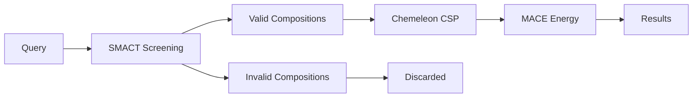

# SMACT - Semiconducting Materials by Analogy and Chemical Theory

SMACT is a computational framework for rapid screening of materials compositions based on chemical analogy and electronegativity principles. In Crystalyse, SMACT serves as the primary composition validation tool in validate mode.

## Overview

SMACT screens millions of possible chemical compositions to identify those most likely to be chemically reasonable and synthesisable. This screening dramatically reduces the search space before expensive structure prediction and energy calculations.

**Key Principle**: Materials with similar chemical properties (oxidation states, electronegativity differences) to known stable compounds are more likely to be synthesisable.

## Integration in Crystalyse

### Availability by Mode
- **explore**: ❌ Not included (the creative server deliberately omits SMACT for speed)
- **validate**: ✅ Full validation pipeline
- **auto**: ✅ Full validation pipeline (same server as validate)

The legacy names `creative`, `rigorous` and `adaptive` still resolve to `explore`,
`validate` and `auto`, but emit a `DeprecationWarning`.

### MCP Server Integration
SMACT is integrated through the **Chemistry Unified Server** (`chemistry-unified-server`),
which backs both **validate** and **auto** mode. The unified server exposes SMACT as seven
tools: `validate_composition`, `analyze_stability`, `predict_band_gap`,
`smact_validate_fast`, `generate_ml_representation`, `filter_compositions` and
`predict_dopants`.

## Core Functionality

### Composition Screening

SMACT validates compositions based on:

1. **Oxidation State Analysis**: Checks if the proposed oxidation states are chemically reasonable
2. **Electronegativity Ratios**: Validates whether the electronegativity differences support the proposed bonding
3. **Charge Balance**: Ensures overall electrical neutrality across the assigned states
4. **Alloys and Metallicity**: Optionally treats pure metals, or compositions above a
   metallicity threshold, as valid without the ionic tests

All four are performed by a single call to `smact.screening.smact_validity()`. There is no
lookup against a database of known compounds and no structure-type categorisation.

### Available Tools

#### `SMACTScreener`
Advanced screening functions for high-throughput materials discovery.

```python
from crystalyse.tools.smact import SMACTScreener

# Validate a single composition
result = SMACTScreener.validate_composition(
    composition="CsSnI3",
    use_pauling_test=True,
    include_alloys=True,
    check_metallicity=False,
    metallicity_threshold=0.7,
    oxidation_states_set="icsd24",
    include_zero=False,
    consensus=3,
    commonality="medium",
)
```

**Output**: `CompositionValidityResult` with the fields `success`, `composition`,
`is_valid`, `use_pauling_test`, `include_alloys`, `check_metallicity`,
`oxidation_states_set`, `metallicity_threshold` and `error_message`. The result is a
boolean verdict plus a record of the parameters used - there is no confidence score.

Also on `SMACTScreener`:

```python
# 103-element normalised composition vector for ML models
rep = SMACTScreener.generate_ml_representation("Li2O")

# Enumerate charge-neutral, electronegativity-consistent compositions
combos = SMACTScreener.filter_compositions(
    elements=["Li", "Fe", "P", "O"],
    threshold=8,
    stoichs=None,
    species_unique=True,
    oxidation_states_set="icsd24",
)
```

`filter_compositions` reports the full count in `num_valid_compositions`, but the
`valid_compositions` list in the response is truncated to the first 100 entries to keep
the MCP payload small.

#### `SMACTValidator`
Core validation logic without heavy dependencies.

```python
from crystalyse.tools.smact import SMACTValidator

# Analyze stability
stability = SMACTValidator.analyze_stability(
    composition="CsSnI3",
    check_electronegativity=True
)
```

**Output**: `StabilityResult` with `formula`, `stable`, `smact_valid`,
`electronegativity_difference`, `bonding_character`, `metallicity_score` and
`stability_prediction`.

`SMACTValidator` also carries `validate_composition(formula, use_pauling_test=True,
include_alloys=True, oxidation_states_set="icsd24")`, returning a `ValidationResult`, and
an awaitable `validate_composition_async` with the same signature.

#### `SMACTDopantPredictor`
Predicts n-type and p-type dopants for materials.

```python
from crystalyse.tools.smact import SMACTDopantPredictor

# Predict dopants
dopants = SMACTDopantPredictor.predict_dopants(
    species=["Cs+", "Sn2+", "I-"],
    composition="CsSnI3",
    num_dopants=5
)
```

**Output**: `DopantPredictionResult` with n-type and p-type suggestions.

#### `SMACTCalculator`
Calculates properties like band gap estimates.

```python
from crystalyse.tools.smact import SMACTCalculator

# Predict band gap (Harrison-inspired electronegativity difference)
gap = SMACTCalculator.predict_band_gap("CsSnI3")

# Element properties straight from the SMACT data tables
info = SMACTCalculator.get_element_info("Sn", include_oxidation_states=True)
```

**Output**: `BandGapResult` with `band_gap_ev`, a qualitative `band_gap_estimate`, the
`method` used, the `electronegativity_difference` it was derived from and a `confidence`
value. `get_element_info` returns an `ElementInfo` with symbol, name, atomic number, mass,
Pauling electronegativity and, optionally, the oxidation states recorded in each dataset
SMACT ships (`icsd24`, `icsd16`, `smact14`, `wiki`).

## Screening Methodology

### Oxidation State Rules

SMACT applies systematic rules for oxidation state assignments:

```python
# Example: CsSnI3 validation
Cs: +1 (Group 1, typical oxidation state)
Sn: +2 (Group 14, common oxidation state)  
I:  -1 (Group 17, typical halide state)
Charge balance: 1 + 2 + 3(-1) = 0 ✓
```

### Electronegativity Analysis

Validates bonding based on Pauling electronegativity differences:

```python
# Electronegativity values (Pauling scale)
Cs: 0.79
Sn: 1.96  
I:  2.66

# Bond analysis
Cs-I: |0.79 - 2.66| = 1.87 (ionic character expected) ✓
Sn-I: |1.96 - 2.66| = 0.70 (polar covalent) ✓
```

### Oxidation State Datasets (smact 4)

Which oxidation states count as reasonable depends on the dataset chosen with
`oxidation_states_set`. Crystalyse accepts five names:

| Name | Source |
|------|--------|
| `icsd24` | 2024 ICSD (default, most up to date) |
| `smact14` | Original SMACT 2014 oxidation states |
| `icsd16` | 2016 ICSD |
| `pymatgen_sp` | PyMatgen structure predictor |
| `wiki` | Wikipedia (use with caution) |

Anything else is rejected with an `error_message` rather than silently ignored.

smact 4.0 replaced the loose `include_zero` / `consensus` / `commonality` keywords with an
`ICSD24FilterConfig` object. Crystalyse still accepts the three values as arguments to
`validate_composition` and bundles them into that config, passing it as `icsd_filter=`.

There is one non-obvious consequence worth knowing. smact only honours `icsd_filter` when
`oxidation_states_set is None`; passing `oxidation_states_set="icsd24"` makes smact ignore
the filter silently. Because `icsd24` *is* smact's own default set, the call site
translates `"icsd24"` to `None` on the way through so that the filter actually applies. Any
other named set is passed straight through, where the ICSD24 filter is correctly
irrelevant. The `oxidation_states_set` reported back on the result is the name you asked
for, not the translated value.

## Practical Usage

### In Crystalyse Workflows

#### Validate Mode Analysis
```bash
crystalyse discover "Find stable perovskite solar cell materials" --mode validate
```

**SMACT Workflow**:
1. Generate candidate perovskite compositions (ABX₃)
2. Screen each composition for chemical feasibility
3. Keep the compositions that pass (the verdict is a boolean, not a ranking)
4. Pass validated compositions to Chemeleon for structure prediction

#### Session-Based Research
```bash
crystalyse --mode validate chat -s perovskite_study

🔬 You: What makes CsSnI3 chemically feasible as a perovskite?

🤖 CrystaLyse: [SMACT validation runs automatically]
Based on SMACT analysis:
- A charge-neutral assignment exists over the icsd24 oxidation states
  (Cs⁺, Sn²⁺, I⁻)
- The Pauling electronegativity ordering is consistent with that assignment
- smact_validity returns True for CsSnI3
```

### Typical Results

`validate_composition` returns a `CompositionValidityResult`. The verdict is the single
boolean `is_valid`; the remaining fields echo the parameters the check ran with, so a
result can be reproduced exactly.

#### Valid Composition Example
```python
CompositionValidityResult(
    success=True,
    composition="CsSnI3",
    is_valid=True,
    use_pauling_test=True,
    include_alloys=True,
    check_metallicity=False,
    oxidation_states_set="icsd24",
    metallicity_threshold=None,
    error_message=None,
)
```

#### Invalid Composition Example
```python
CompositionValidityResult(
    success=True,
    composition="CsF4O3",
    is_valid=False,
    use_pauling_test=True,
    include_alloys=True,
    check_metallicity=False,
    oxidation_states_set="icsd24",
    metallicity_threshold=None,
    error_message=None,
)
```

Note the distinction between `success` and `is_valid`. `success=False` with a populated
`error_message` means the check could not run (SMACT missing, an unknown oxidation-state
set, a formula pymatgen could not parse); `success=True` with `is_valid=False` means the
check ran and the composition failed it. Nothing in the result explains *why* a
composition failed, and no alternative compositions are suggested.

## Limitations and Considerations

### Scope Limitations

- **Kinetic Barriers**: SMACT only considers thermodynamic feasibility, not synthesis kinetics
- **Metastable Phases**: May miss metastable materials that are synthetically accessible
- **Novel Chemistries**: Conservative approach may reject genuinely novel but stable compositions
- **Complex Structures**: Primarily designed for simple ionic/covalent materials

### Best Practices

1. **Use as Pre-Filter**: SMACT is most effective as an initial screening step
2. **Validate Results**: Always follow SMACT screening with structure prediction and energy calculations
3. **Consider Context**: Materials requirements may justify exploring SMACT-rejected compositions
4. **Iterative Refinement**: Use `filter_compositions` to enumerate charge-neutral
   alternatives when a candidate fails - SMACT itself suggests no replacements

### Performance Characteristics

SMACT screening is cheap relative to structure prediction and energy evaluation, which is
why it sits first in the pipeline. Crystalyse does not instrument it: no timing or memory
figure is measured, recorded or returned anywhere in the SMACT tool path, so this page
quotes none. If you need numbers for your own hardware, time
`SMACTScreener.validate_composition` directly.

The one size limit that is real: `filter_compositions` truncates its returned
`valid_compositions` list to 100 entries, though `num_valid_compositions` still reports the
full count.

## Integration with Other Tools

### Workflow Position


### Data Flow

1. **Input**: List of target compositions from materials query
2. **SMACT Processing**: Chemical feasibility validation
3. **Output**: Filtered list of chemically reasonable compositions
4. **Handoff**: Valid compositions sent to Chemeleon for structure prediction

### Error Handling

SMACT provides graceful degradation:

```python
# If SMACT validation fails
if smact_error:
    log_warning("SMACT validation failed, proceeding without pre-filtering")
    # Continue with all compositions
    proceed_to_structure_prediction(all_compositions)
else:
    # Use SMACT-validated compositions
    proceed_to_structure_prediction(valid_compositions)
```

## Advanced Features

### Tuning the Screen

There is no rules dictionary. Everything tunable is a parameter of
`validate_composition`:

| Parameter | Default | Effect |
|-----------|---------|--------|
| `use_pauling_test` | `True` | Apply the Pauling electronegativity ordering test |
| `include_alloys` | `True` | Treat compositions of only metals as valid |
| `check_metallicity` | `False` | Accept compositions above `metallicity_threshold` |
| `metallicity_threshold` | `0.7` | Metallicity score above which a composition passes |
| `oxidation_states_set` | `"icsd24"` | Which oxidation-state dataset to draw from |
| `include_zero` | `False` | Allow zero oxidation states (ICSD24 filter) |
| `consensus` | `3` | Minimum literature occurrences for a valid ion (ICSD24 filter) |
| `commonality` | `"medium"` | Commonality band: `low`, `medium`, `high`, `main` (ICSD24 filter) |

The last three only bite when `oxidation_states_set` is `"icsd24"` - see
[Oxidation State Datasets](#oxidation-state-datasets-smact-4) above for why.

```python
# Stricter: demand more literature support for each ion
strict = SMACTScreener.validate_composition(
    "CsSnI3", consensus=10, commonality="high"
)

# More permissive: accept metallic compositions outright
exploratory = SMACTScreener.validate_composition(
    "CsSnI3", check_metallicity=True, metallicity_threshold=0.5
)
```

### Composition Enumeration

Rather than a template-based generator, SMACT enumerates compositions over a set of
elements and filters them by charge neutrality and electronegativity:

```python
# Enumerate valid Cs-Sn-I compositions
result = SMACTScreener.filter_compositions(
    elements=["Cs", "Sn", "I"],
    threshold=8,
)
# result.num_valid_compositions -> full count
# result.valid_compositions     -> first 100, each with elements,
#                                  oxidation_states and stoichiometry
```

Exposed to the agent as the `filter_compositions` MCP tool.

## Research Applications

### Materials Discovery Pipelines

SMACT is particularly valuable for:

- **High-throughput screening**: Reducing computational cost by pre-filtering
- **Novel composition discovery**: Finding chemically reasonable but unexplored materials
- **Substitution studies**: Systematically exploring element substitutions
- **Materials optimisation**: Refining compositions for specific properties

### Success Stories

Research areas where SMACT has proven particularly effective:

- **Photovoltaic perovskites**: Screening lead-free alternatives
- **Battery materials**: Identifying new cathode and electrolyte compositions
- **Thermoelectric materials**: Exploring complex multi-component systems
- **Magnetic materials**: Validating rare-earth based compositions

## Future Developments

SMACT continues to evolve with new features planned:

- **Machine learning integration**: ML-enhanced feasibility prediction
- **Kinetic considerations**: Incorporation of synthesis accessibility metrics
- **Database expansion**: Addition of more complex structure types
- **Property prediction**: Direct property prediction from composition

## Citation

If you use SMACT through Crystalyse, please cite the original SMACT publications:

```bibtex
@article{park2024mapping,
  title = {Mapping inorganic crystal chemical space},
  author = {H. Park and others},
  journal = {Faraday Discussions},
  year = {2024}
}

@article{davies2019smact,
  title = {SMACT: Semiconducting Materials by Analogy and Chemical Theory},
  author = {D. W. Davies and others},
  journal = {Journal of Open Source Software},
  volume = {4},
  number = {38},
  pages = {1361},
  year = {2019}
}

@article{davies2018materials,
  title = {Materials discovery by chemical analogy: role of oxidation states in structure prediction},
  author = {D. W. Davies and others},
  journal = {Faraday Discussions},
  volume = {211},
  pages = {553},
  year = {2018}
}

@article{davies2016computational,
  title = {Computational screening of all stoichiometric inorganic materials},
  author = {D. W. Davies and others},
  journal = {Chem},
  volume = {1},
  pages = {617},
  year = {2016}
}

@article{pamplin1964systematic,
  title = {A systematic method of deriving new semiconducting compounds by structural analogy},
  author = {B. R. Pamplin},
  journal = {Journal of Physics and Chemistry of Solids},
  volume = {25},
  pages = {675},
  year = {1964}
}
```

## Summary

SMACT provides the essential first step in materials validation, ensuring that computational resources are focused on chemically reasonable compositions. Its integration in Crystalyse's validate and auto modes provides the foundation for reliable, scientifically grounded materials design workflows.

**Key Benefits**:
- Rapid composition screening (seconds to minutes)
- Chemical feasibility validation
- Reduction of computational waste
- Integration with structure prediction pipeline
- Research-grade reliability

For detailed usage examples and advanced features, see the [CLI Usage Guide](../guides/cli_usage.md) and [Analysis Modes](../concepts/analysis_modes.md).