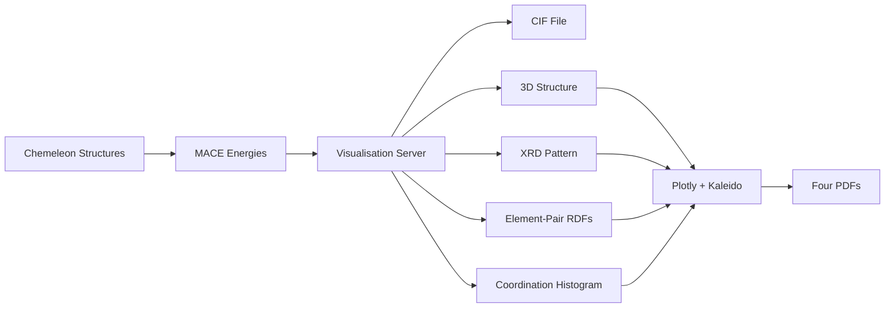

# Visualisation Suite - Structure Files and Analysis Plots

The Crystalyse visualisation suite writes crystal structures to disk as CIF files and
generates a set of quantitative analysis plots as PDFs.

## Overview

> **Interactive 3D viewing is disabled for v2.0-alpha.** `create_3dmol_visualization` is
> now a CIF writer: it saves `{formula}.cif` and returns a payload carrying the note
> *"3dmol.js visualization disabled for v2.0-alpha - CIF file provided instead"*. Its
> `color_scheme` argument is accepted and ignored, and no HTML file is produced by any
> tool. The only 3D output is a static PDF rendering.

What the suite actually provides:

- **Pymatviz**: materials analysis plots (3D structure, XRD, RDF, coordination)
- **Plotly + Kaleido**: the plots are Plotly figures exported to PDF through Kaleido
- **CIF Export**: standard crystallographic file format for compatibility

**Key Strength**: quantitative structural analysis in publication-ready static output,
generated without a display server.

## Integration in Crystalyse

### Availability by Mode
- **explore**: ✅ CIF export
- **validate**: ✅ CIF export plus the full analysis suite
- **auto**: ✅ Same server as validate

### MCP Server Integration
All modes use the **Visualisation Server** (`visualization-mcp-server`), which registers
five tools:

| Tool | Output |
|------|--------|
| `create_3dmol_visualization` | `{formula}.cif` only (3dmol.js disabled) |
| `create_pymatviz_analysis_suite` | CIF + four analysis PDFs |
| `create_creative_visualization` | CIF only (delegates to the first tool) |
| `create_rigorous_visualization` | CIF + analysis suite |
| `create_mode_aligned_visualization` | Routes by `mode` - see below |

**A trap worth knowing about.** The visualisation server's own tool names and its `mode`
parameter still use the *old* vocabulary, and were deliberately left alone.
`create_mode_aligned_visualization(mode=...)` recognises exactly three values:

- `"rigorous"` → CIF + full analysis suite
- `"adaptive"` → CIF only
- `"creative"` → CIF only (also the default)

Anything else - **including the canonical names `"explore"`, `"validate"` and `"auto"`** -
falls through the final `else` branch to CIF-only output. Passing a canonical mode name
here therefore silently downgrades the result rather than raising. Use `"rigorous"` when
you want the plots.

## Core Functionality

### Structure Files

`create_3dmol_visualization(cif_content, formula, output_dir, title, color_scheme)` writes
`{output_dir}/{formula}.cif` and returns a JSON payload with the output path, a `cached`
flag (true if the file was already there) and the 3dmol-disabled note. `title` and
`color_scheme` are accepted for API compatibility; neither affects the output.

### Materials Analysis Plots

There are no individual plot functions to call. `create_pymatviz_analysis_suite` generates
all four figures internally, each from a single pymatviz call with no user-tunable
parameters:

| Figure | Call | Output file |
|--------|------|-------------|
| 3D structure | `pmv.structure_3d_plotly(structure, elem_colors=..., show_bonds=True)` | `3D_Structure_{formula}.pdf` |
| XRD pattern | `pmv.xrd_pattern(structure, annotate_peaks=5)` | `XRD_Pattern_{formula}.pdf` |
| Element-pair RDFs | `pmv.element_pair_rdfs(structure)` | `RDF_Analysis_{formula}.pdf` |
| Coordination histogram | `pmv.coordination_hist(structure)` | `Coordination_Analysis_{formula}.pdf` |

There is no exposed wavelength, 2θ range, peak-broadening, cutoff distance or resolution
setting - and no comparison against experimental patterns or databases. The XRD plot
annotates its five strongest peaks; that count is fixed in the code.

`color_scheme` does reach the 3D structure figure, where `"vesta"` selects
`ElemColorScheme.vesta` and anything else falls back to `ElemColorScheme.jmol`.

### How the PDFs Are Made

The figures are Plotly objects. They are exported to PDF through **Kaleido**, which drives
a headless Chromium, and this is the source of most failure modes in this part of the
system. The server configures Chromium defensively - disabling `VizDisplayCompositor`,
`UseOzonePlatform`, `WebGL` and `WebGL2`, with a 30 s timeout - and batches the exports
through a shared browser session pool when one is available, so a single browser instance
serves all four figures. If a figure fails to render, the suite logs a warning and carries
on with the rest.

PDF is the output format because of this pipeline, not by preference.

### Available Tools

#### `CrystaLyseVisualizer`
Tools for saving structure files and preparing analysis suites.

```python
from crystalyse.tools.visualization import CrystaLyseVisualizer

# Save CIF file
result = CrystaLyseVisualizer.save_cif_file(
    cif_content="...",
    formula="CsSnI3",
    output_dir="./output"
)

# Create analysis directory (Phase 1 placeholder - writes the CIF only)
suite = CrystaLyseVisualizer.create_analysis_suite(
    cif_content="...",
    formula="CsSnI3",
    output_dir="./output"
)
```

**Output**: `VisualizationResult` with `success`, `visualization_type`, `output_path`,
`formula`, `cached`, `description` and `error`.

> **Note**: `create_analysis_suite` here is an explicit Phase-1 placeholder. Its own
> docstring says so, and its body creates `{output_dir}/{formula}_analysis/` and writes
> `{formula}.cif` into it - nothing else. Its `title` and `color_scheme` arguments are
> marked `noqa: ARG004`: accepted and unused. No plots are produced. The plots come from
> `create_pymatviz_analysis_suite` on the **Visualisation Server**; this class is only for
> getting the CIF onto disk.

## Practical Usage

### In Crystalyse Workflows

#### Explore Mode Visualisation
```bash
crystalyse discover "Generate CsSnI3 structure" --mode explore
```

**Visualisation Output**:
- `CsSnI3.cif`: structure file, openable in VESTA, Jmol, OVITO, ASE, pymatgen
- Quick assessment by loading the CIF in whatever viewer you already use

#### Validate Mode Complete Analysis
```bash
crystalyse discover "Characterise CsSnI3 structure comprehensively" --mode validate
```

**Complete Output Package** - exactly five files, all inside the analysis directory:
```
CsSnI3_analysis/
├── CsSnI3.cif                          # Structure file
├── 3D_Structure_CsSnI3.pdf             # Static 3D rendering
├── XRD_Pattern_CsSnI3.pdf              # Simulated diffraction
├── RDF_Analysis_CsSnI3.pdf             # Element-pair radial distributions
└── Coordination_Analysis_CsSnI3.pdf    # Coordination-number histogram
```

If all four PDFs already exist, the suite short-circuits and returns `cached: true` without
re-rendering anything - useful when re-running a workflow, and worth knowing if you expect
a regenerated plot and get the old one. Delete the PDFs to force a rebuild.

### Viewing the Structure

No HTML viewer is generated. Open the CIF in any crystallographic viewer, or load it
programmatically:

```python
from pymatgen.core import Structure

structure = Structure.from_file("CsSnI3_analysis/CsSnI3.cif")
```

For a quick look without leaving the output directory, `3D_Structure_CsSnI3.pdf` is a
static rendering of the same structure.

## Analysis Capabilities

### XRD Pattern Analysis

#### Powder Diffraction Simulation

`XRD_Pattern_{formula}.pdf` is a simulated powder pattern with its five strongest peaks
annotated (`annotate_peaks=5`, fixed). The output is the plot itself - intensity against
2θ, with those five peaks labelled. There is no accompanying peak table, no d-spacing
listing and no Miller indices in machine-readable form; read them off the plot, or compute
them yourself from the CIF with `pymatgen.analysis.diffraction.xrd`.

#### Experimental Comparison

Not provided. There is no experimental pattern database in the visualisation server and no
peak-matching score. Comparing a calculated pattern to your own measurement is a manual
step: read the peak positions off the PDF, or regenerate the pattern yourself with
`pymatgen.analysis.diffraction.xrd` to get the numbers.

### Structural Analysis

#### RDF Analysis

`RDF_Analysis_{formula}.pdf` plots **element-pair** radial distribution functions - one
panel per element pair, so for CsSnI₃ that is Cs-Sn, Cs-I, Sn-I, Cs-Cs, Sn-Sn and I-I. The
first peak in each panel is that pair's nearest-neighbour distance; the panels together
show which pairs are genuinely bonded and which are only second-shell contacts.

#### Coordination Environment Analysis

`Coordination_Analysis_{formula}.pdf` is a histogram of coordination numbers across the
sites in the structure. It answers "how many neighbours do atoms in this structure have"
- not "what is the geometry of each site". Bond angles, polyhedral distortion parameters
and effective coordination numbers are not produced.

For per-site numbers rather than a plot, use the `analyze_coordination` MCP tool on the
chemistry-unified server, which runs a Voronoi analysis by default and returns structured
data.

## Output Formats

### Structure Files

`{formula}.cif` - standard CIF text, written verbatim from whatever the calling server
produced. Nothing is added or reformatted.

### Analysis Plot Files

Each PDF is a single Plotly figure exported by Kaleido, with a centred title of the form
`"XRD Pattern: {formula}"`. There is no multi-page report, no peak table, no d-spacing or
Miller-index listing and no written summary - the PDF contains the plot and its axes.

```
3D_Structure_{formula}.pdf          # pmv.structure_3d_plotly, bonds shown
XRD_Pattern_{formula}.pdf           # pmv.xrd_pattern, 5 peaks annotated
RDF_Analysis_{formula}.pdf          # pmv.element_pair_rdfs
Coordination_Analysis_{formula}.pdf # pmv.coordination_hist
```

## Performance Characteristics

Crystalyse does not instrument the visualisation path, so no timing or file-size figures
are quoted here. Two things do shape the cost in practice:

- **Kaleido startup dominates small jobs.** Launching headless Chromium costs more than
  drawing the figures, which is why the four exports are batched through one shared browser
  session and why the Chromium timeout is set to 30 s
- **Caching is aggressive.** `create_pymatviz_analysis_suite` returns immediately with
  `cached: true` when all four PDFs already exist, so repeat calls on the same formula and
  output directory are effectively free

## Advanced Features

There are none beyond the five registered tools. In particular, the following do not exist
anywhere in the repository, and were previously documented here in error: custom style
creation, property-based colouring, structural animation, multi-structure overlay or
alignment, and property-correlation plotting.

For comparative work, generate a suite per structure into separate output directories and
compare the PDFs, or drive pymatviz directly against the CIFs the suite wrote.

## Integration with Other Tools

### Workflow Integration



### Automatic Integration

Visualisations are automatically generated in Crystalyse workflows:

```python
# Automatic visualisation pipeline
for structure_result in analysis_results:
    # CIF file (3dmol.js disabled - this writes {formula}.cif)
    create_3dmol_visualization(
        structure_result["cif"], formula, output_dir
    )

    # Analysis plots
    if analysis_mode == "validate":
        create_pymatviz_analysis_suite(
            structure_result["cif"], formula, output_dir
        )
```

Note that `create_mode_aligned_visualization` expects `"rigorous"`, not `"validate"`, for
the full suite - see [MCP Server Integration](#mcp-server-integration) above.

## Best Practices

### Visualisation Guidelines

1. **Keep the CIF**: it is the portable artefact; every plot can be regenerated from it
2. **Use a real viewer for inspection**: load the CIF in VESTA, Jmol or OVITO rather than
   relying on the static 3D PDF
3. **Watch the cache**: delete the PDFs when you want them rebuilt, or the suite returns
   the previous ones
4. **Pass `mode="rigorous"`** to `create_mode_aligned_visualization` when you want plots

### Analysis Recommendations

1. **Always generate XRD patterns**: essential for comparison against experiment
2. **Include RDF analysis**: element-pair RDFs reveal the local environments
3. **Check the coordination histogram**: a quick sanity check on chemical reasonableness
4. **Compare with known structures**: by loading reference CIFs yourself - no database
   comparison is built in

## Research Applications

### Structure Validation

Visual and quantitative validation of predicted structures:

```python
# Structure validation, using tools that exist
create_pymatviz_analysis_suite(cif_content, formula, output_dir)
# -> CIF + 3D structure, XRD, RDF and coordination PDFs to inspect

# Quantitative checks live on the chemistry-unified server, not here:
#   analyze_space_group, analyze_coordination, validate_oxidation_states
```

### Materials Characterisation

Complete characterisation package for research:

```
{formula}_analysis/
├── {formula}.cif                       # portable structure file
├── 3D_Structure_{formula}.pdf          # static 3D rendering
├── XRD_Pattern_{formula}.pdf           # simulated diffraction
├── RDF_Analysis_{formula}.pdf          # local environments
└── Coordination_Analysis_{formula}.pdf # coordination geometries
```

## Citation

If you use the Crystalyse visualisation suite, please cite the underlying tools:

### Pymatviz (Analysis Plots)
```bibtex
@software{riebesell_pymatviz_2022,
  title = {Pymatviz: visualization toolkit for materials informatics},
  author = {Riebesell, Janosh and Yang, Haoyu and Goodall, Rhys and Baird, Sterling G.},
  date = {2022-10-01},
  year = {2022},
  doi = {10.5281/zenodo.7486816},
  url = {https://github.com/janosh/pymatviz},
  note = {10.5281/zenodo.7486816 - https://github.com/janosh/pymatviz},
}
```

Crystalyse pins `pymatviz>=0.8.5,<0.19.0`; cite the version you actually have installed.

### 3Dmol.js
Not currently used - 3dmol.js visualisation is disabled for v2.0-alpha and no 3dmol.js code
ships in the output.

## Summary

The Crystalyse visualisation suite turns a predicted structure into a portable CIF file and
a set of quantitative analysis plots. Interactive 3D viewing is disabled for v2.0-alpha; the
suite's value today is the static, reproducible output it leaves on disk.

**Key Benefits**:
- Portable CIF output that any crystallographic tool can open
- Publication-quality analysis plots (3D structure, XRD, RDF, coordination)
- Headless generation - no display server required
- Aggressive caching, so re-running a workflow costs nothing
- Seamless integration with structure prediction and energy analysis

The visualisation suite completes the Crystalyse analysis pipeline, providing the critical visual and analytical tools needed to understand and validate computational materials design results.

For detailed usage examples and integration patterns, see the [CLI Usage Guide](../guides/cli_usage.md) and [Analysis Modes Documentation](../concepts/analysis_modes.md).